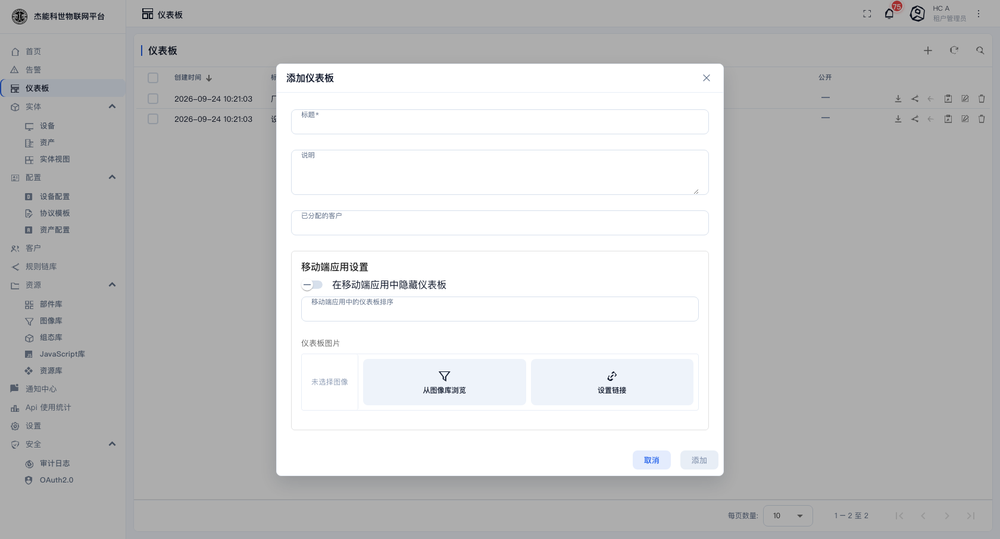
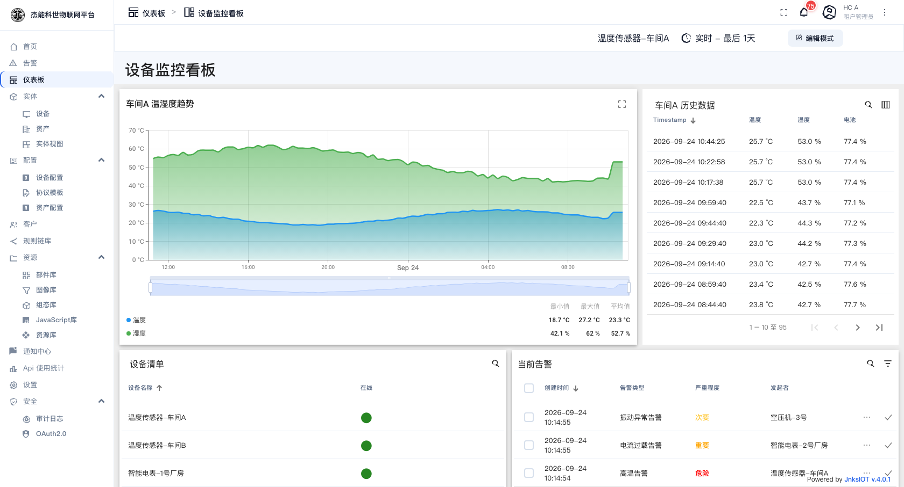

# 00 · 端到端实战教程

这是一条**从零走到能看的看板**的完整路径。跟着做一遍，平台的主要功能就都碰过了。

**预计时间**：30~45 分钟（不含设备端开发）。
**前置条件**：有一个租户管理员账号，且能在某台机器上执行 `curl`。

**最终结果**：一台叫 `温度传感器-车间A` 的设备在平台上持续上报温度，超限时产生告警并通知到你，同时有一块仪表盘实时显示温度曲线。

---

## 第 0 步 · 登录并确认身份

打开平台地址登录。登录后看侧边栏：如果能看到「实体 / 配置 / 客户 / 规则链库」这几组，说明你是**租户管理员**，可以完成全部步骤。


---

## 第 1 步 · 建一个设备档案

**为什么先建档案**：档案定义了"这类设备用什么协议接入、有什么告警规则"。设备必须挂在某个档案下。

菜单：**配置 → 设备配置** → 点 `+` → **创建设备配置**


| 字段 | 填什么 |
|---|---|
| 名称 | `环境监测终端` |
| 传输方式 | `默认`（本章用 HTTP 接入，默认即可） |
| 说明 | `温湿度、电池电量采集` |

点「添加」。

**接着配告警规则**：进入刚建的档案 → 「告警规则」页签 → 添加一条：

| 字段 | 填什么 |
|---|---|
| 严重程度 | `危险` |
| 键 | `temperature` |
| 条件 | 大于 `40` |
| 持续时间 | `0`（立即触发） |


保存。这一步让"温度超过 40℃"自动产生告警。

---

## 第 2 步 · 建设备

菜单：**实体 → 设备** → `+` → **添加设备**


| 字段 | 填什么 |
|---|---|
| 名称 | `温度传感器-车间A` |
| 标签 | `温度传感器-车间A` |
| 设备配置 | `环境监测终端`（第 1 步建的那个） |
| 说明 | `车间A 采集点` |

点「下一个：凭证」→「添加」。

设备出现在列表里，状态是**非活动**（还没上报过）。

---

## 第 3 步 · 拿到令牌，让设备上报

### 复制令牌

在设备列表点该行进入详情页 → 点 **复制访问令牌**：


同时记下平台地址与端口 —— 在 **设置 → 基本设置 → 设备连接** 里看 HTTP 那一组的「主机」和「端口」。

### 发一条数据

把下面的 `<平台地址>`、`<HTTP端口>`、`<访问令牌>` 换成实际值：

```bash
curl -v -X POST http://<平台地址>:<HTTP端口>/api/v1/<访问令牌>/telemetry \
  -H 'Content-Type: application/json' \
  -d '{"temperature": 25.3, "humidity": 60.2, "battery": 98}'
```

看到 `200 OK` 就成功了。

### 再发一串数据，让曲线好看

单点看不出趋势，模拟一段上报：

```bash
for i in $(seq 1 20); do
  curl -s -X POST http://<平台地址>:<HTTP端口>/api/v1/<访问令牌>/telemetry \
    -H 'Content-Type: application/json' \
    -d "{\"temperature\": $((22 + i % 7)), \"humidity\": $((55 + i % 9)), \"battery\": $((95 - i / 4))}"
  sleep 2
done
```

---

## 第 4 步 · 确认数据到位

回到设备详情页：

**① 状态变成"活动"了吗？**

设备列表里该行左侧应该是绿点。

**② 遥测页签里有数据吗？**

点「最新遥测数据」页签：


三个键（temperature / humidity / battery）都在。

> **到这里为止，数据链路就通了。** 后面几步是把数据用起来。

---

## 第 5 步 · 确认超限时产生告警

再发一个超过 40 的值：

```bash
curl -s -X POST http://<平台地址>:<HTTP端口>/api/v1/<访问令牌>/telemetry \
  -H 'Content-Type: application/json' -d '{"temperature": 42.5}'
```

然后菜单：**告警**：


应该多出一条 `危险` 级别的告警，状态是**激活未确认**。

**处理它**：点该行 → **确认**（表示已认领）→ 把**受托人**改成自己 → 加一条**注释**记录原因。

> 如果告警没出现：检查第 1 步的告警规则是否真的保存了；或该设备的规则链是否把数据保存下来了（见 [06-3 调试与排错](06-规则引擎/03-调试与排错.md)）。

---

## 第 6 步 · 做一块仪表盘

菜单：**仪表板** → `+` → **创建仪表板**：



标题填 `车间A 温度看板`，点「添加」。进入空仪表盘后点右上角 **编辑模式**。

### 加一个时序图

点 **添加部件**：


在「图表」包里选第一个（时序图）。配置对话框里：

| 配置项 | 选什么 |
|---|---|
| **实体别名** | 新建一个别名，类型选**单实体**，指向 `温度传感器-车间A` |
| **数据键** | 选 `temperature`，显示名填"温度"，单位 `°C` |
| **时间窗口** | 用仪表盘默认（最后 1 天） |

点「添加」。拖动右下角把它调大一些，点 **保存**。



### 再加一个告警表

再次「添加部件」→「告警部件」→ 告警表，数据源指向同一个别名。这样温度异常时告警会直接出现在看板上。

---

## 第 7 步 · 配通知

到这一步，告警只在系统里有记录。要让"人"收到消息：

菜单：**通知中心** → **规则** 页签：


找到 **「新告警」** 这条规则，确认它右侧的开关是**打开**的。它用「新告警通知」模板，发给「租户管理员」收件人组 —— 也就是说你有告警时会收到站内通知。

回 **收件箱** 页签，应该能看到刚才那条告警的通知。

> 要让**邮件**也能收到，还需要系统管理员在 [11-系统设置](11-系统设置.md) 里配好 SMTP。没有配的话，站内通知是通的，邮件不会发。

---

## 第 8 步（可选）· 把看板交给客户

如果你要服务下游客户：

1. 菜单 **客户** → `+` 建一个客户，如 `华东分公司`。
2. 在客户详情点 **管理用户** → `+` 建一个客户用户（激活方式选「显示激活链接」，把链接给用户）。
3. 客户详情点 **管理设备** → 勾上 `温度传感器-车间A`。
4. 客户详情点 **管理仪表板** → 勾上 `车间A 温度看板`。

详见 [04-客户与用户](04-客户与用户.md)。客户用自己的账号登录后，只看得到你分配给他的这些东西。

---

## 检查清单

走完之后对照一遍，这些都该成立：

- [ ] 有一个自定义的设备档案，里面有传输方式和告警规则
- [ ] 有一台设备，状态是**活动**
- [ ] 设备的「最新遥测数据」里有实际数据
- [ ] 超限时产生了告警，且你能确认/清除它
- [ ] 有一块仪表盘，图表显示了真实曲线
- [ ] 通知中心的收件箱里有告警通知
- [ ] （可选）客户用户能看到分配给自己的设备与看板

## 接下来读什么

| 想深入 | 读 |
|---|---|
| 设备端怎么写代码 | [14-设备接入指南](14-设备接入指南.md) |
| 档案里的每一项什么意思 | [03-4 设备档案](03-实体管理/04-设备档案.md) |
| 仪表盘部件怎么配 | [05-2 仪表盘编辑器](05-仪表盘/02-仪表盘编辑器.md) |
| 告警规则写复杂逻辑 | [06-1 规则链](06-规则引擎/01-规则链.md) |
| 数据没上来怎么查 | [06-3 调试与排错](06-规则引擎/03-调试与排错.md) |

---

回到 [README](README.md) · 下一章：[01-快速开始](01-快速开始.md)
