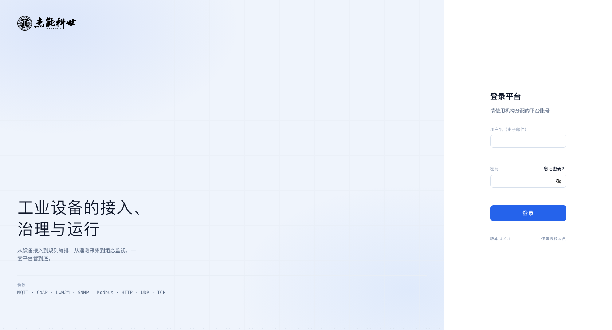
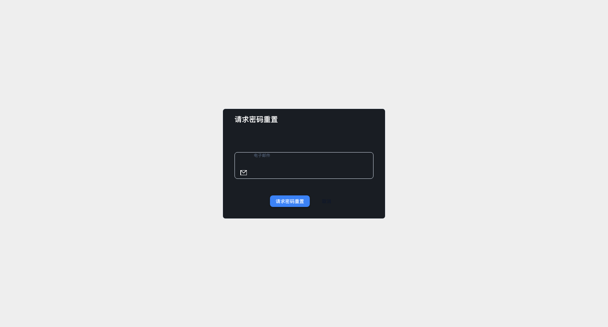
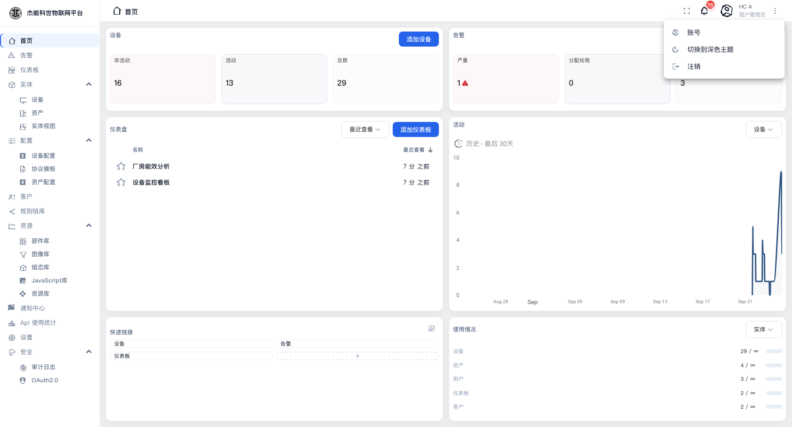

# 01 · 快速开始

这一章把"怎么进到平台里"和"界面上的每一块叫什么"讲清楚。后面所有章节都建立在这一章的词汇之上。

## 登录

在浏览器里打开平台地址（本机部署通常是 `http://localhost`），会看到登录页：

页面分左右两栏：左栏是品牌、标语与平台支持的协议清单（底部注明了平台版本号）；右栏是登录表单。

| 字段 | 说明 |
|---|---|
| **用户名（电子邮件）** | 登录账号，是一个邮箱地址。例如租户管理员 `hc-admin@jnks-iot.org` |
| **密码** | 首次登录用管理员分配的初始密码；改过密码后以你自己设置的为准 |

右侧眼睛图标可以显示/隐藏密码。填好后按回车或点「登录」按钮。登录成功后自动跳到**首页**（见 [02-首页](02-首页.md)）。

> **账号未激活会登录失败**，提示 `User account is not active`。新建的用户默认是未激活状态，需要先点邮件里的激活链接设置密码。本地没有配邮件服务时，由管理员在用户列表里**取出激活链接**（用户行末的动作按钮），手工转给用户（见 [04-客户与用户](04-客户与用户.md#激活链接)）。

### 忘记密码

点登录框下方的「忘记密码」，填入邮箱后提交。系统会向该邮箱发送一封重置密码的邮件，邮件里的链接有时效，过期需要重新申请。

> 能否收到邮件取决于平台是否配置了**发件邮箱**。这一步由系统管理员在 [11-系统设置](11-系统设置.md) 的「邮件」页配置。

### 连续登录失败

多次输错密码后，账号会被临时锁定（锁定时长由 [10-安全设置/01-通用安全设置](10-安全设置/01-通用安全设置.md) 里的"最大登录失败次数"决定）。等锁定期过去再试，或请管理员重置密码。

## 界面分区

登录后的界面固定分成四块，本手册提到这些名字时都指这几块：

| 区域 | 位置 | 作用 |
|---|---|---|
| **顶部栏** | 最上方一条 | 左侧是当前页面的层级路径（如 `设备 › 空压机-3号`）；右侧依次是**全屏**、**通知铃铛**（带未读数）、**用户头像菜单** |
| **侧边栏** | 左侧竖列 | 全部功能入口。带 `›` 的条目可展开子项；当前所在项高亮显示 |
| **主内容区** | 右侧大块 | 当前页面。列表页、详情页、编辑器都在这里 |
| **提示条** | 屏幕正中最上方 | 操作结果提示（"已保存""已复制"等），短暂停留后自动消失 |

**侧边栏的管理习惯**：一级条目（如「实体」「配置」「资源」「安全」）本身不是页面，点它是**展开/收起**子项；真正能跳转的是缩进一级的子项（如「设备」「资产」）。展开状态会被浏览器记住，刷新后保持不变。

**详情页**：在列表里点一整行，主内容区会切换到该实体的详情页。详情页顶部有一排页签（`详情 / 属性 / 最新遥测数据 / 告警 / 事件 / 关联 / 审计日志`），右上角那个圆形按钮进入编辑态。

**顶部栏的层级路径**可以点，用来快速回到上一层。例如从 `设备 › 空压机-3号` 点「设备」就回到设备列表。

## 用户菜单

点顶部栏最右侧的头像，展开用户菜单：

菜单里只有三项：

| 菜单项 | 作用 |
|---|---|
| **账号** | 显示你的姓名与角色（如"租户管理员"）；点进去可以改姓名、手机号、邮箱，并管理双因素认证 |
| **切换到深色主题 / 切换到浅色主题** | 在亮色与深色主题之间切换，文案随当前主题变化。见下节 |
| **注销** | 结束当前会话，回到登录页 |

### 主题：亮色与深色

平台有两套配色，内容完全相同，只是明暗相反。

- **亮色**：白底深字，适合白天与投影演示。**本手册所有截图都是亮色主题。**
- **深色**：深底浅字，适合机房值班、夜间监控大屏。

切换后立即生效，不需要刷新。仪表盘上的图表也会跟着换配色 —— 用户自己给部件配的背景色在深色主题下会被统一成深色面板，以保证文字可读。

## 多标签页与全屏

- 顶部栏的**全屏**按钮把当前页面切到全屏，再点一次退出。适合把仪表盘投到大屏上。
- 浏览器里开多个标签页、用同一个账号登录是允许的，互不干扰。
- 会话有时效。长时间不操作后再点任意菜单，如果被弹回登录页，重新登录即可，不会丢数据。

## 常见问题

**登录后侧边栏比同事少了几项。**
菜单是按角色渲染的，见 [README](README.md#三种角色) 的角色对照表。系统管理员、租户管理员、客户用户各只有 13 / 21 / 7 项。

**侧边栏里找不到"网关""移动中心""高级功能"。**
这三块由平台的特性开关控制，本部署中处于关闭状态，因此整组菜单不显示。

**界面上一部分控件还是英文。**
上游遗留的少量字段（如表格里的 `Timestamp`、`Active`）未汉化，含义与同义中文一致，不影响使用。

**改了数据但页面没变化。**
先按 `Cmd + Shift + R`（Windows 是 `Ctrl + F5`）强制刷新。浏览器会缓存前端资源，强制刷新能拿到最新版本。

---

下一章：[02-首页](02-首页.md) ·
或者直接跟一遍 [00-端到端实战教程](00-端到端实战教程.md)
