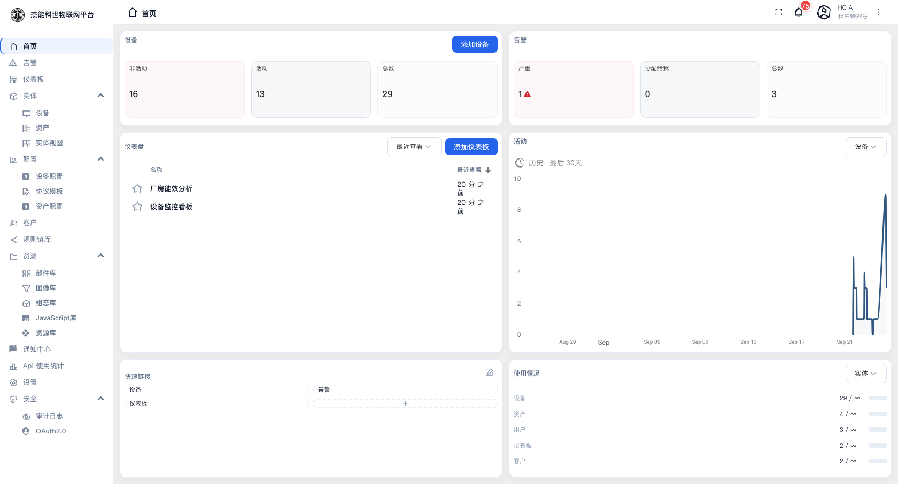
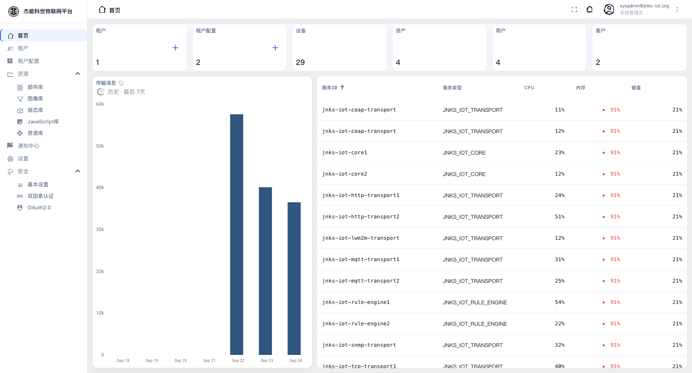
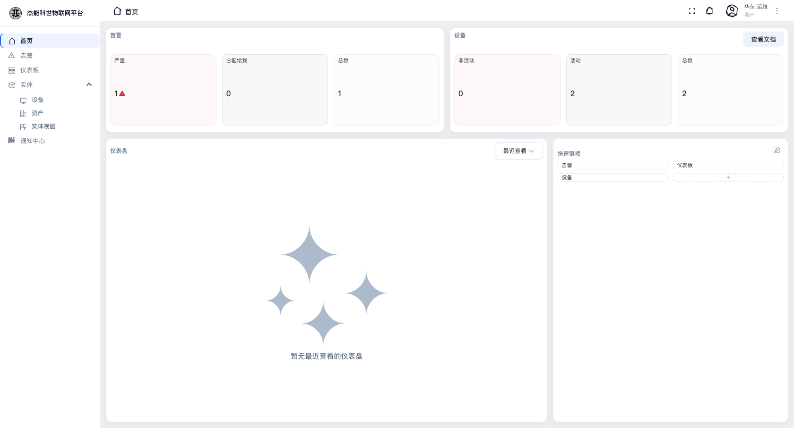
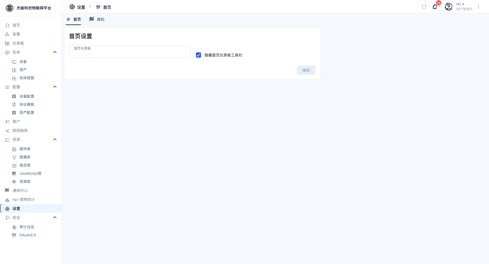

# 02 · 首页

首页是登录后落地的第一个页面，也是日常使用频率最高的一屏。**三种角色看到的首页完全不同** —— 它不是固定的一张页面，而是按角色加载不同的仪表盘。

| 角色 | 首页内容 |
|---|---|
| 租户管理员 | 设备/告警统计、最近查看的仪表盘、实体活动趋势、快速链接、配额使用情况 |
| 系统管理员 | 租户/租户档案/设备/资产/用户/客户 计数、传输消息趋势、平台服务状态表 |
| 客户用户 | 本客户的告警与设备统计、最近查看的仪表盘、快速链接 |

首页上的卡片都可以点，点进去就是对应的功能页。

## 租户管理员首页

| 区块 | 读数 | 点击行为 |
|---|---|---|
| **设备** | 非活动 / 活动 / 总数 | 「添加设备」直接打开新建设备对话框；三个数字卡进设备列表 |
| **告警** | 严重 / 分配给我 / 总数 | 进告警列表。**严重**卡片红色高亮并带警告图标，是当前需要处理的告警数 |
| **仪表盘** | 最近查看的仪表盘列表与"多久之前看过" | 「添加仪表板」新建；表头可切换成其他排序；点某一行直接打开该仪表盘 |
| **活动** | 所选实体近 30 天的消息量折线图 | 右上角下拉可切换统计对象（设备/资产等） |
| **快速链接** | 常用页面的快捷入口 | 默认是设备、告警、仪表板。点右上角铅笔图标可以增删；点虚线框里的 `+` 添加 |
| **使用情况** | 设备/资产/用户/仪表板/客户 的"已用 / 配额" | 分母是 `∞` 表示不限量。**接近配额时要做扩容或清理** |

> **"活动"与"在线"不是一回事**：设备卡上的**活动**指设备最近有上报（按设备自己的活跃超时判定），仪表盘部件里的**在线**读的是设备的 `active` 属性。一个设备可能"在线属性为真"但当前没有数据上报。

## 系统管理员首页

| 区块 | 读数 |
|---|---|
| **六个计数卡** | 租户、租户配置、设备、资产、用户、客户。每张卡右上角的 `+` 直接跳到对应的新建对话框 |
| **传输消息** | 平台近 7 天消息量柱状图（历史窗口，可切换） |
| **服务 ID 表** | 平台各微服务的运行状态：服务 ID、服务类型、CPU、内存、磁盘占用 |

**服务 ID 表里出现红色的百分比要留意**。内存/磁盘长期高位说明该服务需要扩容（本机部署下常见于 transport 与 rule-engine）。服务 ID 的命名规则是 `jnks-iot-<服务>-<序号>`，例如 `jnks-iot-mqtt-transport1`。

## 客户用户首页

客户用户只能看到**分配给自己所属客户**的数据，因此计数天然比租户管理员小：

- **告警**：只有本客户设备产生的告警。
- **设备**：只有分配给本客户的设备。右上角是「查看文档」。
- **仪表盘**：只有分配给本客户的仪表盘。刚建好的客户用户这里是空态（"暂无最近查看的仪表盘"），需要由租户管理员先把仪表盘分配给该客户 —— 见 [04-客户与用户](04-客户与用户.md)。

## 把首页换成自己的仪表盘

首页默认是上面这套"概览"。你可以把自己做的仪表盘设为**首页仪表盘**，登录后直接进入它：

**租户管理员**：菜单「设置」→「首页」页 → 在「首页仪表板」里选一个仪表盘 → 保存。

同页还有一个开关「隐藏首页仪表板工具栏」。勾上后，作为首页打开的仪表盘不显示顶部的工具栏（时间窗口、实体选择器等），适合投屏场景。

**系统管理员**：同一位置，另外还有「通知」等更多子页 —— 见 [11-系统设置](11-系统设置.md)。

设好后，点侧边栏的「首页」进入的就是你选的那个仪表盘。想改回来，回到「设置 → 首页」清空选择即可。

---

上一章：[01-快速开始](01-快速开始.md) · 下一章：[00-端到端实战教程](00-端到端实战教程.md)
