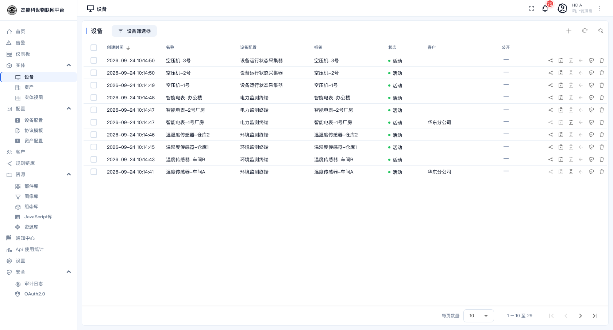
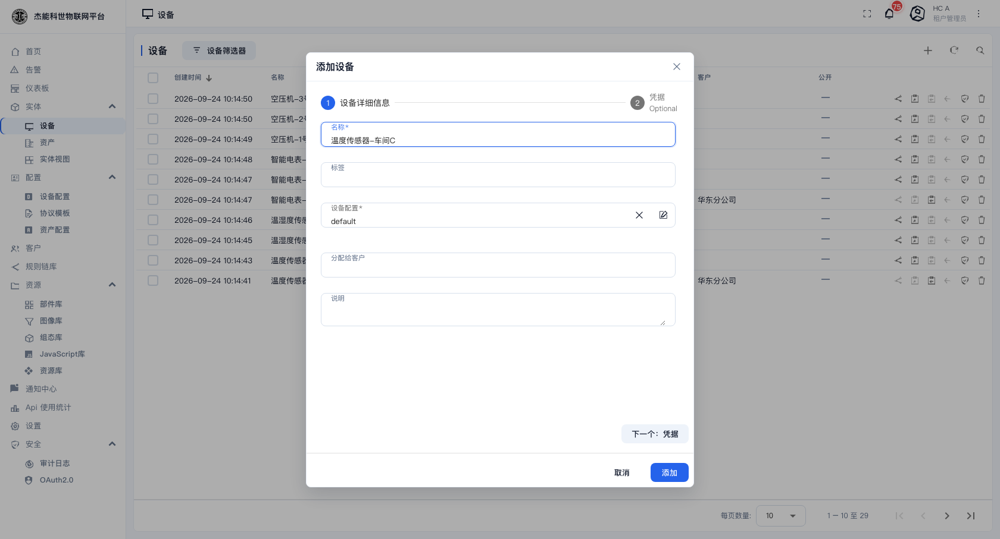
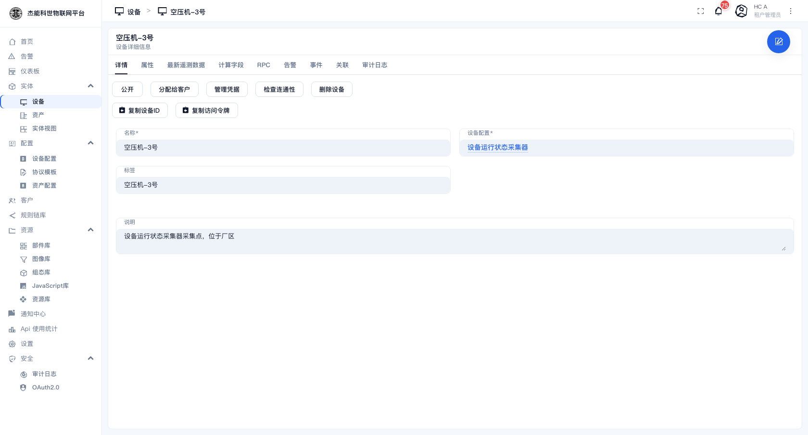
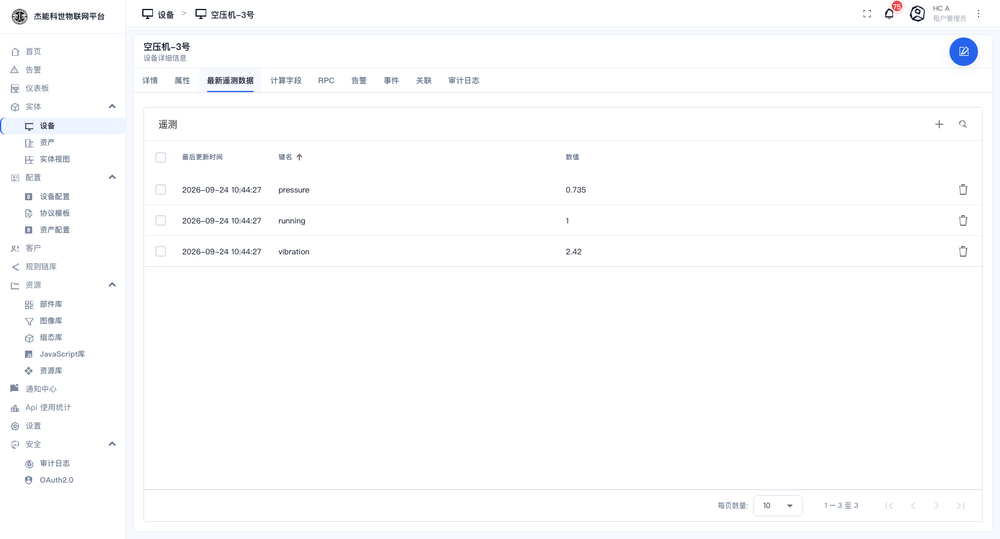
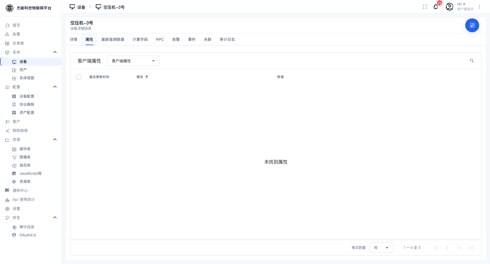
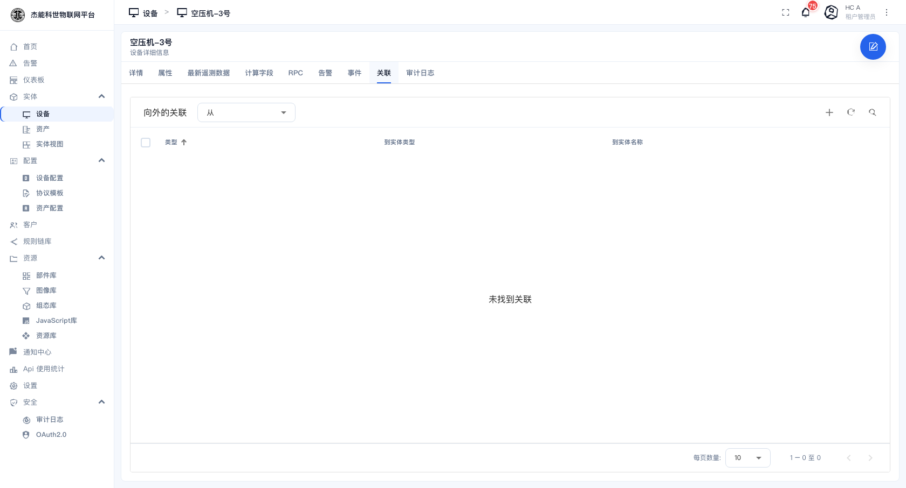
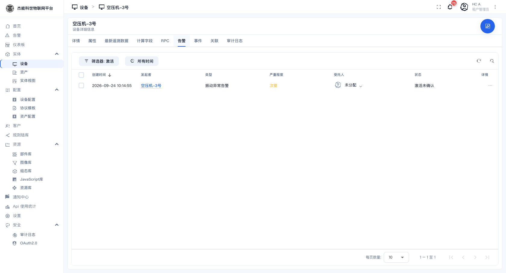
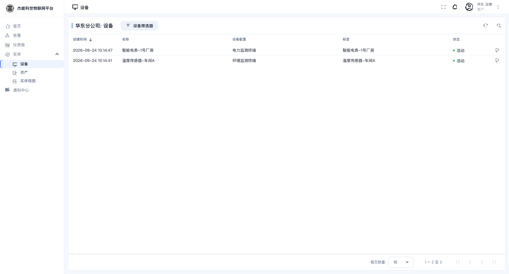
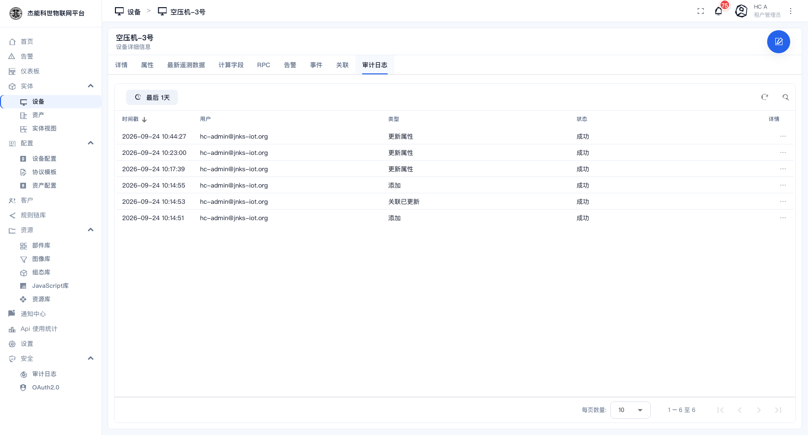

# 03-1 · 设备

**设备**是平台里最核心的实体 —— 一台真实上报数据的机器（传感器、电表、空压机、网关……）在平台里的账号。

设备与**设备档案**（Device Profile）是"实例"与"模板"的关系：

```
设备档案「环境监测终端」  ← 定义传输方式、告警规则、属性键、RPC
        ├── 温度传感器-车间A
        ├── 温度传感器-车间B
        └── 温湿度传感器-仓库1
```

同一个档案下的设备，共享传输配置与告警规则。所以**新建一台设备之前，先确认它该用哪个档案** —— 见 [03-4 设备档案](04-设备档案.md)。

## 设备列表

菜单：**实体 → 设备**



| 列 | 说明 |
|---|---|
| 创建时间 | 设备在平台里被创建的时间。表头可点，切换升/降序 |
| 名称 | 设备名，租户内唯一。**建议用"类型-位置-编号"**，如 `温度传感器-车间A` |
| 设备配置 | 所属的设备档案 |
| 标签 | 设备的 label，可空。用于在列表里做辨识 |
| 状态 | **活动**（绿点）/ **非活动**（灰点）/ 未激活。按设备最近是否上报判定 |
| 客户 | 已分配给哪个客户；`—` 表示未分配 |
| 公开 | 勾选表示该设备对未登录的访客可见 |
| 行内动作 | 一排图标按钮，悬停显示名称 |

顶部工具条：

| 控件 | 位置 | 作用 |
|---|---|---|
| **设备** | 左侧 | 页面标题 |
| **设备筛选器** | 标题右侧 | 按名称、类型、状态等条件过滤列表 |
| `+` | 右侧 | 新建或导入 —— 点开是个菜单 |
| 刷新 / 搜索 | 右侧 | 重新拉取 / 全表搜索 |

底部分页：每页条数与翻页箭头。

### 行内动作逐个说明

| 图标 | 名称 | 作用 |
|---|---|---|
| 箭头进入 | 分配给客户 | 把设备划给某个客户，客户用户才能看到它 |
| ⧉ | 复制设备 ID | 复制设备的 UUID，写 API 调用或排查时用 |
| 🔓 | 公开 | 切换"对访客可见"。公开的设备在未登录的仪表盘分享页里也能取到数据 |
| 🗝 | 管理凭证 | 打开凭证对话框，查看/重置设备的访问令牌 |
| 🗑 | 删除 | 删除设备。**设备产生的遥测数据不会一并删除**，需要另外清理 |

> 删除确认框的按钮是 **「否 / 是」**。

## 新建一台设备

点工具条的 `+` → 菜单里选 **添加设备**：



对话框分两步，顶部有步骤指示（`1 设备详细信息` → `2 凭证`）：

| 字段 | 必填 | 说明 |
|---|---|---|
| **名称** | 是 | 设备名，租户内唯一 |
| **标签** | 否 | 便于识别的短标签 |
| **设备配置** | 是 | 选一个设备档案。默认选中 `default` |
| **分配给客户** | 否 | 直接指定归属客户；也可以建好之后再分配 |
| **说明** | 否 | 自由文本，会显示在详情页 |

填完点「下一个：凭证」进入第二步，再点「添加」完成。

### 批量导入

同一菜单里选 **导入设备**，可以上传一个 CSV 或 JSON 文件一次建多台。导入时指定的设备档案必须已存在。

## 设备详情页

在列表里点任意一行进入详情页：



页面上半部是操作按钮区，下半部是各页签的内容。

### 操作按钮

| 按钮 | 作用 |
|---|---|
| **公开** | 切换设备对访客是否可见 |
| **分配给客户** | 把设备划给某个客户 |
| **管理凭证** | 打开凭证对话框 —— 见下节 |
| **检查连通性** | 发一条 RPC 探活，确认设备真的在线且能应答。**这是排除"设备配好了但没数据"的第一步** |
| **删除设备** | 删除该设备 |
| **复制设备ID** | 复制 UUID |
| **复制访问令牌** | 把设备当前令牌复制到剪贴板，用于设备端代码 |

### 详情 页签

显示设备本身的可编辑字段：名称、设备配置、标签、说明，以及档案里定义的**设备配置**（共享属性）。

右上角的圆形按钮进入**编辑态**：字段变为可改，右下角出现 ✓（保存）与 ✗（取消）。

### 属性 / 最新遥测数据





- **最新遥测数据**页签分上下两段：上面是**遥测**（随时间变化的数据，如温度、电流），下面是**属性**（相对稳定的配置项，如固件版本、安装位置）。每行显示最后更新时间、键名、数值。
- 右上角的 `+` 可以**手工写入**一条遥测或属性（用于造测试数据），垃圾桶图标删除单个键。

> 遥测数据由平台按部署方配置的保留策略清理；**属性不会自动清理**，会一直保留。

### 关联



显示该设备与其他实体的关系。左侧下拉可切换方向：

- **向外的关联**：本设备指向别人（例如"空压机-3号 属于 空压机组"）
- **向内的关联**：别人指向本设备（例如"一号厂房 包含 温度传感器-车间A"）

类型是自由文本。常见约定：`包含`（资产包含设备）、`属于`、`管理`。点 `+` 新增一条关联。

设备详情页的「告警」页签长这样：



### 告警 / 事件 / 审计日志

| 页签 | 内容 |
|---|---|
| **告警** | 该设备产生过的告警（含已清除的历史） |
| **事件** | 引擎侧的调试事件与生命周期事件（设备上下线、创建、更新等） |
| **审计日志** | 谁在什么时候改过这台设备 —— 见 [10-4 审计日志](../10-安全设置/04-审计日志.md) |

### RPC / 计算字段

| 页签 | 内容 |
|---|---|
| **RPC** | 向设备下发指令并查看响应。按钮来自设备档案里配置的 RPC 方法 |
| **计算字段** | 由已有遥测派生出的新字段（如"功率 = 电压 × 电流"），在档案里定义 |

## 设备凭证

「管理凭证」打开凭证对话框。平台支持两种设备身份：

| 凭证类型 | 适用场景 | 说明 |
|---|---|---|
| **访问令牌**（Access Token） | 绝大多数设备 | 一串随机字符串。设备上报时把它放在 URL、用户名或请求头里 |
| **MQTT 基础** | 需要用户名/密码的 MQTT 设备 | 用 clientId + 用户名 + 密码三元组，比令牌更严格 |

对话框中可以**复制**当前令牌，也可以**重置**生成新令牌。

> **重置令牌会让设备立刻断连**，必须同步改设备端的配置。生产环境上重置前先确认能远程改设备。

客户用户登录后看到的是同一张列表，但只有分配给本客户的设备，且没有新建/删除权限：



设备的「审计日志」页签记录了谁改过它：



## 排查"设备不出数据"

按这个顺序查，能覆盖绝大多数情况：

1. **状态是不是"活动"？** 列表页看状态列。非活动说明设备根本没连上来。
2. **档案里的传输方式对不对？** 设备的类型设置是"默认"还是"Mqtt"等，必须与设备实际用的协议一致 —— 见 [03-4 设备档案](04-设备档案.md)。
3. **令牌对不对？** 详情页「管理凭证」核对；或点「复制访问令牌」重新拷一份。
4. **网络通不通？** 详情页「检查连通性」。
5. **数据到了但没存？** 在设备详情页的「事件」页签看引擎是否收到了消息，再顺着规则链查「保存遥测数据」节点 —— 见 [06-3 调试与排错](../06-规则引擎/03-调试与排错.md)。
6. **数据存了但仪表盘没有？** 那是仪表盘的别名/数据键问题，见 [05-2 仪表盘编辑器](../05-仪表盘/02-仪表盘编辑器.md)。

---

上一章：[02-首页](../02-首页.md) · 下一章：[02-资产](02-资产.md)
