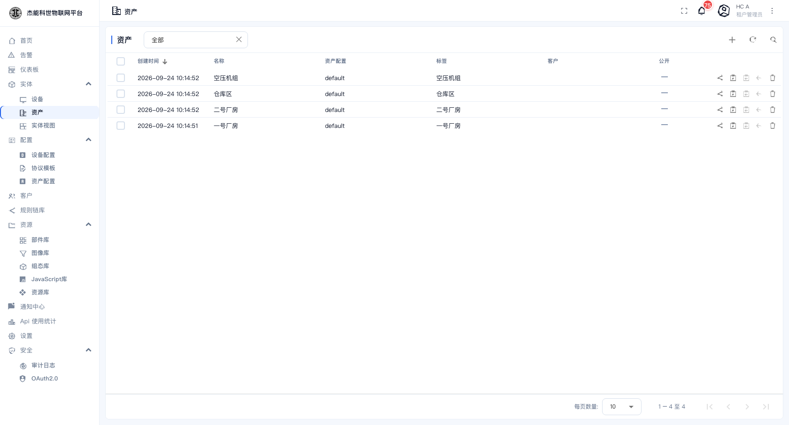
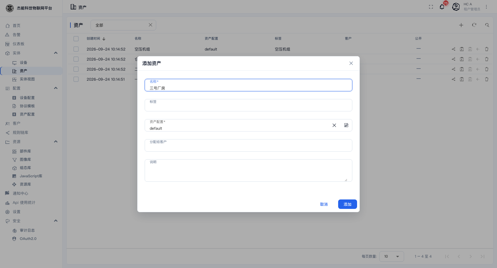
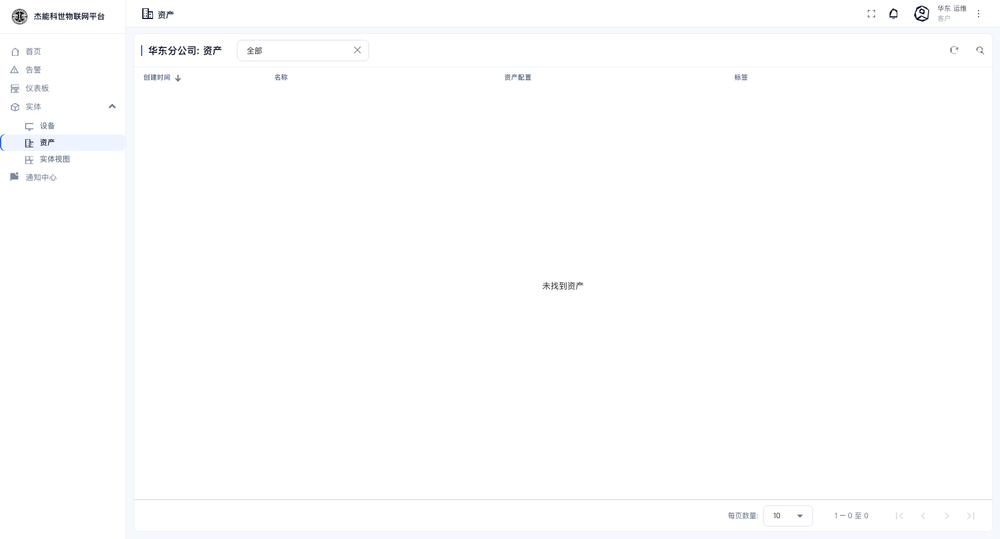
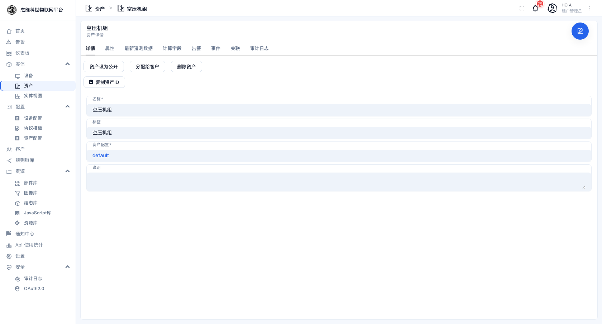

# 03-2 · 资产

**资产**是"非设备"的实体 —— 厂房、产线、机柜、班组、车辆这类**组织单元**。它自己不上报数据，作用是**把设备组织起来**，让仪表盘可以按"一号厂房"这个粒度去查数据。

```
资产「一号厂房」
  ├── 包含 → 设备「温度传感器-车间A」
  ├── 包含 → 设备「智能电表-1号厂房」
  └── 包含 → 设备「空压机-1号」
```

有了这层关联，仪表盘上就能"选中一号厂房 → 自动汇总它下面所有设备的温度/电量"。

## 资产列表

菜单：**实体 → 资产**



| 列 | 说明 |
|---|---|
| 创建时间 / 名称 / 标签 | 同设备 |
| 资产配置 | 所属的**资产档案**。作用与设备档案类似，主要用来定义告警规则 |
| 客户 | 已分配给哪个客户 |
| 公开 | 对访客是否可见 |

行内动作与设备一致：分配给客户、复制资产 ID、公开、删除。资产**没有**凭证 —— 它不直连平台。

## 新建资产

点 `+` → **添加资产**：



| 字段 | 必填 | 说明 |
|---|---|---|
| **名称** | 是 | 资产名，如 `一号厂房` |
| **标签** | 否 | 短标签 |
| **资产配置** | 是 | 选一个资产档案，默认 `default` |
| **分配给客户** | 否 | 归属客户 |
| **说明** | 否 | 自由文本 |

客户用户登录后只看到分配给本客户的资产：



## 资产详情页



页签与设备几乎一致：`详情 / 属性 / 最新遥测数据 / 计算字段 / 告警 / 事件 / 关联 / 审计日志`。

操作按钮是：**资产设为公开 / 分配给客户 / 删除资产 / 复制资产ID**。

### 资产也要有"属性"

资产不上报遥测，但**属性**很有用 —— 它承载了组织信息：

| 属性键 | 值示例 | 用途 |
|---|---|---|
| `address` | 杭州市余杭区xx路 8 号 | 地图部件定位 |
| `area` | 3200 | 面积，用于能效计算 |
| `manager` | 张工 | 责任人 |
| `latitude` / `longitude` | `30.25` / `120.05` | 地图部件的坐标 |

在「属性」页签右上角点 `+` 手工添加。这些属性在仪表盘里可以用别名取到。

### 用「关联」把设备挂到资产下

在**资产**详情页 →「关联」页签 → `+`：

| 字段 | 填什么 |
|---|---|
| 类型 | `包含`（约定用词，也可以用别的，但要前后一致） |
| 方向 | 从本资产**向外** |
| 目标实体 | 选一台设备 |

保存后，在**设备**详情页的「关联」页签里，方向切到「向内的关联」，就能看到 `一号厂房 包含 本设备`。

> **关联是单向存储、双向可见的**。只要在一边建好，另一边的"向内/向外"就能查到。不要两边各建一次，那会产生两条关系。

## 通过仪表盘按资产看数据

资产的价值主要体现在仪表盘上。以「一号厂房」为例，在仪表盘的实体别名里这样配置（详见 [05-2 仪表盘编辑器](../05-仪表盘/02-仪表盘编辑器.md)）：

| 别名 | 过滤器类型 | 设置 |
|---|---|---|
| `厂房` | 实体类型（资产） | 类型 `default` |
| `厂房下的设备` | 关系查询 | 从状态实体出发，方向"向外"，关系类型 `包含`，最大层级 1 |

第二个别名是关键：它把"当前选中的厂房"下面的所有设备一次性取出来，于是图表自动汇总。

## 常见用法

| 场景 | 怎么建 |
|---|---|
| 按厂区看用电 | 资产 = 厂房；设备 = 各车间的电表；用「包含」关联 |
| 按租户内客户分区 | 用**客户**而不是资产 —— 见 [04-客户与用户](../04-客户与用户.md)。资产管"物理归属"，客户管"数据归属" |
| 按产线看设备 | 资产 = 产线；同一台设备可以同时属于产线和厂房，建两条关联即可 |

---

上一章：[01-设备](01-设备.md) · 下一章：[03-实体视图](03-实体视图.md)
