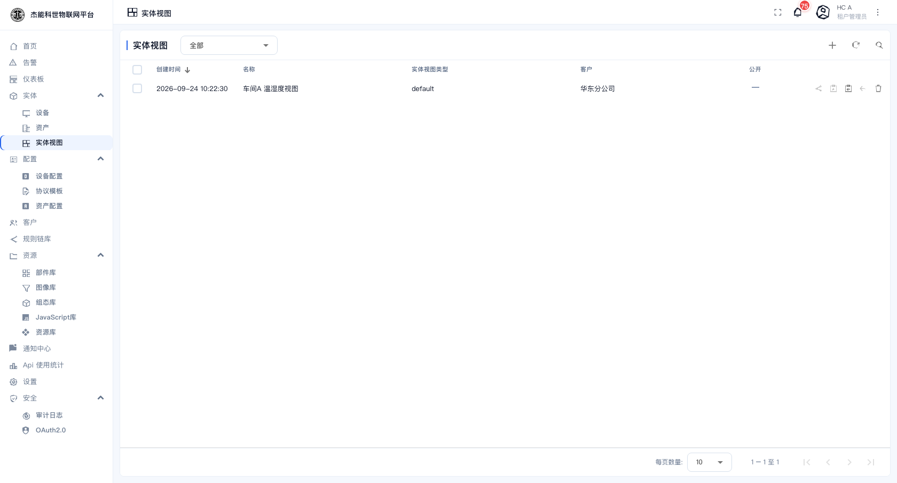
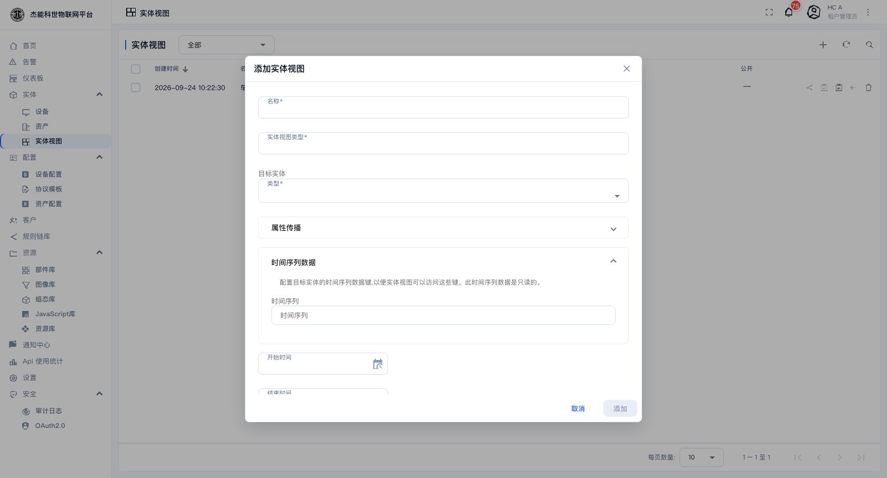
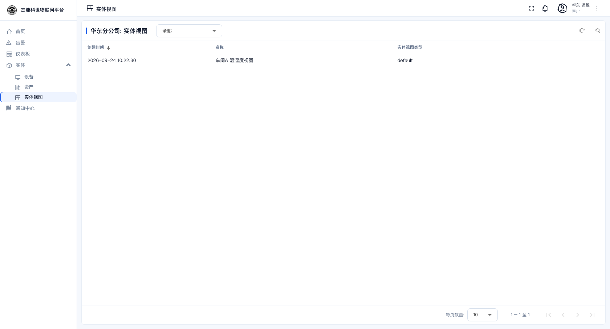

# 03-3 · 实体视图

**实体视图**（Entity View）是给客户用的"裁剪视图"。它本身不存数据，而是**指向一台设备（或资产）**，并且只暴露你允许客户看到的那几个字段。

```
设备「温度传感器-车间A」        → 有 temperature、humidity、battery、内部固件版本、标定参数…
        ↓ 实体视图「车间A 温湿度视图」
客户看到的：只有 temperature 和 humidity
```

**什么时候需要它**：设备上常常有"内部字段"（维护密码、标定系数、诊断计数）。如果把整台设备直接分配给客户，客户在详情页和遥测页签里能看到全部键。用实体视图就能把可见范围收窄到该看的那些。

> 如果客户本来就该看全部数据，**直接用「分配给客户」把设备给客户就行**，不必额外建实体视图。

## 实体视图列表

菜单：**实体 → 实体视图**



列表顶部有一个下拉，可以在**设备视图 / 资产视图**之间切换。

## 新建实体视图

点 `+` → **添加实体视图**：



| 字段 | 必填 | 说明 |
|---|---|---|
| **名称** | 是 | 视图名，租户内唯一，如 `车间A 温湿度视图` |
| **实体视图类型** | 是 | 自由文本，用于分类，通常填 `default` |
| **目标实体 → 类型** | 是 | 视图指向的对象是**设备**还是**资产** |
| **目标实体** | 是 | 选定具体哪一台（会出现实体选择框） |
| **属性传播** | 否 | 展开后选择要暴露的**属性**（客户端/共享/服务端三类中各勾哪些键） |
| **时间序列数据** | 否 | 展开后勾选要暴露的**遥测键**。这是最常配的一项 |
| **开始时间 / 结束时间** | 否 | 限定只暴露某个时间段内的数据。留空表示不限 |
| **客户** | — | 保存后在详情页里分配 |

填写要点：**没有在"时间序列数据"里勾上的遥测键，客户一律看不到**。勾选时只勾业务需要的键。

客户用户在列表里看到的就是这些被分配过去的实体视图：



## 分配给客户

建好之后，实体视图要**分配给客户**，客户用户才能看到：

- 列表行内点「分配给客户」图标，或
- 详情页点「分配给客户」按钮

未分配的实体视图客户看不到 —— 这与设备、仪表盘一致。

## 和设备的区别一览

| | 设备 | 实体视图 |
|---|---|---|
| 存不存数据 | 存（遥测/属性都在它身上） | **不存**，只是引用 |
| 谁做数据上报 | 设备自己 | 目标设备 |
| 令牌/凭证 | 有 | **没有** |
| 主要用途 | 接入与存储 | 给客户裁剪可见字段 |
| 分配给客户后客户能改吗 | 不能（只读） | 不能（只读） |

客户用户在设备列表里看到的就是实体视图，其行为与设备一致：可以看详情、看遥测、看告警，但不能改配置。

---

上一章：[02-资产](02-资产.md) · 下一章：[04-设备档案](04-设备档案.md)
