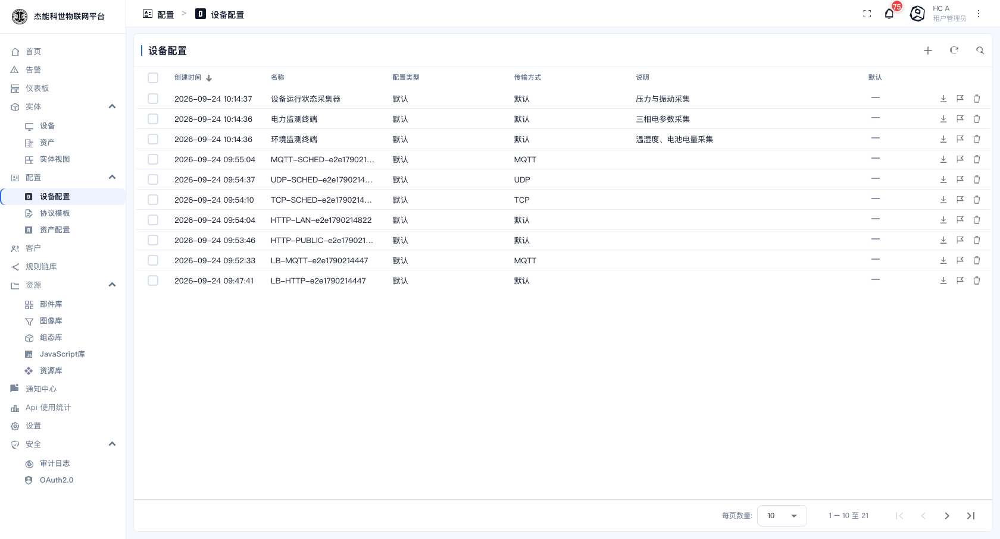
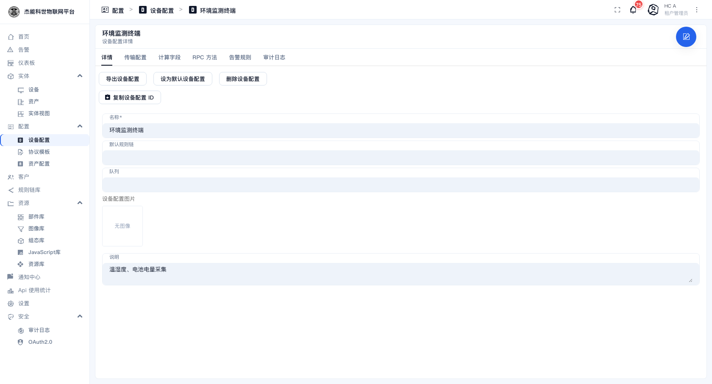
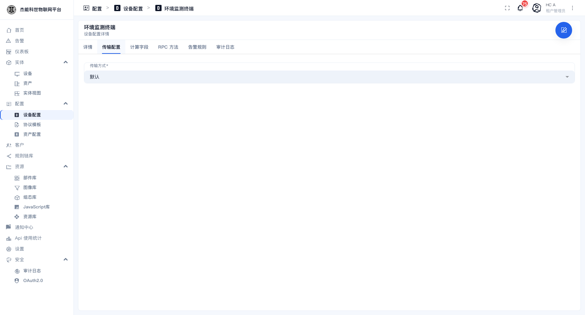
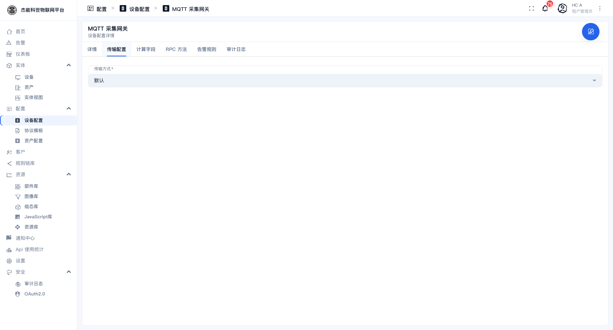
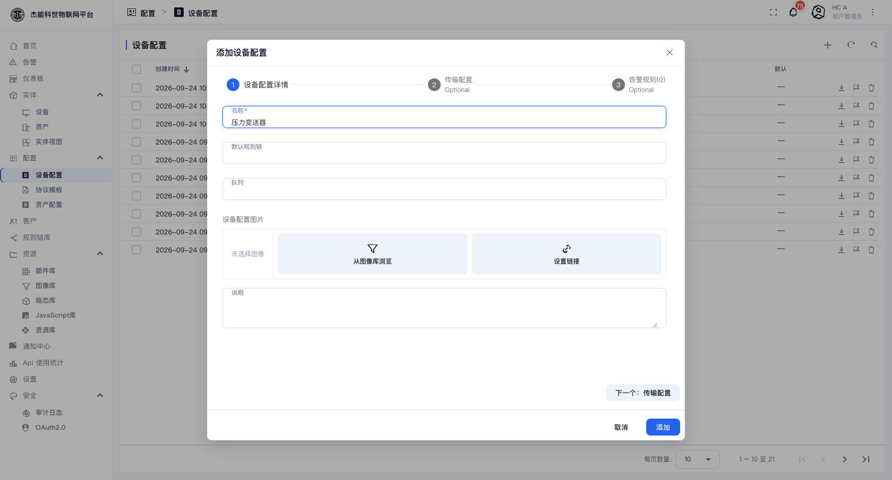
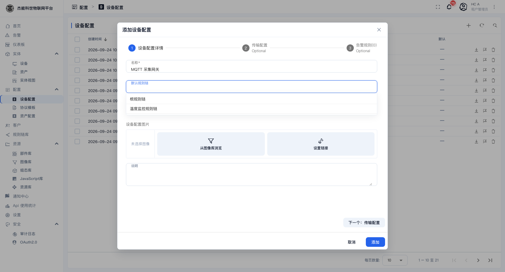
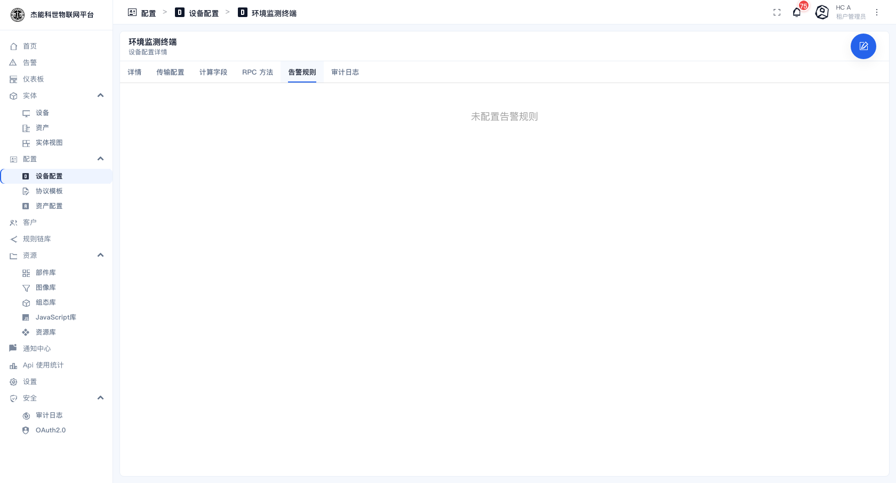
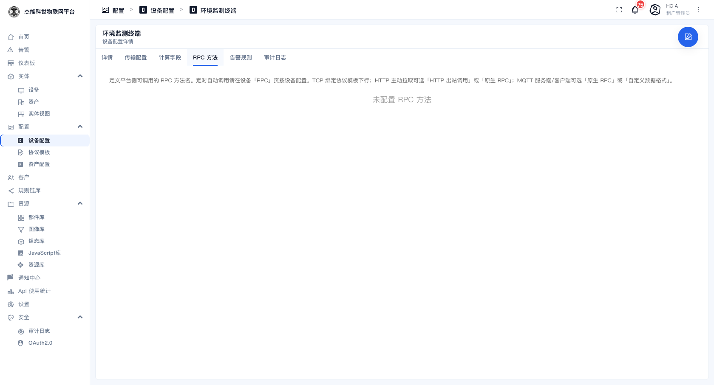

# 03-4 · 设备档案

**设备档案**（Device Profile）是设备的"模板"。它不存数据，但决定了挂在这个档案下的设备**怎么接入、怎么告警、能用哪些指令**。

```
设备档案「环境监测终端」
  ├── 传输方式：默认
  ├── 默认规则链：（留空，走根规则链）
  ├── 告警规则：temperature > 40 持续 0 秒 → 危险
  ├── 计算字段：power = voltage * current
  └── RPC 方法：reboot
        ↑ 被下面这些设备共享
  ├── 温度传感器-车间A
  ├── 温度传感器-车间B
  └── 温湿度传感器-仓库1
```

**改了档案 = 改了它下面所有设备的行为。** 这是档案最大的价值，也是最大的风险。

## 设备档案列表

菜单：**配置 → 设备配置**



| 列 | 说明 |
|---|---|
| 创建时间 / 名称 / 说明 | — |
| **配置类型** | 见下节 |
| **传输方式** | 该档案的设备用什么协议接入 |
| **默认** | 打勾 = 新建设备时默认选中的档案。**只能有一个** |

行内动作：导出、设为默认、删除。

> **`default` 这个档案不能删**，也不建议改传输方式 —— 平台内部有逻辑依赖它。

点一行进入档案详情：



## 页签逐个说明

档案详情有六个页签：`详情 / 传输配置 / 计算字段 / RPC 方法 / 告警规则 / 审计日志`。

### 详情

档案本身的信息，字段只有这几项：

| 字段 | 说明 |
|---|---|
| **名称** | 档案名 |
| **默认规则链** | 该档案的设备上报数据先进入哪条规则链。**留空 = 用租户的根规则链** |
| **队列** | 该档案的设备消息走哪个内部队列。**留空用默认**，一般不用改 |
| **配置类型** | `默认` 或 `设备档案`。绝大部分场景用「默认」 |
| **设备配置图片** | 该档案在列表/详情里显示的缩略图 |
| **说明** | 自由文本 |

操作按钮：

| 按钮 | 作用 |
|---|---|
| **导出设备配置** | 导出该档案为 JSON，用于跨环境迁移或备份 |
| **设为默认设备配置** | 把该档案设为"新建设备时默认选中"。**一个租户只能有一个默认档案** |
| **删除设备配置** | 删除。**挂着设备的档案删不掉**，要先处理那些设备 |
| **复制设备配置 ID** | 复制 UUID |

### 传输配置



**传输方式**决定这个页签里能配什么：

| 传输方式 | 含义 | 传输配置里还要配 |
|---|---|---|
| **默认** | 不限协议，设备可以用任意一种接入 | 只有"传输方式"一项 |
| **MQTT** | 只允许 MQTT 接入 | MQTT 的端口与凭证方式 |
| **HTTP / CoAP / LWM2M / SNMP** | 对应协议 | 各自的参数 |
| **TCP / UDP** | 自定义字节流协议 | **必须绑定一个[协议模板](06-协议模板.md)** |

**「默认」与具体协议的区别**：选「默认」时平台不做协议校验，设备用 HTTP 也行、用 MQTT 也行；选了具体协议后，用别的协议接入会被拒绝。**生产上建议选具体协议**，能尽早发现接错。

选 MQTT 时的传输配置长这样：



新建时的对话框里就能选传输方式：





### 告警规则



不用写规则链就能配的简单告警。没配过时显示"未配置告警规则"。每条规则包含：

| 字段 | 说明 |
|---|---|
| **严重程度** | 危险 / 重要 / 次要 / 警告 / 不确定 |
| **键** | 监控哪个遥测或属性键，如 `temperature` |
| **条件** | 比较运算：大于 / 小于 / 等于 / 不等于… |
| **阈值** | 比较的目标值，如 `40` |
| **持续时间** | 条件持续多久才产生告警（秒）。填 `0` = 立即触发 |
| **告警类型** | 告警显示的类型名 |

**「持续时间」是防误报的关键**：填 `300` 表示"温度连续 5 分钟超过 40 才告警"，能滤掉瞬间的毛刺。填 `0` 的话，一次抖动就报警。

> 这里配的规则生成的是标准告警，和规则链里创建的一样，都会进 [告警列表](../07-告警.md)。

### 计算字段

由已有遥测派生出的新字段。这是一个**可增删的列表**（列：创建时间 / 名称 / 类型 / 表达式），点 `+` 添加：

| 计算字段 | 表达式 |
|---|---|
| `power` | `voltage * current` |
| `temperatureF` | `temperature * 9 / 5 + 32` |

派生出的字段会像普通遥测一样存储、可以在仪表盘上使用。适合"设备只上报原始量，平台算出业务量"的场景。

### RPC 方法



定义平台可以向该档案下的设备下发的指令名（如 `reboot`）。空态下平台会提示适用范围：

> 定义平台侧可调用的 RPC 方法名。定时自动调用请在设备「RPC」页按设备配置。TCP/UDP 每条方法可选「协议模板下行」或「自定义 JSON」；HTTP 主动拉取可选「HTTP 出站调用」或「原生 RPC」；MQTT 服务端/客户端可选「原生 RPC」或「自定义数据格式」。

配好之后：

- 设备详情页的 **RPC** 页签里会出现这些按钮
- 仪表盘的「按钮」部件可以通过"发送 RPC 请求"动作触发它们

**RPC 需要设备端配合实现**。设备不响应的话，界面上点了没有反应 —— 见 [14-设备接入指南](../14-设备接入指南.md)。

### 审计日志

谁在什么时候改过这个档案。见 [10-4 审计日志](../10-安全设置/04-审计日志.md)。

> **本版本的档案详情里没有"属性与遥测"配置页签** —— 即不能在这个界面里设置"哪些键不保存""遥测保留多少天"。这类数据保留策略由部署方在服务端配置。

## 什么时候该建新档案

| 情况 | 处理 |
|---|---|
| 设备的接入协议不同 | **建新档案** |
| 设备的告警阈值不同 | **建新档案**（阈值在档案里） |
| 只是设备位置/编号不同 | 不用建，用同一档案 + 不同的设备名 |

**建新档案的判断标准**：**传输方式**或**告警规则**不同，就建新的。这两个是档案的主要区分维度。

## 改档案的影响面

| 改了什么 | 影响 |
|---|---|
| 告警规则 | 立即对该档案下所有设备生效 |
| 传输方式 | 挂在档案下的设备可能立刻连不上 —— **最危险的一项改动** |
| 默认规则链 | 数据流向改变，可能导致数据不再入库 |
| 名称 | 如果被规则链按名引用会失效 |

> **改传输方式与默认规则链之前，先导出档案备份，并确认影响多少台设备。** 这两项改错会让一批设备同时失联。

---

上一章：[03-实体视图](03-实体视图.md) · 下一章：[05-资产档案](05-资产档案.md)
