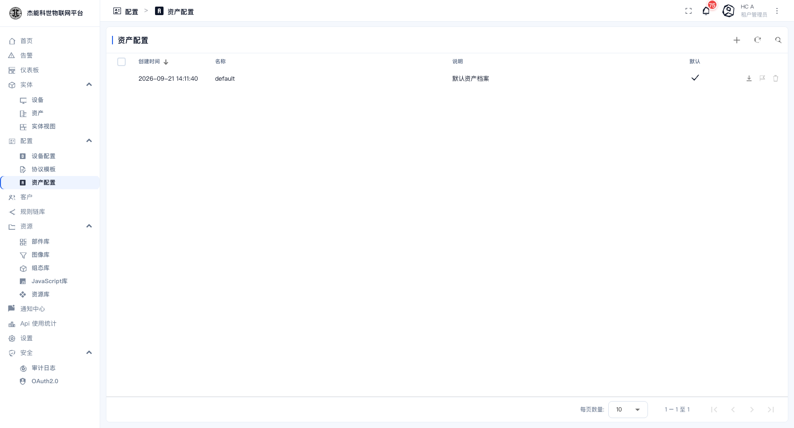
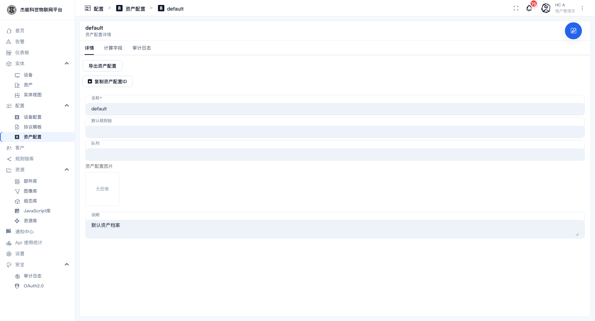

# 03-5 · 资产档案

**资产档案**（Asset Profile）是资产的模板。它比[设备档案](04-设备档案.md)简单得多 —— 资产不直连平台，所以没有传输配置。

```
资产档案「default」
  ├── 默认规则链：（留空）
  ├── 计算字段：（可加，如 area * 单价）
  └── 说明：默认资产档案
        ↑ 被下面这些资产共享
  ├── 一号厂房
  ├── 二号厂房
  └── 仓库区
```

## 资产档案列表

菜单：**配置 → 资产配置**



| 列 | 说明 |
|---|---|
| 创建时间 / 名称 / 说明 | — |
| **默认** | 打勾 = 新建资产时默认选中。**只能有一个** |

平台自带一个名为 `default` 的档案（说明是"默认资产档案"）。多数场景一个档案就够用了。

## 资产档案详情

点一行进入：



页签只有三个：`详情 / 计算字段 / 审计日志`。

### 详情

| 字段 | 说明 |
|---|---|
| **名称** | 档案名 |
| **默认规则链** | 该档案的资产相关消息走哪条规则链。**留空 = 用根规则链**，一般不用设 |
| **队列** | 内部队列。**留空用默认** |
| **资产配置图片** | 缩略图 |
| **说明** | 自由文本 |

操作按钮：

| 按钮 | 作用 |
|---|---|
| **导出资产配置** | 导出为 JSON |
| **复制资产配置ID** | 复制 UUID |

> 「设为默认」与「删除」只对**非内置**的档案出现。平台自带的 `default` 不能删，也**不要改名** —— 系统里有按名判断的默认档案逻辑。

### 计算字段

与设备档案同理：从资产的属性或关联数据派生出新字段。例如按面积算分摊：

| 计算字段 | 表达式 |
|---|---|
| `loadPerArea` | `total_power / area` |

### 审计日志

谁改过这个档案。见 [10-4 审计日志](../10-安全设置/04-审计日志.md)。

## 与设备档案的对比

| | 设备档案 | 资产档案 |
|---|---|---|
| 传输配置 | 有（协议、凭证） | **没有** |
| 告警规则 | 有 | **没有** —— 资产的告警请在规则链里配 |
| 计算字段 | 有 | 有 |
| 默认规则链 | 有 | 有 |
| 典型数量 | 按协议/告警维度，可能十几个 | 通常 1~3 个 |

**为什么资产没有告警规则**：资产自己不上报数据，没有"某个键越界"这种直接条件。资产的告警通常基于它下面设备的汇总值，逻辑要写在[规则链](../06-规则引擎/01-规则链.md)里。

## 什么时候需要多个资产档案

多数项目**一个 `default` 就够**。需要新建的情况：

| 情况 | 处理 |
|---|---|
| 不同类别的资产要用不同规则链处理 | 建新档案，各自指定默认规则链 |
| 需要一个自定义的计算字段只对某类资产生效 | 建新档案 |
| 只是分类（厂房 / 产线 / 车辆） | **不用建档案** —— 用资产的 `type` 字段或标签区分即可 |

---

上一章：[04-设备档案](04-设备档案.md) · 下一章：[06-协议模板](06-协议模板.md)
