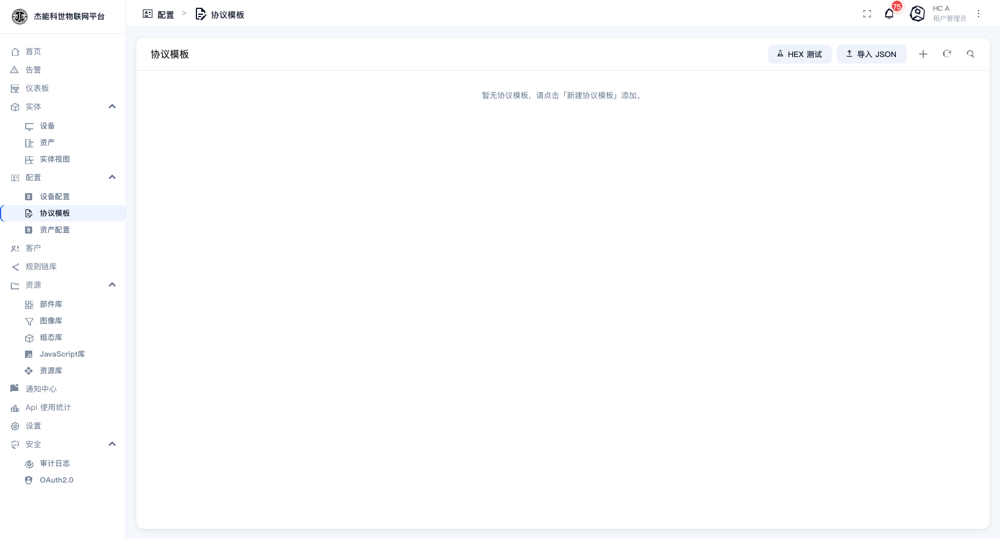
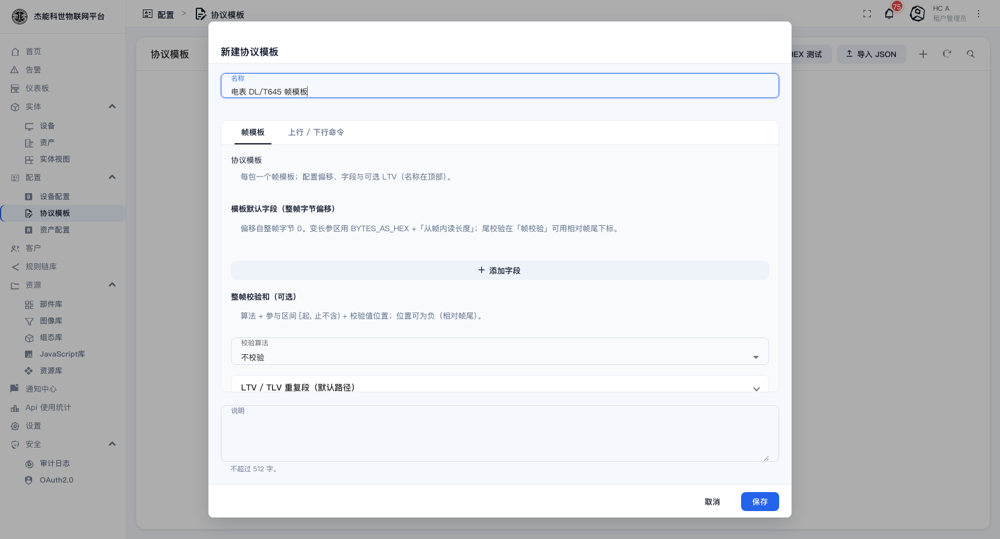
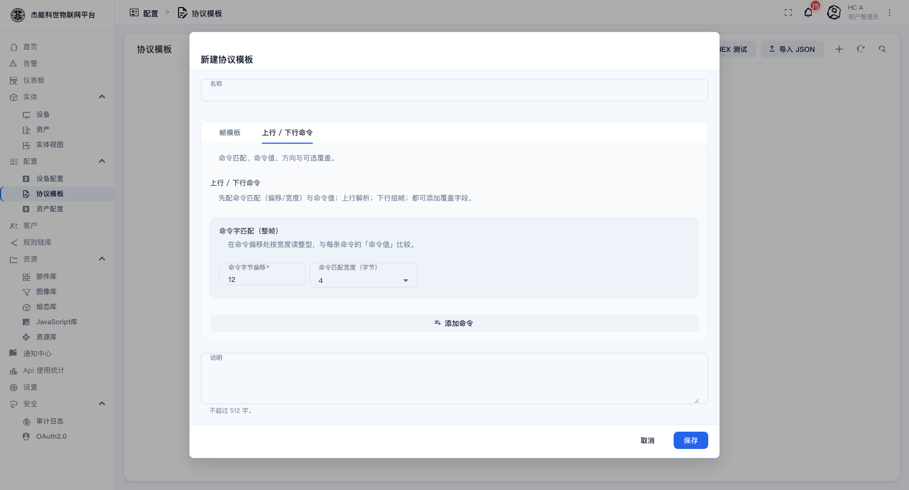

# 03-6 · 协议模板

**协议模板**是给**自定义字节流协议**准备的解析器。

TCP / UDP 这类连接上传过来的是**一串裸字节**，平台不知道哪几个字节是温度、哪几个是状态。协议模板就是"翻译规则"：告诉平台从第几个字节开始、取多长、按什么类型解释、怎么校验。

```
设备发出：  AA 55 02 00 1D 8C 3F
             帧头   长度 温度  CRC

协议模板：帧头 = AA55，长度在第 3 字节，
         温度在第 4~5 字节（大端，×0.1），尾部 2 字节是 CRC16
              ↓ 平台解析
平台收到：  temperature = 23.6
```

**没有协议模板，TCP/UDP 设备收不到任何数据。**

## 协议模板列表

菜单：**配置 → 协议模板**



页面顶部的两个按钮很实用：

| 按钮 | 作用 |
|---|---|
| **HEX 测试** | 粘贴一段十六进制报文，按当前模板试解析，直接看结果。**调模板时用它验证，比真发数据快得多** |
| **导入 JSON** | 从 JSON 导入模板 |
| `+` | 新建模板 |

列表为空时会给出提示："暂无协议模板、请点击「新建协议模板」添加。"

## 新建协议模板

点 `+` 打开新建对话框：



对话框顶部有两个页签：

| 页签 | 配什么 |
|---|---|
| **帧模板** | 上行/下行报文的字节结构 |
| **上行 / 下行命令** | 命令码与对应的处理 |



### 帧模板

| 区块 | 填什么 |
|---|---|
| **名称** | 模板名，如 `电表 DL/T645 帧模板` |
| **模板默认字段（整帧字节偏移）** | 定义每个字段从帧内第几个字节开始、类型、长度。**这是模板的主体** |
| **整帧校验和（可选）** | 校验算法 + 参与区间 `[起, 止不含)` + 校验值位置 |
| **LTV / TLV 重复段** | 变长参数区（默认路径） |
| **说明** | 不超过 512 字 |

界面上给出的几条关键提示：

- **偏移自整帧字节 0 算起。**
- 变长参区用 `BYTES_AS_HEX` +「从帧内读长度」。
- **尾校验在「帧校验」里可用相对帧尾下标**（比如"-2"表示倒数第 2 个字节）。
- 校验值位置**可以为负**，表示相对帧尾。

### 整帧校验和

| 项 | 说明 |
|---|---|
| **算法** | 不校验 / 常见校验算法（如 CRC16、累加和等） |
| **参与区间** | `[起, 止不含)`，从帧内哪个字节算到哪个字节 |
| **校验值位置** | 校验结果在帧里的位置，可为负（相对帧尾） |

**配错校验的表现**：所有报文都被判为非法，平台一条数据都不解析。调试时可以先临时把校验设为"不校验"确认字段解析对不对，再回头调校验。

## 怎么用起来

协议模板本身不生效，必须**绑定到设备档案**：

1. 建一个传输方式为 **TCP** 或 **UDP** 的设备档案。
2. 在档案的**传输配置**里选定刚建的协议模板。
3. 建一台设备，选这个档案。
4. 设备按模板约定的格式往平台的 TCP/UDP 端口发字节流。

详见 [03-4 设备档案](04-设备档案.md) 与 [14-设备接入指南](../14-设备接入指南.md)。

**一个模板可以绑到多个档案**；一个档案只能绑一个模板（TCP 和 UDP 各一个）。

## 调模板的正确顺序

| 步骤 | 做什么 |
|---|---|
| 1 | 抓一段设备的真实报文，转成十六进制 |
| 2 | 打开「HEX 测试」，粘贴进去，按预期逐字节对 |
| 3 | 先不配校验，只调字段偏移与类型，直到每个字段的值都对 |
| 4 | 再配上校验，用同一段报文验证能通过 |
| 5 | 多抓几段不同长度的报文（变长帧最容易出错） |
| 6 | 绑定到档案，用真实设备验证 |

**第 5 步最容易漏**：只拿一段报文调通，遇到长度不同的帧就解析错位。

## 常见问题

| 现象 | 原因 |
|---|---|
| 平台完全没数据 | 档案里没绑模板，或设备连的端口不对 |
| 有数据但字段全是错的值 | 偏移算错了（注意是从 0 还是从 1 开始数）、大小端反了、没乘缩放系数 |
| 时好时坏 | 变长帧的长度字段没配对；或粘包/半包没处理 |
| 校验永远不过 | 校验算法或参与区间不对；校验值位置写成了正数但实际在帧尾 |
| 改完模板不生效 | 绑定的档案没重新保存；或设备还在用旧格式发 |

> **改模板会影响所有绑定它的档案和设备。** 生产环境上改模板前，先确认有多少设备在用，并准备好回滚（导出 JSON 备份）。

---

上一章：[05-资产档案](05-资产档案.md) · 下一章：[04-客户与用户](../04-客户与用户.md)
