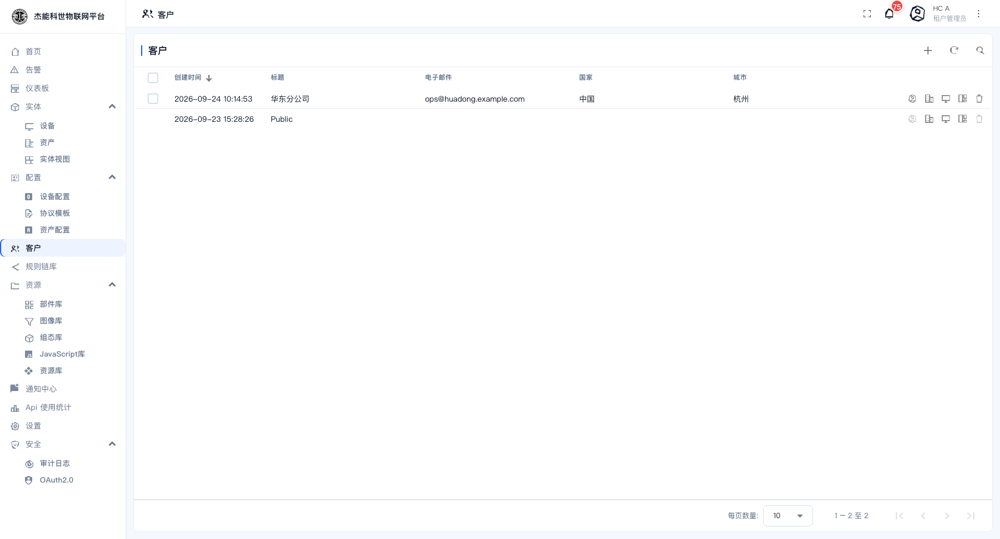
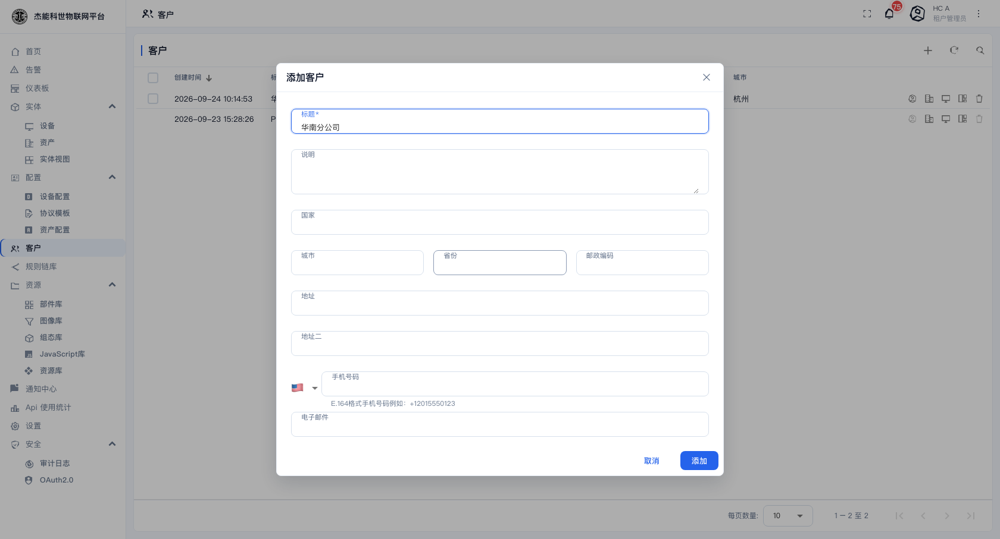
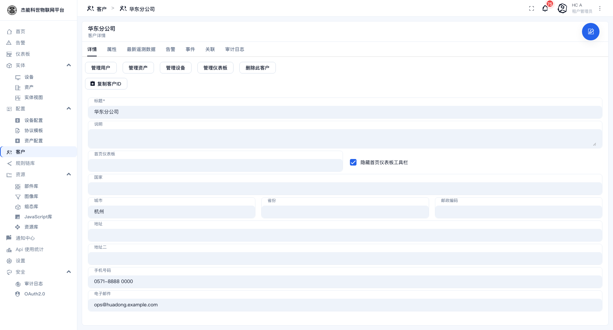
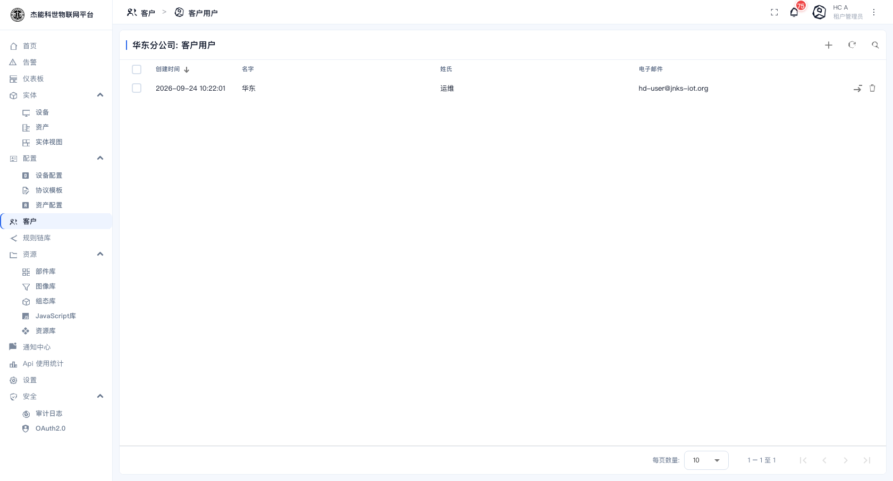
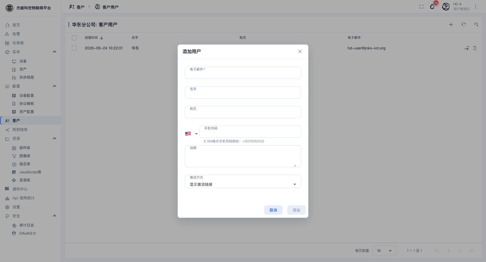

# 04 · 客户与用户

## 三个概念先分清

| 概念 | 是什么 | 例子 |
|---|---|---|
| **用户** | 一个能登录的账号 | `hc-admin@jnks-iot.org` |
| **角色** | 用户的权限级别 | 租户管理员 / 客户用户 |
| **客户** | 租户内部的一级组织，管"数据归谁" | `华东分公司` |

一个**客户**下面可以挂：若干**用户**、若干**设备**、若干**资产**、若干**仪表盘**。

客户用户登录后，**只能看到被分配给本客户的那些东西**。这是平台做数据隔离的主要手段（另一层隔离是**租户**，租户之间完全看不见彼此）。

## 客户列表

菜单：**客户**

| 列 | 说明 |
|---|---|
| 创建时间 | — |
| 标题 | 客户名 |
| 电子邮件 / 国家 / 城市 | 联系信息 |
| 行内动作 | 见下表 |

每行最右侧的图标按钮：

| 图标 | 名称 | 作用 |
|---|---|---|
| 📷 | 管理仪表板 | 把仪表盘分配给该客户 |
| 💻 | 管理设备 | 把设备分配给该客户 |
| 🗄 | 管理资产 | 把资产分配给该客户 |
| 👤 | 管理用户 | 新建/删除该客户下的用户 |
| 🗑 | 删除 | 删除客户 |

> 平台自带一个 **`Public`** 客户，无法删除。它是"未分配"数据的默认归属。**不要把业务数据挂在 Public 下** —— 它没有隔离意义。

## 新建客户

点 `+` → **添加客户**：

| 字段 | 必填 | 说明 |
|---|---|---|
| **标题** | 是 | 客户名 |
| **国家 / 城市 / 州省 / 邮编** | 否 | 地址信息，国家是个下拉 |
| **邮箱 / 电话** | 否 | 联系方式 |
| **描述** | 否 | 自由文本 |

## 客户详情

点一行进入客户详情：

页签：`详情 / 属性 / 最新遥测数据 / 告警 / 事件 / 关联 / 审计日志`。

操作按钮：

| 按钮 | 作用 |
|---|---|
| **管理用户** | 打开该客户的用户列表 | 
| **管理资产** | 把资产分配/取消分配给该客户 |
| **管理设备** | 把设备分配/取消分配给该客户 |
| **管理仪表板** | 把仪表盘分配/取消分配给该客户 |
| **删除此客户** | 删除客户。**它下面的数据不会被删**，只是解除归属 |
| **复制客户ID** | 复制 UUID |

### 分配数据的两种做法

有两种方式把设备/资产/仪表盘给客户，效果一样：

1. **从客户出发**：客户详情 →「管理设备」→ 勾选设备。适合"一次性把一批东西交给某个客户"。
2. **从实体出发**：在设备/资产/仪表盘的列表行内点「分配给客户」，或进详情页点同名按钮。适合"给某一台设备指定客户"。

分配后，客户用户的列表里就会出现这些实体。**取消分配**用同样的入口反选即可。

## 客户用户

点客户详情里的「管理用户」：

这打开了**该客户下的用户列表**（页面路径变成 `客户 › 客户用户`）。列表列为：创建时间、名字、姓氏、电子邮件。

### 新建客户用户

点 `+`：

| 字段 | 必填 | 说明 |
|---|---|---|
| **电子邮件** | 是 | 登录账号，也用于接收激活邮件 |
| **名字 / 姓氏** | 否 | 显示名 |
| **手机号码** | 否 | 左侧旗帜选国家区号，号码用 E.164 格式，如 `+8613800138000` |
| **说明** | 否 | 自由文本 |
| **激活方式** | 是 | 见下 |

**激活方式**有三个选项，决定了新用户第一次怎么设置密码：

| 选项 | 行为 |
|---|---|
| **显示激活链接** | 不发送邮件，建好后直接给出激活链接，由你手工转给用户。**本地没配邮件服务时选这个** |
| **发送激活邮件** | 向该邮箱发一封激活邮件（需要在 [11-系统设置](11-系统设置.md) 里配好发件邮箱） |
| **使用密码** | 建号时直接指定密码，跳过激活流程 |

### 激活链接

选「显示激活链接」建完用户后，**用户列表里行末会出现一个取链接的动作按钮**，点它即可复制激活链接。用户打开该链接、设置密码后，账号才可用。

**未激活的用户登录会失败**，提示 `User account is not active`。

> 激活链接有有效期。过期后需要重新生成 —— 在用户列表里再点一次那个动作按钮即可（会签发新的链接）。

## 租户管理员自己

租户管理员账号由系统管理员创建（见 [12-租户与租户档案](12-租户与租户档案.md)）。租户管理员不能新建或删除同级账号，但可以在用户菜单里改自己的姓名、手机号与邮箱。

## 权限速查

| 操作 | 系统管理员 | 租户管理员 | 客户用户 |
|---|---|---|---|
| 建客户 | ✗ | ✓ | ✗ |
| 建租户管理员 | ✗ | ✗（由 sysadmin 建） | ✗ |
| 建客户用户 | ✓ | ✓ | ✗ |
| 分配设备/仪表盘给客户 | ✓ | ✓ | ✗ |
| 看到别的客户的数据 | ✓ | ✓ | ✗ |

---

上一章：[03-实体视图](03-实体管理/03-实体视图.md) · 下一章：[05-1 仪表盘管理](05-仪表盘/01-仪表盘管理.md)
