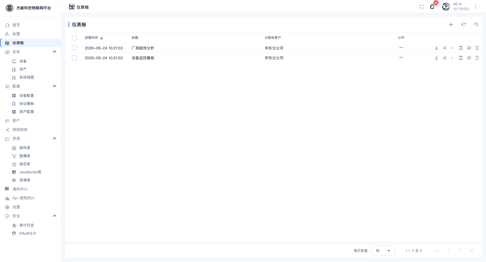
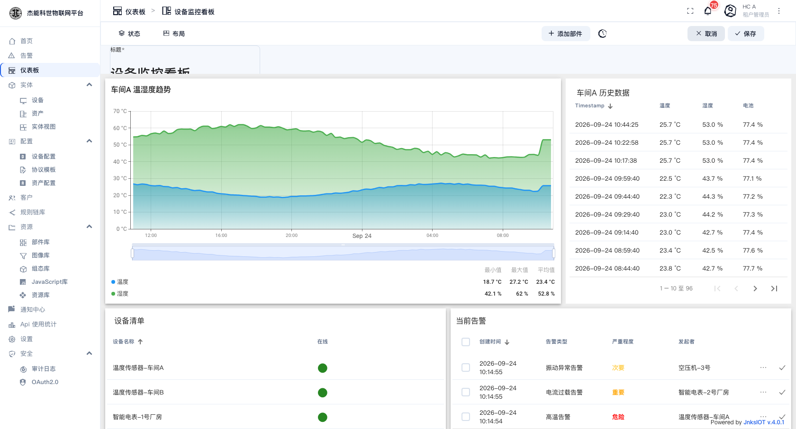
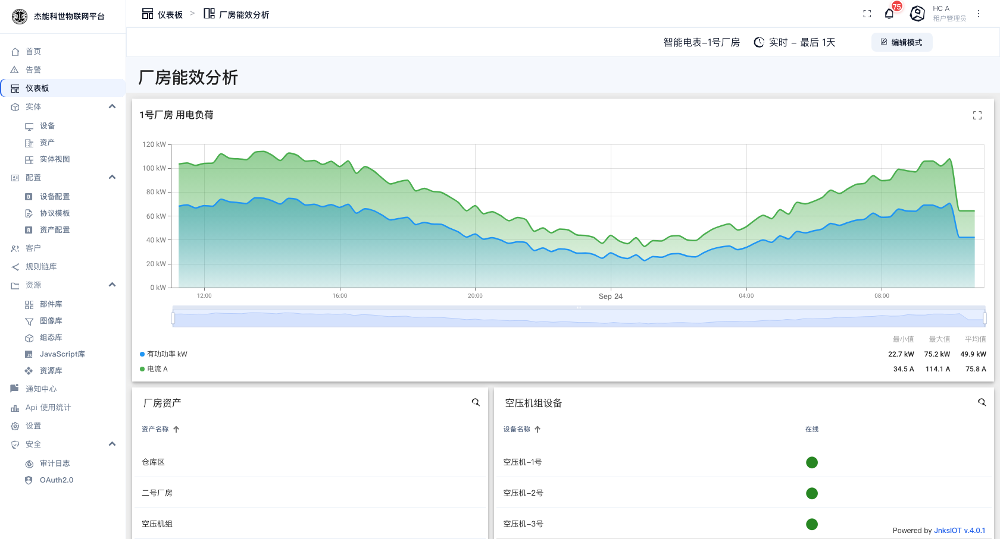
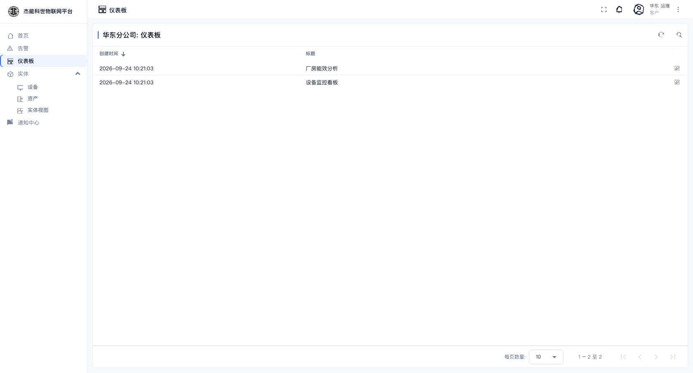

# 05-1 · 仪表盘管理

**仪表盘**是数据的展示层：把设备上报的遥测、属性、告警，用图表、表格、卡片呈现出来。一个仪表盘由若干个**部件**（widget）拼成，部件的位置和大小自由拖拽。

```
仪表盘「设备监控看板」
  ├── 部件：车间A 温湿度趋势（时序图）
  ├── 部件：车间A 历史数据（表格）
  ├── 部件：设备清单（实体表）
  └── 部件：当前告警（告警表）
```

部件内部怎么配，见 [05-2 仪表盘编辑器](02-仪表盘编辑器.md)；常见部件的用法见 [05-3 常用部件](03-常用部件.md)。

## 仪表盘列表

菜单：**仪表板**



| 列 | 说明 |
|---|---|
| 创建时间 / 标题 | — |
| 分配给客户 | 该仪表盘已经给了哪些客户；`—` 表示还没分 |
| 公开 | 勾选后**未登录的访客**也能打开（只读） |
| 行内动作 | 见下 |

行内动作：

| 图标 | 名称 | 作用 |
|---|---|---|
| ⬇ | 导出 | 把仪表盘导出成 JSON 文件 |
| ⟨ | 分配给客户 | 指定归属客户 |
| ⧉ | 复制仪表盘 ID | 复制 UUID |
| 🗝 | 管理凭证 | 公开时需要，见下节 |
| ✏ | 编辑 | 打开该仪表盘的详情编辑（标题、说明、图片） |
| 🗑 | 删除 | 删除 |

## 新建仪表盘

点 `+`，菜单里有两个选项：

- **创建仪表板** —— 建一个空白仪表盘
- **导入仪表板** —— 从 JSON 文件导入（见下节）

选「创建仪表板」：


| 字段 | 必填 | 说明 |
|---|---|---|
| **标题** | 是 | 仪表盘名 |
| **说明** | 否 | 备注，会显示在仪表盘信息里 |
| **已分配的客户** | 否 | 直接指定归属客户 |
| **在移动端应用中隐藏仪表板** | 否 | 勾上后手机 App 里不显示 |
| **移动端应用中的仪表板排序** | 否 | 数字，越小越靠前 |
| **仪表板图片** | 否 | 缩略图。可以「从图像库浏览」挑一张，或「设置链接」填外链 |

建好后点「添加」，进入空仪表盘。此时是**只读态**，点右上角的「编辑模式」才能加部件。

## 查看与编辑

在列表里点一行标题，打开仪表盘：


这是只读态。顶部的工具条提供：

| 控件 | 作用 |
|---|---|
| 实体选择器（如 `温度传感器-车间A`） | 切换仪表盘当前"关注"的实体。部件里用了"状态实体"别名的地方会跟着变 |
| **时间窗口**（如 `实时 - 最后 1天`） | 切换数据的时间范围。可选实时/历史、最后 N 分钟/小时/天，也可以选固定区间 |
| **编辑模式** | 进入编辑态 |

点「编辑模式」后，工具条换成编辑专用的按钮：



| 控件 | 作用 |
|---|---|
| **状态 / 布局** | 在"按状态编辑"与"按布局摆放"之间切换。多状态仪表盘用前者，普通仪表盘用后者 |
| **添加部件** | 打开部件库挑选部件 |
| **时间窗口**（时钟图标） | 设置这个仪表盘**默认**的时间范围 |
| **取消 / 保存** | 放弃或提交本次改动 |

**编辑态下拖拽部件**：拖标题栏移动位置，拖右下角改变大小。改完必须点「保存」，否则刷新就丢。

第二个演示看板「厂房能效分析」是同一套做法做出来的：



## 导入与导出

**导出**：列表行内的导出图标，得到一个 JSON 文件。导出内容包含仪表盘的**全部部件配置、别名定义、布局**。

**导入**：`+` →「导入仪表板」，选 JSON 文件，填新的标题。

导入导出的用途：

| 场景 | 做法 |
|---|---|
| 在测试环境调好，搬到生产 | 从测试导出，到生产导入 |
| 给别的租户复制一套看板 | 导出后到目标租户导入 |
| 备份 | 定期导出留档 |

> **导入不会带上数据**。部件里引用的设备/资产别名在目标环境里要重新指认 —— 如果目标环境没有同名实体，图表会是空的。

## 设为首页与公开分享

| 需求 | 做法 |
|---|---|
| 登录后直接进某个仪表盘 | 设置为**首页仪表盘** —— 菜单「设置」→「首页」页 → 选择 → 保存。详见 [02-首页](../02-首页.md#把首页换成自己的仪表盘) |
| 让客户看到 | 「分配给客户」。客户用户登录后在**仪表板**菜单里看到它 |
| 让未登录的人看 | 行内「公开」图标打开开关。之后任何人拿到该仪表盘的链接都能只读打开 —— 适合车间大屏、对外展示页 |

> **公开是有风险的**：公开仪表盘上的所有数据（包括设备名、位置、告警）都对外可见，不需要登录。只公开确实可以公开的看板。

## 分配给客户后的效果

客户用户登录后，仪表板菜单里只有分配给本客户的仪表盘；打开后：

- 部件里用"状态实体"别名的地方，实体选择器只列出**本客户的实体**。
- 想显示本客户之外的数据是做不到的 —— 别名解析时会按客户过滤。



---

上一章：[04-客户与用户](../04-客户与用户.md) · 下一章：[02-仪表盘编辑器](02-仪表盘编辑器.md)
