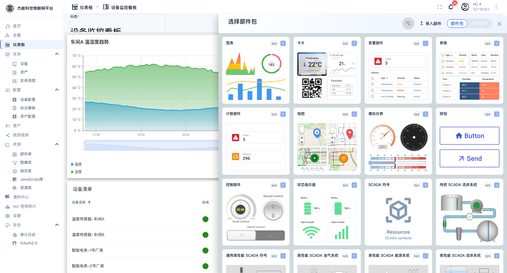

# 05-3 · 常用部件

平台自带 **680 个**部件，分布在十几个部件包里。实际项目里常用的就那么十来个，这一章按"要解决什么问题"来介绍它们怎么配、怎么读。

挑选部件时记住一条：**先想清楚"要展示一个数、一条曲线、还是一张表"，再去找对应包**。

## 展示一个最新值 → 卡片包

数据是在变的单个值（当前温度、今日电量、在线设备数）用**卡片**。

| 部件 | 长相 | 关键设置 |
|---|---|---|
| **最新值**（Latest value） | 一个大数字 + 单位 | 数据键、单位、小数位、阈值变色 |
| **HTML 值卡片** | 自定义 HTML | 需要自己写 HTML 模板，灵活但门槛高 |
| **计数部件** | "共 N 台" | 数据源类型选"实体计数"，过滤条件用别名 |

**阈值变色**是卡片最实用的功能：给数据键配几条阈值，超过就变红/变黄，值班人员一眼就能看出异常。

> 卡片上的数字是**最后一次上报的值**，不是实时计算出来的。设备 3 小时没上报，卡片就显示 3 小时前那个值。**看到"数字不动"先查设备是否还在上报**，别怀疑卡片坏了。

## 展示一条趋势 → 图表包

随时间变化的量用**时序图**（`图表` 包里的第一个）。

配置要点：

| 项 | 说明 |
|---|---|
| **数据源** | 选别名 + 数据键。可以多个别名、多个键画在一张图上 |
| **Y 轴** | 量纲不同的键（温度 ℃ 与湿度 %）要么分左右轴，要么拆成两张图 |
| **图例** | 默认在下方，显示每个键的当前值/最小值/最大值/平均值 |
| **聚合** | 数据点密时按分钟/小时聚合。**长时间跨度的图必须开聚合**，否则浏览器会卡 |
| **堆叠** | 把多个键叠起来看总量 |
| **阈值线** | 在图上画一条水平参考线（如"警戒温度 40℃"） |
| **缩放（Data zoom）** | 图下方那条可以拖动的时间选择条 |

**读图技巧**：图下方的拖拽条可以缩放时间范围；点图例里的键名可以临时隐藏/显示某条线。

## 展示一批实体 → 表格包

| 部件 | 用途 |
|---|---|
| **实体表** | 列出符合条件的实体（设备清单、资产清单），可配列、可搜索、可翻页 |
| **时序数据表** | 把某个实体的一段遥测铺成表格（时间 + 各键的值） |
| **告警表** | 告警列表，支持确认/清除/跳转 |

实体表的配置项：

| 项 | 说明 |
|---|---|
| 实体别名 | 列出哪些实体 |
| 列 | 每行显示哪些键（属性或遥测的最新值） |
| 列宽 / 默认可见性 | 列可以拖宽，也可以默认隐藏 |
| 单元格样式函数 | 用 JS 决定单元格的颜色/内容，比如"值为 true 显示绿点" |
| 行点击动作 | 点一行跳到该实体的详情页或其他状态 |

> 表格里"在线"这一列通常读的是设备的 `active` 属性，配合一个把 `true/false` 渲染成绿点/红点的单元格样式函数。见 [03-1 设备](../03-实体管理/01-设备.md)。

## 展示位置 → 地图包

设备带经纬度时，用**地图**部件在地图上打点。

前置条件：设备（或资产）上要有 `latitude` / `longitude` 属性。配好后：

- 地图上每个点是一台设备。
- 点标记可以弹出该设备的最新数据。
- 地图可以配静态底图（本平台默认用外部瓦片服务，**内网部署要换成自建瓦片或静态图片**）。

## 展示开关与表盘 → 仪表包 / 控制部件

| 部件 | 用途 |
|---|---|
| **模拟仪表** | 圆形表盘显示一个值，适合压力、转速 |
| **控制部件 → 开关 / 旋钮** | 显示一个布尔或数值，**并且能把值写回去** —— 需要配"更新属性/遥测"动作 |
| **状态指示器** | 电池电量、信号强度这类分段指示条 |

> **写回数据的部件要谨慎**：它会把值直接写进实体的属性。如果没有对应的规则链去处理，写了也不会下发到设备。这块要配合 [06-1 规则链](../06-规则引擎/01-规则链.md) 一起用。

## 展示告警 → 告警包

**告警表**是最常用的。配置项：

| 项 | 说明 |
|---|---|
| 告警来源 | 指定看哪些实体的告警（用别名） |
| 列 | 创建时间、类型、严重程度、状态、发起者、受托人 |
| 操作 | 是否允许在表里直接**确认**、**清除**、**指派** |
| 默认筛选 | 只显示激活的 / 全部（含已清除的历史） |

## 放一段说明文字 → 卡片包 / 静态部件

用 **HTML 卡片** 或 **Markdown** 部件可以放标题、操作说明、注意事项。首页上那些"设备/告警/仪表盘"区块就是用 HTML 卡片拼出来的。

## 部件调不好怎么办

| 现象 | 先查 |
|---|---|
| 图表一条线都没有 | 时间窗口太小；或别名的实体不存在（改名了/删了）；或键名写错 |
| 图卡在转圈 | 别名解析不出来（常见于导入的仪表盘在目标环境没有对应实体） |
| 数字不动 | 设备没在上报，不是部件问题 |
| 表格里是空的 | 实体表的数据源要选"实体"类型别名；选了"计数"类型就只有一行数 |
| 页面很卡 | 时间窗口太大且没开聚合；或一张图上挂了十几个键 |
| 中文全是方框 | 浏览器字体问题，与本平台无关 |

---

上一章：[02-仪表盘编辑器](02-仪表盘编辑器.md) · 下一章：[06-1 规则链](../06-规则引擎/01-规则链.md)
