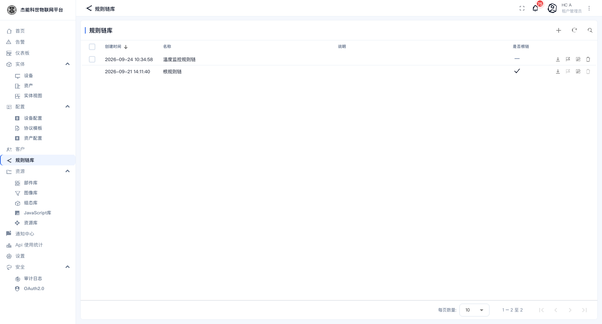
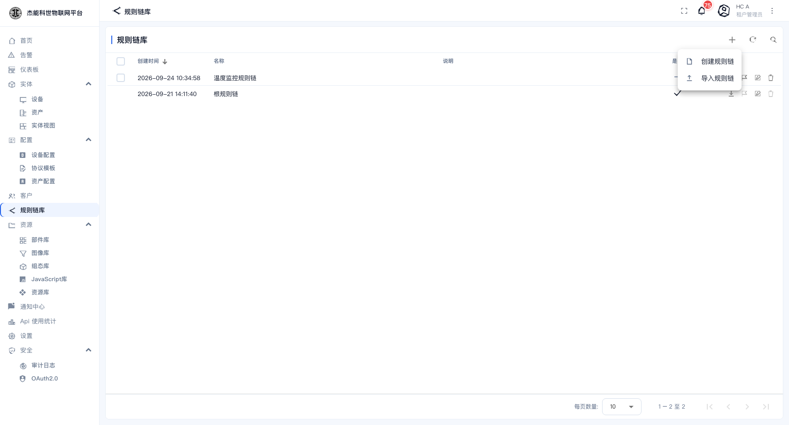

# 06-1 · 规则链

**规则链**是平台的"数据加工流水线"。设备上报的消息不会自动入库 —— 它先进入规则链，由链上的节点依次决定**这条消息要不要保存、要不要告警、要不要转发到别处**。

```
设备上报 {"temperature": 41.2}
      ↓
   规则链
   ├── 保存遥测数据      → 写进数据库，仪表盘才有数据
   ├── 高温判断（脚本）   → 41.2 > 40 ？
   ├── 创建高温告警      → 产生一条告警
   └── 发送告警通知      → 发到通知中心 / 邮件
```

**记住一条**：消息不经过规则链，平台里就什么都看不到。这是排查"设备连上了、事件里也有消息，但仪表盘空着"的关键 —— 见 [03-1 设备](../03-实体管理/01-设备.md#排查设备不出数据)。

## 根规则链与子规则链

| 类型 | 说明 |
|---|---|
| **根规则链** | 每个租户有且只有一条。所有设备上报的消息**默认**先进入它 |
| **子规则链** | 你自己建的链。通过「子规则链」节点被其他链调用，或指定给某个设备档案作为其专属链 |

**谁也进哪条链，由设备档案决定**：设备档案的「详情」里有"默认规则链"设置，没设就落到根规则链。所以"给某类设备单独一套处理逻辑"的正确做法是：建一条子链 → 在设备档案里指定它。

## 规则链列表

菜单：**规则链库**



| 列 | 说明 |
|---|---|
| 创建时间 / 名称 / 说明 | — |
| **是否根链** | 打勾的就是根规则链。一个租户里只能有一个 |

行内动作：

| 图标 | 名称 | 作用 |
|---|---|---|
| ⬇ | 导出 | 导出成 JSON |
| 🚩 | 设为根链 | 把这条链提升为根规则链。**要慎重**：原来根链的处理逻辑会立即失效 |
| ✏ | 编辑 | 打开规则链编辑器 |
| 🗑 | 删除 | 删除。**根链不能删**；被其他链引用的子链也不会被删 |

## 新建规则链

点 `+`：



| 字段 | 说明 |
|---|---|
| **名称** | 链名 |
| **说明** | 备注 |
| **是否根链** | 勾上就是根链（会替换现有根链） |
| **调试模式** | 打开后，链上每个节点处理的消息会记录调试事件 —— 见 [06-3 调试与排错](03-调试与排错.md)。**排查问题时打开，平时关掉**（会占存储） |

建好后会自动打开编辑器。**新链是空的，只有一个 Input 节点** —— 不接任何节点的话，走这条链的消息会被直接丢弃。

## 导入与导出

同仪表盘：导出成 JSON，可以在别的租户/环境导入。跨环境迁移规则链比迁移仪表盘靠谱得多，因为规则链不自带数据引用。

## 消息是怎么进来的：消息类型

从设备进来的消息带一个**消息类型**，规则链里通常第一个节点就是「消息类型分流」把它分开：

| 消息类型 | 含义 |
|---|---|
| **Post telemetry** | 上报遥测（随时间变化的数据） |
| **Post attributes** | 上报属性（客户端属性） |
| **RPC Request from Device** | 设备主动发起的 RPC 请求 |
| **RPC Request to Device** | 平台要下发给设备的 RPC（响应走这里回去） |
| **Connect event / Disconnect event / Activity event** | 设备上下线与活跃事件 |
| **Other** | 其他（自定义脚本发的消息等） |

分流节点的每条输出线对应一个类型。**没接线的输出 = 这类消息被丢弃**。这是新手最常踩的坑：只接了 `Post telemetry`，结果设备上报的属性一个都没存下来。

## 一条完整链长什么样

编辑器里打开演示链：


这条链做的事：

| 节点 | 类型 | 作用 |
|---|---|---|
| 输入 | Input | 消息入口（平台自动生成，不用配） |
| 消息类型分流 | 过滤 | 按消息类型分四路 |
| 保存遥测数据 | 动作 | 把 Post telemetry 的消息落库 |
| 保存属性 | 动作 | 把 Post attributes 的消息写成属性 |
| 高温判断 | 过滤（脚本） | 温度 > 40 走 True，否则 False |
| 创建高温告警 | 动作 | 产生一条"高温告警" |
| 发送告警通知 | 外部 | 通过通知渠道推送给相关人 |
| 记录其它消息 | 动作 | 把其余消息写进日志 |

连线上的文字是**输出标签**，节点的类型决定了它有哪些标签（分流节点是消息类型，过滤节点是 `True`/`False`，动作节点是 `Success`/`Failure`）。

## 什么时候需要动规则链

| 需求 | 要做什么 |
|---|---|
| 设备数据要能查 | 确认「保存遥测数据」节点接到了 Post telemetry |
| 加一个自定义告警条件 | 复制现有链，在保存节点后插一个「脚本过滤」+「创建告警」 |
| 数据要转发到第三方 | 插一个「REST API 调用」或「MQTT」节点 |
| 某类设备单独处理 | 建子链 → 在对应的**设备档案**里指定 |
| 上报的键名不规范，想统一 | 用「重命名键」或「脚本」节点改名后再保存 |

## 不要在生产上做的事

| 危险动作 | 后果 |
|---|---|
| 把现有根链删掉 | 根链不能删，但把它改成空链等于所有数据不入库 |
| 「设为根链」给一条空链 | 全平台数据流立即中断 |
| 在根链上打开调试模式且长期不关 | 调试事件会持续写入，占数据库 |
| 直接改正在被使用的子链 | 改动即时生效，没有"发布/回滚"概念 |

改规则链之前**先导出一份 JSON 备份**，这是唯一可靠的还原手段。

---

上一章：[05-3 常用部件](../05-仪表盘/03-常用部件.md) · 下一章：[02-规则链编辑器](02-规则链编辑器.md)
