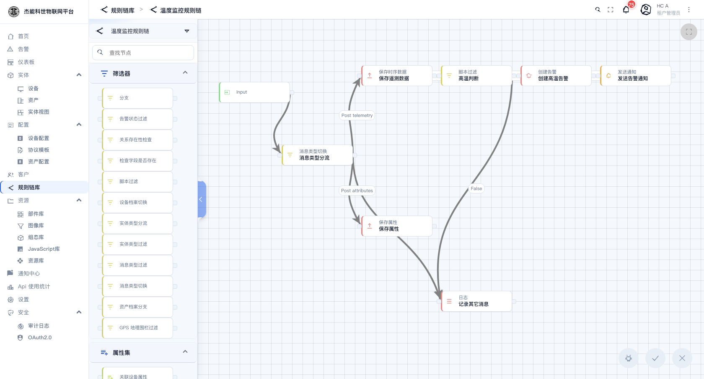
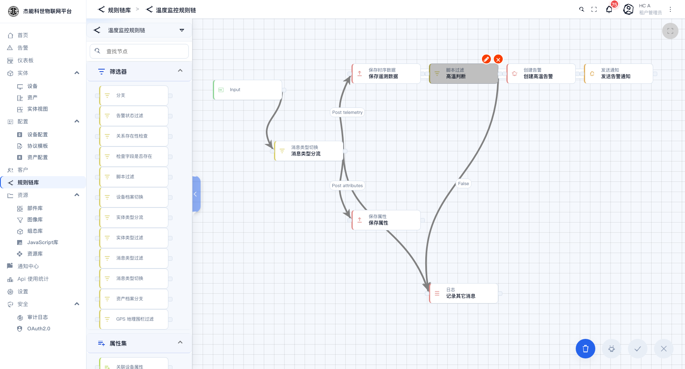

# 06-2 · 规则链编辑器

从规则链列表点一条链，就进入编辑器。



## 界面分三块

| 区域 | 位置 | 作用 |
|---|---|---|
| **节点库** | 左侧 | 全部可用的规则节点，按类别分组 |
| **画布** | 中间 | 节点与连线的摆放区，可缩放/平移 |
| **节点配置面板** | 双击节点后出现 | 配置该节点的参数 |

顶部左侧是链名与返回按钮；右上角有搜索（在画布上找节点）、全屏；右侧的 `⋮` 菜单里是链级别的操作（导出、设为根链、删除等）。

## 节点库

节点库按功能分成几组，展开后是具体的节点。常用的几组：

| 分组 | 代表节点 | 用途 |
|---|---|---|
| **筛选器** | 消息类型分流、脚本过滤、实体类型分流、设备档案切换、检查字段是否存在、告警状态过滤 | 决定消息往哪走 |
| **属性集 / 数据** | 来源方属性、来源方遥测、关联设备属性、租户详情 | 把额外数据补充进消息 |
| **转换** | 脚本、JSON 路径、重命名键、删除键、复制键、拆分数组、更改来源方 | 改消息的内容或来源 |
| **动作** | 保存遥测数据、保存属性、创建告警、清除告警、日志、RPC 调用请求、RPC 调用回复、分配给客户、创建关系、数学函数、生成器 | 产生副作用 |
| **外部** | REST API 调用、MQTT、Kafka、RabbitMQ、发送邮件、发送短信、发送通知、AWS / Azure / GCP 各类 | 把数据送到平台之外 |
| **流程** | 子规则链、检查点、确认、输出 | 控制流程结构 |

节点库顶部的**「查找节点」**输入框可以直接搜名称，比一层层展开快得多。

## 添加节点

把节点从左侧库**拖到画布**上。节点落到画布后：

- 顶部一行是**节点的类型图标 + 类型名**（如"脚本过滤"）
- 下面一行是**你给它起的名字**（如"高温判断"），双击可改

## 连线

节点左右两侧各有一个小圆点。**从上一个节点右侧的圆点拖到下一个节点左侧的圆点**，就连好了。

连线成功后线上会出现一个标签，标签名由**上一个节点的类型**决定：

| 上一个节点是 | 输出标签 |
|---|---|
| 消息类型分流 | `Post telemetry` / `Post attributes` / `RPC Request from Device` / `Other` … |
| 脚本过滤 / 各种过滤 | `True` / `False` / `Failure` |
| 动作节点 | `Success` / `Failure` |
| 设备档案切换 | 各个档案名 |

**同一个输出标签只能连一条线**。想同时走两个方向，得在中间加个节点。

## 配置节点

**双击节点**打开右侧的配置面板：



面板内容随节点类型而变，但结构一致：

| 部分 | 说明 |
|---|---|
| **常规** | 节点名称 |
| **参数** | 该节点自己的参数。例如"脚本过滤"是一个 JS 编辑器；"保存遥测数据"是 TTL 与处理策略；"创建告警"是告警类型、严重程度、是否传播 |
| **调试** | 是否记录调试事件（见 [06-3 调试与排错](03-调试与排错.md)） |
| **告警/失败处理** | 部分节点可配"失败时发通知" |

改完点面板底部的**保存**关闭。面板里还有**删除节点**按钮。

### 脚本节点怎么写

「脚本」与「脚本过滤」节点支持两种语言：

| 语言 | 特点 |
|---|---|
| **JS**（JavaScript） | 生态熟、示例多。**推荐** |
| **TBEL** | 平台自带的表达式语言，性能更好，语法类似 Java |

JS 里可用的对象：

| 变量 | 内容 |
|---|---|
| `msg` | 消息体。`msg.temperature` 取遥测里的温度 |
| `metadata` | 消息元数据（设备名 `deviceName`、设备类型 `deviceType`、时间戳 `ts` 等） |
| `msgType` | 消息类型字符串 |
| `msg` 上的 `originator` | 发起方实体 |

约定：

- **过滤节点**：`return true/false`。true 走 `True` 输出，false 走 `False`。
- **转换节点**：返回字符串表示"把消息体换成这个新内容"；返回对象直接作为新消息体；返回 `null` 表示丢弃这条消息。

```javascript
// 高温判断（过滤节点）
var t = msg.temperature;
if (t === undefined || t === null) return false;
return t > 40;
```

> **脚本报错不会中断整条链**：节点会走 `Failure` 输出（如果接了线），同时记录一条调试事件。**建议每个脚本节点都把 `Failure` 接出来**，接一个「日志」节点，否则出错时悄无声息。

## 保存

编辑器**不会自动保存**。改完点右上角的 ✓（保存），点 ✗ 则放弃全部改动。

保存后**立即生效** —— 正在流动的消息会用新逻辑处理，没有"发布"这一步。

## 操作速查

| 想做的事 | 操作 |
|---|---|
| 加节点 | 从左侧库拖到画布 |
| 改名 | 双击节点名 |
| 改参数 | 双击节点本体 |
| 连线 | 拖节点右侧圆点到目标左侧圆点 |
| 删除连线 | 点线上选中后按 Delete |
| 删除节点 | 选中后点画布右下角的垃圾桶，或在配置面板里删 |
| 找节点 | 编辑器右上角的搜索框 |
| 移动画布 | 在空白处按住拖动 |
| 缩放 | 画布右下角的缩放控件 |

## 从零建一条链的推荐顺序

1. **先规划**：这条链要处理哪类消息、最终要产生什么结果。
2. 从 **Input** 拉线到「消息类型分流」。
3. 给需要用到的类型各接一条分支（**每条分支的末端再接一个「日志」节点**，方便调试）。
4. 逐段加节点、配置、连线。
5. 接好后**打开调试模式**，让设备发一条数据，看链上是否按预期走过（见下一章）。
6. 验证通过后**关掉调试模式**，导出 JSON 备份。

---

上一章：[01-规则链](01-规则链.md) · 下一章：[03-调试与排错](03-调试与排错.md)
