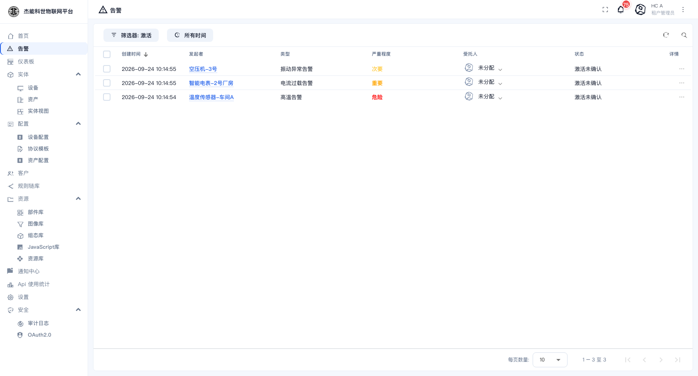
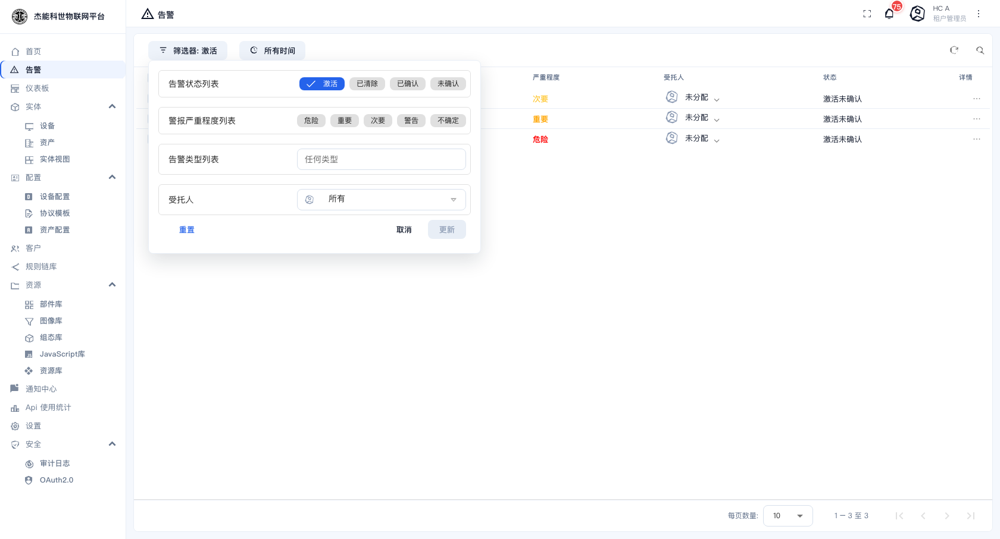
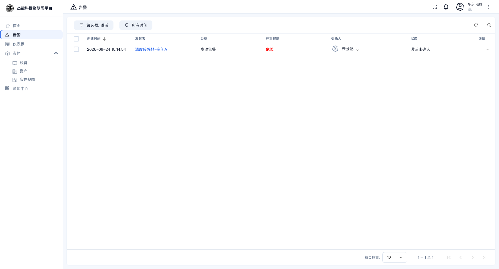

# 07 · 告警

**告警**是"某个实体的某个指标出了状况"的记录。它由 [规则链](06-规则引擎/01-规则链.md) 产生 —— 设备上报的数据经过规则链，满足条件时由「创建告警」节点生成一条告警。

```
温度传感器-车间A 上报 41.2℃
      ↓ 规则链：高温判断 = true
   创建告警
   类型：高温告警   严重程度：危险   状态：激活未确认
      ↓ 发送通知
   通知中心 / 邮件 / 短信
```

## 两个维度：状态 与 严重程度

### 状态

告警有两个独立的维度：**还成不成立**（激活 / 已清除）和**有没有人认领**（未确认 / 已确认）。组合起来是四种：

| 状态 | 含义 | 该做什么 |
|---|---|---|
| **激活未确认** | 问题还在，没人处理 | 需要处理。首页"严重"卡片统计的就是这类 |
| **激活已确认** | 问题还在，但已有人认领 | 正在处理中 |
| **已清除未确认** | 问题已消失，但没人看过 | 需要看一眼，必要时关闭 |
| **已清除已确认** | 问题已消失且已处理完 | 归档状态 |

**确认**是"我知道这件事了，我来处理"；**清除**是"问题已经不存在了"（通常由规则链自动清除，也可以手工清）。

### 严重程度

| 等级 | 典型场景 |
|---|---|
| **危险**（Critical） | 设备即将损坏、安全风险。需要立即响应 |
| **重要**（Major） | 明显异常，影响运行 |
| **次要**（Minor） | 轻微异常，可以安排时间处理 |
| **警告**（Warning） | 提示性质，尚未越界 |
| **不确定**（Indeterminate） | 暂时无法判断 |

严重程度在列表里以颜色区分，规则链创建告警时指定。

## 告警列表

菜单：**告警**



| 列 | 说明 |
|---|---|
| 创建时间 | 告警产生的时间。可点表头切换排序 |
| 发起者 | 产生告警的实体（点进去到该实体详情页） |
| 类型 | 告警类型，如 `高温告警`。类型名由规则链定义，可以自定义 |
| 严重程度 | 见上表，带颜色 |
| **受托人** | 指派给谁处理。未指派时显示"未分配"，可点下拉直接改 |
| 状态 | 见上表的四种组合 |
| 详情 | 行末的 `⋮`，打开行操作菜单 |

### 筛选

点顶部的 **筛选器**：



| 筛选项 | 说明 |
|---|---|
| **告警状态列表** | 激活 / 已清除 / 已确认 / 未确认，可多选。默认只选"激活" |
| **警报严重程度列表** | 危险 / 重要 / 次要 / 警告 / 不确定，可多选 |
| **告警类型列表** | 按类型过滤，填类型名 |
| **受托人** | 只看指派给某个人的 |

改完点「更新」，点「重置」恢复默认。旁边的 **所有时间** 按钮切换时间范围。

> **默认只显示"激活"的告警**。想找历史告警（已清除的），一定要在筛选器里勾上"已清除"，否则会以为"告警不见了"。

### 行操作

点某行末的 `⋮`：

| 操作 | 作用 |
|---|---|
| **确认** | 把状态改成"已确认"，表示有人认领 |
| **清除** | 把状态改成"已清除" |
| **指派** | 指定受托人（也可以通过点击表格里的受托人列直接改） |
| **详情 / 注释** | 查看该告警的详细信息，并添加处理记录 |


**注释**是团队协作的关键 —— 处理过程、原因、结论都写在这里，后面复盘有据可查。

## 告警从哪配置

告警规则有两条路：

### 方式一：在设备档案/资产档案里配（推荐）

设备档案的 **「告警规则」** 页签可以直接配"超过阈值就产生告警"。适合简单、标准的场景，不用碰规则链。

见 [03-4 设备档案](03-实体管理/04-设备档案.md) 与 [03-5 资产档案](03-实体管理/05-资产档案.md)。

### 方式二：在规则链里创建

需要"多个条件组合""按设备标签区分""告警内容带上计算结果"这类复杂逻辑时，在规则链里用「脚本过滤」+「创建告警」节点。见 [06-1 规则链](06-规则引擎/01-规则链.md)。

| 对比 | 档案里配 | 规则链里配 |
|---|---|---|
| 门槛 | 低，填表即可 | 需要会写脚本 |
| 灵活性 | 单条件阈值 | 任意逻辑 |
| 适用 | "温度 > 40 就告警" | "温度 > 40 且设备在运行 且 持续 5 分钟" |

两者可以并存。

## 告警与通知

创建告警只是产生了一条记录。**要让相关人收到消息，还得配通知** —— 在 [09-通知中心](09-通知中心.md) 的「规则」里定义"什么告警、发给谁、用什么渠道（站内/邮件/短信）"。

只创建告警不配通知，结果就是"系统里有记录但没人知道"。这是很常见的疏漏。

## 客户用户看到的告警

客户用户在**告警**菜单里看到的，只有**分配给本客户的设备**产生的告警。



客户用户**可以确认和清除**自己客户下的告警，也可以加注释。这适合把设备交给客户自己运维的场景；如果你不希望客户改动，就不要把告警涉及的设备分配给客户。

## 处理告警的标准流程

1. **看首页的"严重"卡片**，有非零数字就进告警列表。
2. 列表默认已筛选出**激活**的告警，按创建时间倒序看最新的。
3. 点「确认」认领，同时把**受托人**改成自己。
4. 去设备详情页看实时数据与历史趋势，判断原因（这一步用的是 [03-1 设备](03-实体管理/01-设备.md) 与 [05-3 常用部件](05-仪表盘/03-常用部件.md)）。
5. 处理完，如果问题已消失，点「清除」；在**注释**里写下原因与处置。
6. 复盘：如果这是重复出现的问题，回到规则链或档案里**调整阈值**，避免误报泛滥。

---

上一章：[06-3 调试与排错](06-规则引擎/03-调试与排错.md) · 下一章：[08-1 部件库](08-资源库/01-部件库.md)
