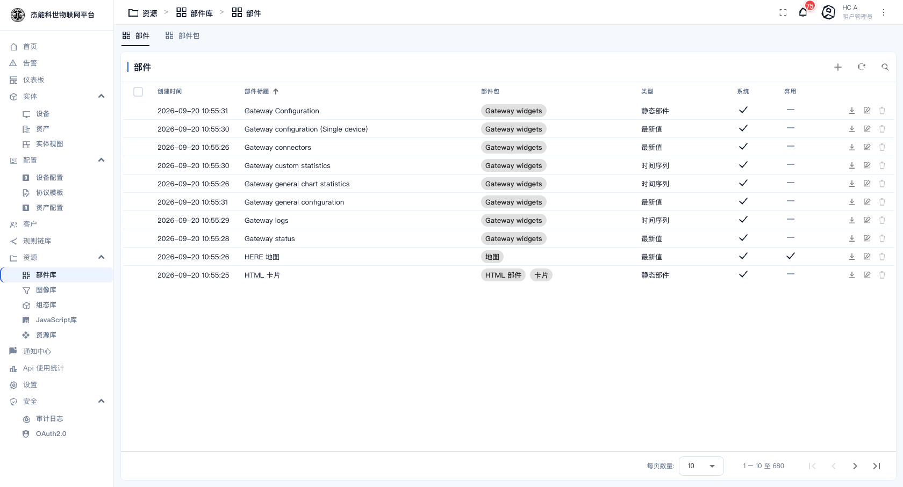

# 08-1 · 部件库

**部件库**是仪表盘可用的全部"积木"。每一个部件定义了"长什么样、能配什么参数、怎么取数据"。仪表盘里放的每一个格子，都是从这里取的一个部件。

菜单：**资源 → 部件库**

页面有两个页签：

| 页签 | 内容 |
|---|---|
| **部件** | 680 个部件，一行一个 |
| **部件包** | 部件按功能分成若干包（图表、卡片、告警、地图…） |

## 部件页签

| 列 | 说明 |
|---|---|
| 创建时间 | 部件加入平台的时间 |
| 部件标题 | 部件名。**悬停可以看到该部件的介绍与配置说明** |
| 部件包 | 属于哪个包，可点（会跳到该包） |
| 类型 | `时间序列` / `最新值` / `静态部件` / `告警` 等。**这决定它取数据的姿势** |
| 系统 | 打勾 = 平台自带部件。**自带部件不能删，但可以复制后改** |
| 弃用 | 打勾 = 已标记弃用，新建仪表盘时不再推荐 |

行内动作：

| 图标 | 作用 |
|---|---|
| ⬇ | 下载该部件的 JSON |
| ⧉ | 复制部件 |
| ✏ | 编辑（打开部件编辑器，改模板/JS/CSS） |
| 🗑 | 删除（系统部件不可删） |

顶部工具条的 `+` 是**新建部件**，`⋮` 菜单里可以**导入部件**（JSON 或 ZIP）。导出用行内的下载按钮。

## 部件包页签

按包浏览部件，每个包是一张卡，点进去看该包下的全部部件，并支持**导入/导出整个包**（ZIP）。跨环境迁移部件时，导包比一个个导部件方便。

## 什么情况下要动部件库

| 需求 | 做法 |
|---|---|
| 改某个部件的默认样式（比如默认线宽） | 复制那个系统部件 → 改副本 → 在仪表盘里改用副本 |
| 团队内共享自制部件 | 导出部件 JSON 发给同事，对方导入 |
| 从别的项目搬一套部件 | 导包（ZIP），在新环境导入 |
| 删掉不用的部件 | 只能删非系统的。系统部件用"弃用"标记让它不出现在新建列表 |

> **不要直接改系统部件**。升级平台时系统部件会被覆盖，改动会丢。要改就复制一份。

## 部件编辑器的三个区域

点行内编辑图标进入部件编辑器，右侧有三个页签：

| 页签 | 改什么 |
|---|---|
| **设置表单** | 部件在使用时能配哪些选项（就是仪表盘里配置对话框的那些字段） |
| **数据键设置表单** | 时序类部件才有：每个数据键能配什么 |
| **设置** | 部件本身的实现：HTML 模板、JavaScript（数据怎么处理）、CSS |

「设置」页签里的 JavaScript 是部件的核心逻辑。写 JS 时平台的全局 API（如 `self.ctx`、`self.defaultSubscription`）都会列在右侧帮助面板里。

> **改了部件模板会影响所有用到它的仪表盘**。改之前先确认影响面，尤其是被多个仪表盘引用的部件。

---

下一章：[02-图像库](02-图像库.md)
