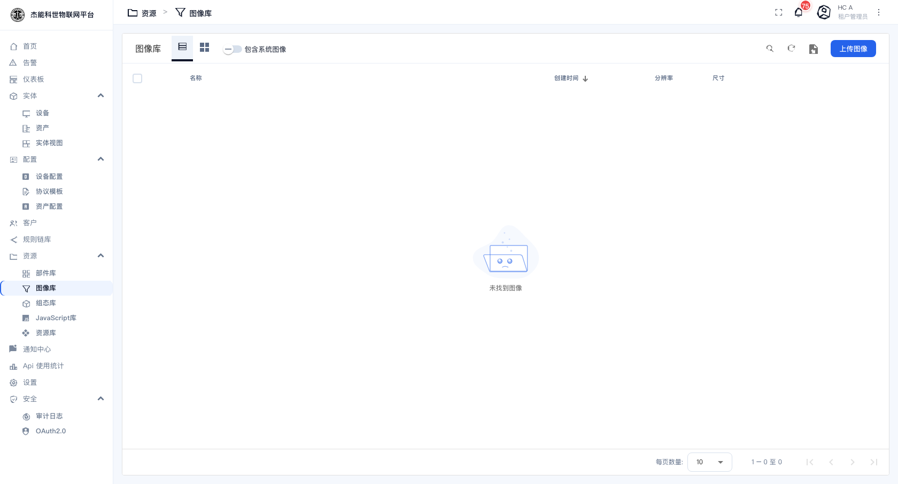
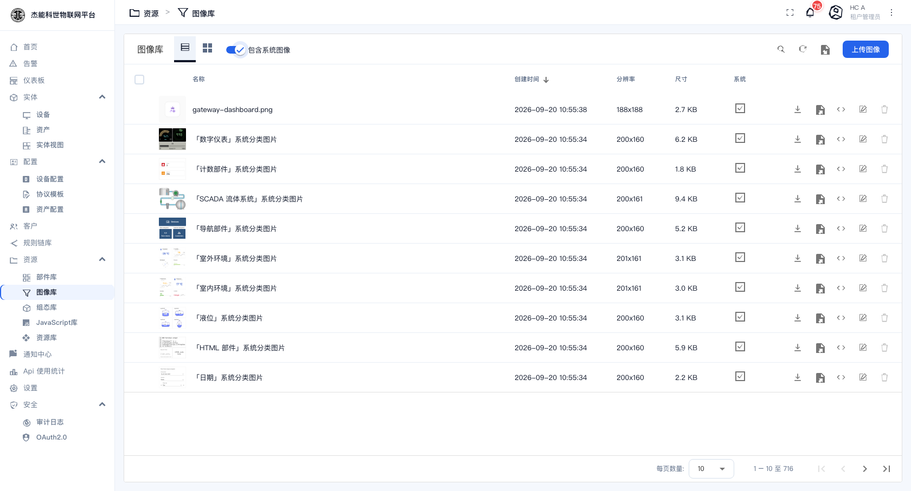

# 08-2 · 图像库

**图像库**存放仪表盘与部件里用到的图片：设备图标、厂房照片、地图标记、背景图等。

菜单：**资源 → 图像库**

## 界面

| 控件 | 作用 |
|---|---|
| **图像库**页签 | 当前租户自己上传的图片 |
| 列表/网格图标 | 切换显示方式。网格模式下是缩略图墙，挑图更快 |
| **包含系统图像** 开关 | 打开后，把平台自带的图片也一并列出来 |
| 搜索 / 刷新 | 按名称搜；重新拉取列表 |
| **上传图像** | 上传新图片 |

**刚建的租户里图像库是空的**，打开「包含系统图像」就能看到平台自带的那批：

| 列 | 说明 |
|---|---|
| 名称 | 图片名（就是文件名） |
| 创建时间 | 上传时间 |
| 分辨率 | 宽 × 高（像素） |
| 尺寸 | 文件大小 |

## 上传图片

点 **「上传图像」**，选本地文件。支持常见位图格式（PNG / JPG / GIF / SVG）。

**几点建议**：

| 建议 | 原因 |
|---|---|
| 用 PNG 而不是 JPG 做图标/线框图 | PNG 支持透明背景，放在卡片上不会有一块白底 |
| 仪表盘背景图控制在 1MB 以内 | 大图会拖慢仪表盘加载 |
| 名称用英文或拼音 | 中文名在部分部件的 URL 引用里会被转义，排查时不好认 |
| 组态图（矢量图）用 SVG | 缩放不失真，见 [03-组态符号库](03-组态符号库.md) |

## 图片在哪里被用到

| 场景 | 引用方式 |
|---|---|
| 仪表盘的缩略图 | 仪表盘列表行内编辑 → 「从图像库浏览」 |
| 部件里的图片（如"图像"部件、导航卡） | 部件配置 → 图片来源 → 从图像库选 |
| 地图部件的自定义标记 | 部件配置里的标记图标 |
| 部件背景图 | 部件配置里的背景设置 |

> **图片名是引用键**。删除一张正在被使用的图片，用到它的地方会变成空白或破图。删之前先确认没人在用。

## 删除

行内动作里删除。**系统自带图片不能删**（「包含系统图像」列出来的那批）。自己上传的可以删。

> 本地部署中，图片实际存放在数据库里（`resource` 表），不是文件系统。所以**备份数据库就等于备份了图像库**。

---

上一章：[01-部件库](01-部件库.md) · 下一章：[03-组态符号库](03-组态符号库.md)
