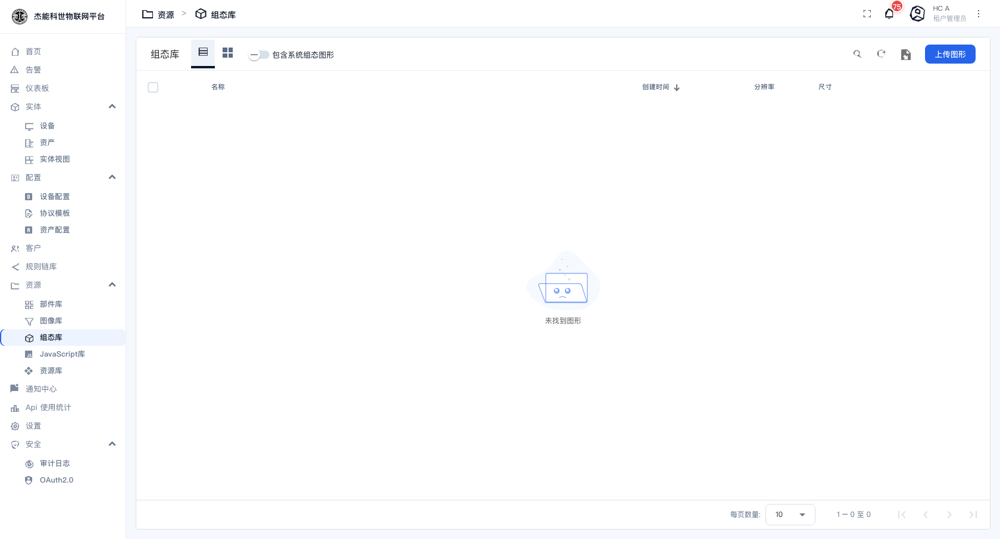
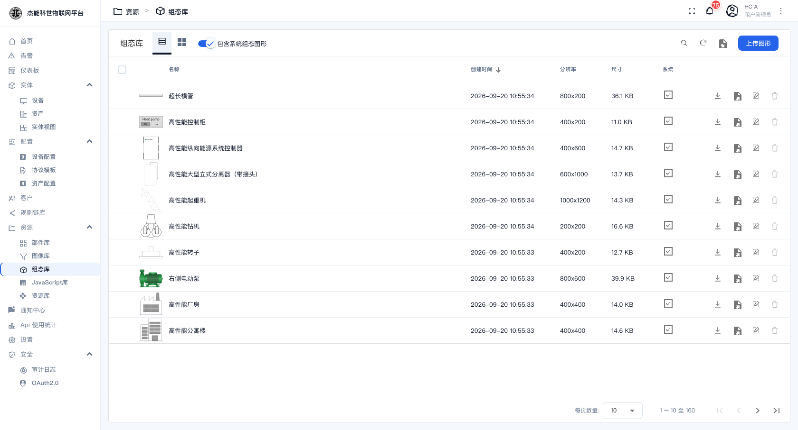

# 08-3 · 组态符号库

**组态符号**是画工艺流程图用的矢量图元：泵、阀门、罐体、管道、电机、风机……把它们摆到画布上并绑定设备数据，就做成一张 SCADA 画面（水厂、化工厂、能源站的常见做法）。

菜单：**资源 → 组态库**

## 界面

和图像库几乎一样：

| 控件 | 作用 |
|---|---|
| **组态库**页签 | 本租户上传的符号 |
| 列表/网格图标 | 切换显示方式 |
| **包含系统组态图形** 开关 | 打开后显示平台自带的那批符号 |
| 搜索 / 刷新 | — |
| **上传图形** | 上传符号（SVG） |

| 列 | 说明 |
|---|---|
| 名称 | 符号名。**就是显示在符号选择器里的名字**，建议起得具体（如"离心泵-立式"） |
| 创建时间 / 分辨率 / 尺寸 | — |

打开「包含系统组态图形」就能看到平台自带的那批符号：

## 与图像库的区别

| | 图像库 | 组态符号库 |
|---|---|---|
| 用途 | 仪表盘里的图片、图标、背景 | SCADA 组态画布上的图元 |
| 推荐格式 | PNG / JPG / SVG | **SVG**（要能改颜色、能缩放） |
| 能否绑数据 | 不能 | **能** —— 图元的状态（开/关、正常/故障）可以跟设备数据联动 |

**上传前把 SVG 处理干净**很重要：

| 要点 | 原因 |
|---|---|
| 删除设计软件里的多余图层与注释 | 减小体积，避免解析出错 |
| 用 `currentColor` 或可替换的 `fill` | 组态画布要能按状态改颜色；写死 `fill="#333"` 就换不了 |
| 设好 `viewBox` | 没有 viewBox 的 SVG 在不同尺寸下会变形 |
| 命名各部件（如 `body`、`blade`、`status-light`） | 在组态编辑器里要按名字选中元素做动画 |

## 用在哪里

组态符号主要在 **SCADA 组态部件**里用（部件库的「高性能 SCADA …」系列）。流程是：

1. 在仪表盘里放一个 SCADA 组态部件。
2. 进入它的**组态编辑器**（一个专门的画布）。
3. 从符号库里拖符号到画布、连线、摆位。
4. 给符号绑定设备/遥测数据，配置状态与动画。
5. 保存，回到仪表盘看效果。

> 组态编辑器是部件内部的一个独立界面，操作方式与常规仪表盘不同。它支持**导出/导入整个组态**（JSON），迁移时导组态比逐个搬符号方便。

## 什么时候用它

| 场景 | 是否合适 |
|---|---|
| 水厂/污水厂工艺流程图 | 合适 —— 大量泵阀罐体，需要状态联动 |
| 配电系统一次图 | 合适 —— 断路器开合状态 |
| 产线设备布局图 | 合适 —— 但要先有 SVG 素材 |
| 只是想放几张设备照片 | **不合适** —— 用 [图像库](02-图像库.md) 就够 |
| 想看数据趋势 | **不合适** —— 用图表部件 |

---

上一章：[02-图像库](02-图像库.md) · 下一章：[04-JavaScript库](04-JavaScript库.md)
