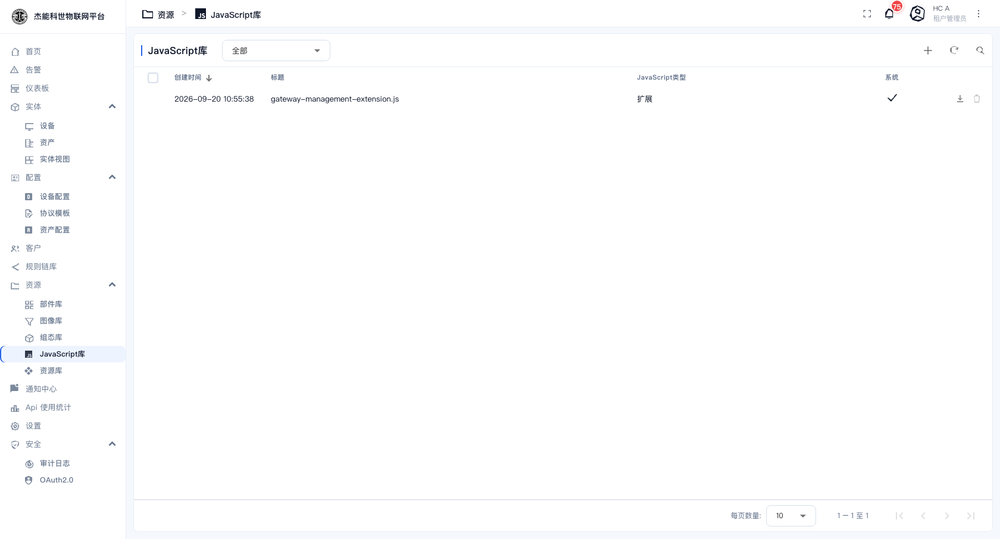
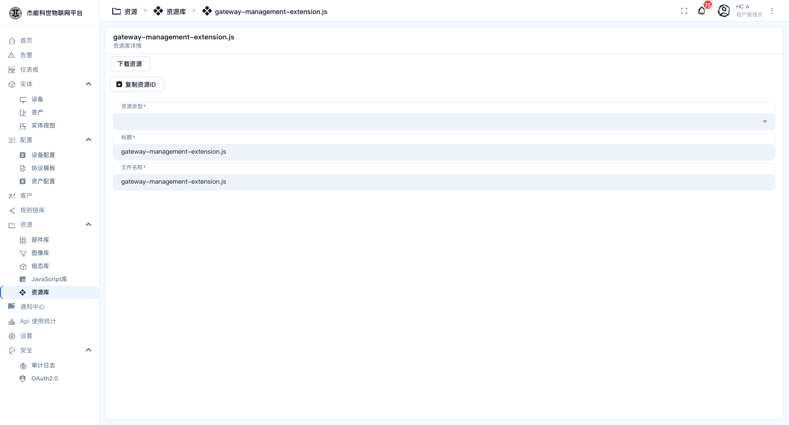

# 08-4 · JavaScript 库

**JavaScript 库**存放可复用的 JS 函数。写规则链脚本或部件脚本时，可以调用这里定义的函数，不用每次都把公共逻辑复制一遍。

菜单：**资源 → JavaScript库**



| 列 | 说明 |
|---|---|
| 创建时间 / 标题 | 标题就是文件名，如 `gateway-management-extension.js` |
| **JavaScript 类型** | 见下表 |
| 系统 | 打勾 = 平台自带，不可删 |

行内动作：下载、删除。顶部 `+` 是新建，`⋮` 菜单里是导入。

## 两种类型

| 类型 | 作用 | 怎么用 |
|---|---|---|
| **扩展（Extension）** | 定义工具函数，供规则链/部件脚本调用 | 脚本里直接用函数名 |
| **模块（Module）** | 按模块导出，供部件脚本 `require` | 部件 JS 里 `var m = require('模块名')` |

## 新建一个扩展

点 `+`，填标题（如 `my-utils.js`），类型选「扩展」，然后在代码区写：

```javascript
// 把温度从摄氏度转换到华氏度
function toFahrenheit(c) {
    return c * 9 / 5 + 32;
}

// 判断一个值是否越界，越界返回 true
function isOutOfRange(value, low, high) {
    return value < low || value > high;
}
```

保存后，在**规则链脚本节点**里就能直接调用：

```javascript
var f = toFahrenheit(msg.temperature);
console.log('华氏温度:', f);
return isOutOfRange(msg.temperature, -10, 40);
```



## 使用要点

| 要点 | 说明 |
|---|---|
| 函数**必须**声明为顶层 `function` | 平台加载时会把这些函数注入到脚本的全局作用域 |
| 不要在扩展里写 `return` 顶层语句 | 扩展只是"函数集合"，不执行 |
| 改完立即生效 | 没有缓存，下一个消息就用新逻辑 |
| 同名函数以**后加载的为准** | 所以函数名要加前缀避免撞名，如 `jnks_` 开头 |
| 报错会中断调用方脚本 | 公共函数一定要做参数校验，尤其是 `null` / `undefined` |

## 什么时候值得抽出来

| 场景 | 建议 |
|---|---|
| 同一段计算在 3 个以上规则链里出现 | **抽成扩展**，改一处全生效 |
| 一段复杂的状态机逻辑 | 抽成扩展，配注释，比散在节点脚本里好维护 |
| 只在一个节点用一次 | 直接写在节点里，不用抽 |
| 需要引入第三方库 | 用「模块」类型 + 打包，或用 REST API 调用节点绕开 |

> **改公共扩展的影响面很大**：所有调用它的规则链与部件都会立刻用新逻辑。改之前先确认有哪些地方在调用（全仓搜函数名）。

---

上一章：[03-组态符号库](03-组态符号库.md) · 下一章：[05-资源库](05-资源库.md)
