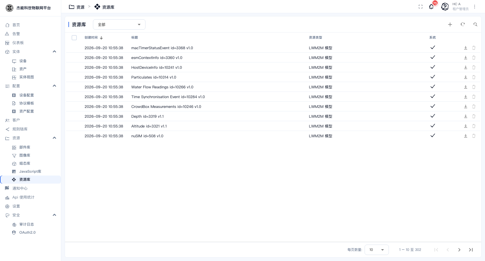
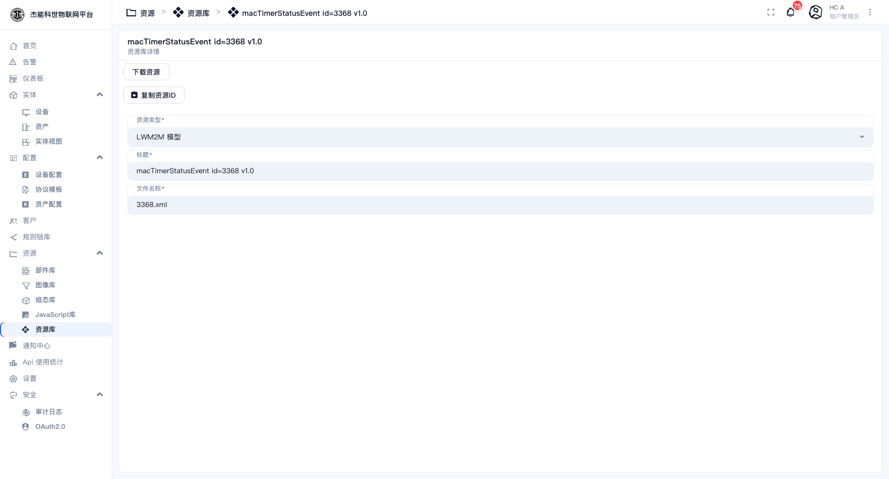

# 08-5 · 资源库

**资源库**是平台里的通用文件柜，放不属于图像/组态/JS 的其他文件：LWM2M 模型定义、固件包、证书、配置模板、设备说明书等。

菜单：**资源 → 资源库**



## 界面

| 控件 | 作用 |
|---|---|
| 顶部下拉 | 按**资源类型**筛选。默认"全部" |
| 搜索 / 刷新 | — |
| `+` | 新建资源。可以上传文件，也可以手工填内容 |
| `⋮` | 导入资源 |

| 列 | 说明 |
|---|---|
| 创建时间 / 标题 | 标题就是资源的显示名 |
| **资源类型** | 分类标签，见下 |
| 系统 | 打勾 = 平台自带，不可删 |

行内动作：下载、删除。

## 常见的资源类型

平台自带的资源里，绝大多数是 **LWM2M 模型**（平台上开箱即有 300 条左右）。这些是 LWM2M 协议规范里的对象/资源定义，LWM2M 接入时会用到，**不要删**。

| 类型 | 用途 |
|---|---|
| **LWM2M 模型** | LWM2M 协议的对象定义，平台自带 |
| **扩展配置 / 固件 / 软件** | OTA 升级用的包（本部署未开启 OTA 菜单） |
| **通用** | 你自己上传的其他文件 |

## 资源详情

点一行进入详情：



| 字段 | 说明 |
|---|---|
| **资源类型** | 分类 |
| **标题** | 显示名 |
| **文件名** | 实际文件名 |
| 内容 | 文本类资源的正文；二进制资源在这里看不到内容 |

操作按钮：**下载资源**（把文件下载到本地）、**复制资源ID**（复制 UUID，脚本里引用资源时要用）。

## 在脚本里取资源

规则链（比如「REST API 调用」节点要带一个证书文件）或部件里可以按资源 ID 取到内容：

```javascript
// 伪代码示意：按资源 ID 取内容
var res = getResource('0f0e0d0c-...');
```

具体 API 名以部件编辑器右侧的帮助面板为准。

## 使用建议

| 场景 | 做法 |
|---|---|
| 存固件/证书 | 直接用资源库，靠**资源类型**分类 |
| 存设备说明书 PDF | 资源库，类型选"通用" |
| 存图片 | **不用这里** —— 用 [图像库](02-图像库.md) |
| 存 SCADA 图元 | **不用这里** —— 用 [组态符号库](03-组态符号库.md) |
| 存公共 JS 函数 | **不用这里** —— 用 [JavaScript 库](04-JavaScript库.md) |

> 四个库各管一类，**别混用**。混用的直接后果是：该出现在图像选择器里的图找不到，该被 LWM2M 引用的模型却躺在别处。

---

上一章：[04-JavaScript库](04-JavaScript库.md) · 下一章：[09-通知中心](../09-通知中心.md)
