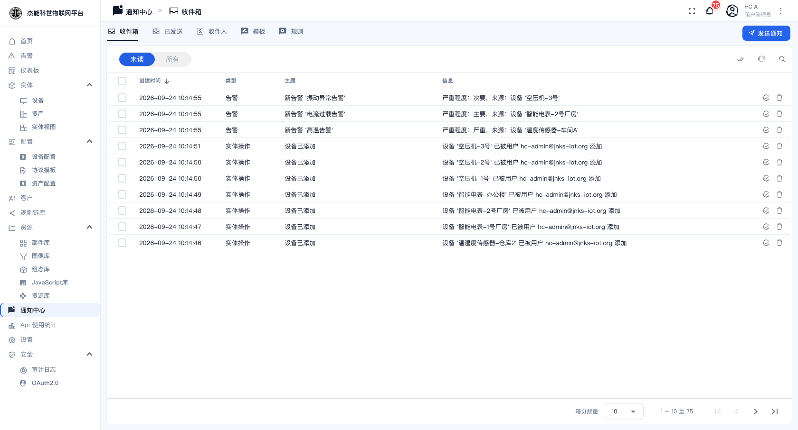
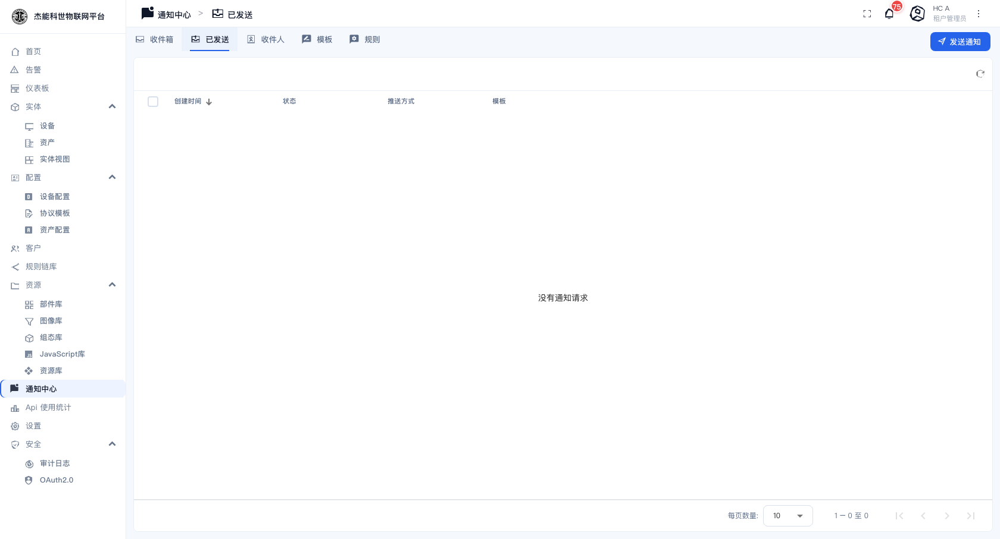
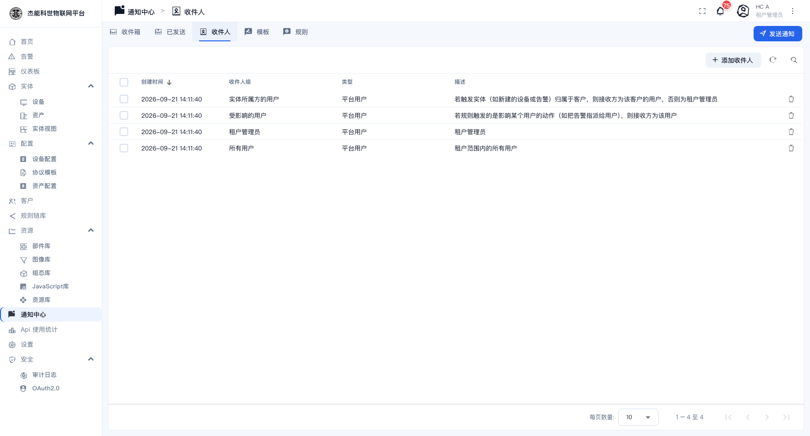
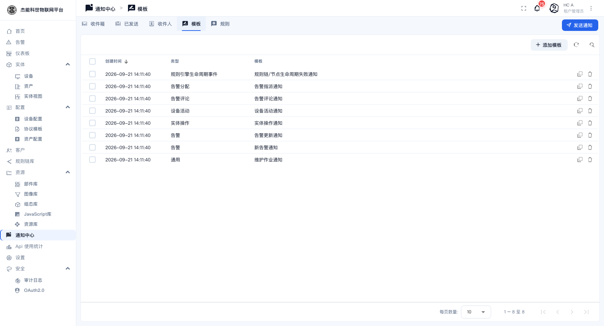
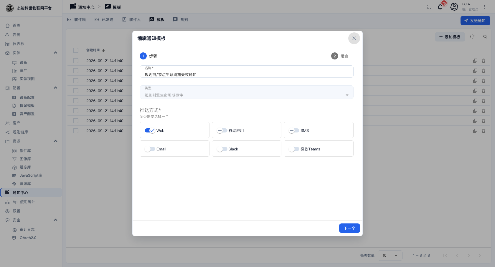
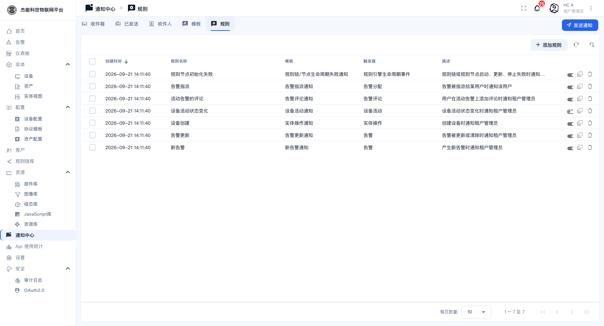
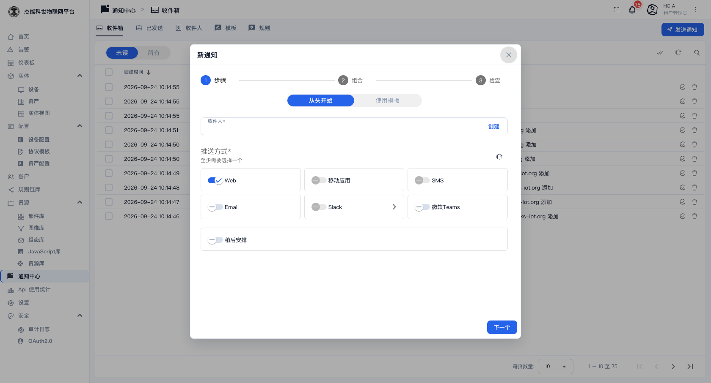
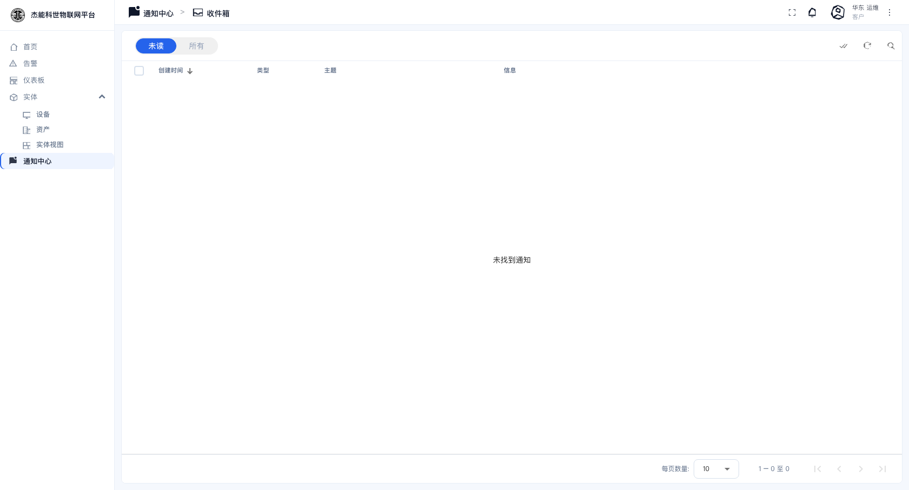

# 09 · 通知中心

**通知中心**负责"把事情告诉人"：告警产生了、设备被创建了、告警被指派给某人了 —— 这些事件可以自动推送给相关的人，渠道有站内、邮件、短信。

菜单：**通知中心**

页面顶部有五个页签，右上角是「发送通知」：


| 页签 | 作用 |
|---|---|
| **收件箱** | 我收到的通知 |
| **已发送** | 系统/我发出去的通知记录 |
| **收件人** | 定义"发给谁" |
| **模板** | 定义"通知长什么样" |
| **规则** | 定义"什么事件、用哪个模板、发给哪个收件人" |

三者的关系：

```
事件（告警产生）
   ↓ 规则：新告警 → 用模板「新告警通知」→ 发给「租户管理员」组
   ↓
模板：决定标题与正文的措辞
   ↓
收件人组：解析出具体的人（可能是动态的，如"该设备所属客户的用户"）
   ↓
渠道：站内（收件箱）/ 邮件 / 短信
```

**只看不配**：如果只是想知道"有告警了"，站内渠道就够了，平台自带的 7 条规则已经覆盖常见场景。要让邮件/短信也能到人，还需要系统管理员在 [11-系统设置](11-系统设置.md) 里配好发信/短信通道。

## 收件箱


| 控件 | 作用 |
|---|---|
| **未读 / 所有** | 切换只看未读或看全部。**默认"未读"**，所以看到列表变短了先确认是不是切到了未读 |
| 创建时间 / 类型 / 主题 / 信息 | 类型有"告警""实体操作"等 |
| 行内动作 | 标记已读 / 删除 |

切到「未读」只看没看过的：



顶部栏的**通知铃铛**上有个数字，就是未读数。

## 已发送

系统与用户发出的全部通知记录。用来确认"这条通知到底发出去了没有、发给了谁"。



## 收件人



平台自带四个**收件人组**，都是动态解析的 —— 也就是说同一条规则，在不同事件下解析出的人不一样：

| 收件人组 | 解析规则 |
|---|---|
| **实体所属方的用户** | 触发实体（如新建的设备、告警）归属于某个客户时，收件人是该客户的用户；不属于客户时是租户管理员 |
| **受影响的用户** | 规则触发的是针对某个用户的操作时（如告警被指派给某人），收件人就是那个用户 |
| **租户管理员** | 租户管理员本人 |
| **所有用户** | 租户范围内的所有用户 |

点 **「+ 添加收件人」** 可以自定义收件人组，指定具体的平台用户、客户、用户组等。

> **动态收件人是这个功能最有价值的地方**：把设备分配给客户后，这条设备产生的告警会自动通知到该客户的用户，不需要为每个客户各建一条规则。

## 模板



平台自带 8 个模板，对应常见事件：

| 模板 | 用于 |
|---|---|
| 新告警通知 | 产生了新的告警 |
| 告警更新通知 | 告警被更新或清除 |
| 告警指派通知 | 告警被指派给某用户 |
| 告警评论通知 | 有人在告警上加评论 |
| 设备活动通知 | 设备活动状态变化（上线/离线） |
| 实体操作通知 | 实体被创建/更新/删除 |
| 规则链/节点生命周期失败通知 | 规则链或节点启动/更新/停止失败 |
| 维护作业通知 | 通用模板 |

模板里定义的是**标题与正文**，正文支持占位符：

| 占位符 | 会被替换成 |
|---|---|
| `${entityName}` | 实体名（如设备名） |
| `${alarmType}` | 告警类型 |
| `${alarmSeverity}` | 严重程度 |
| `${entityTypeLabel}` | 实体类型的中文名（设备/资产…） |

点行内编辑图标可以改措辞，点模板名可以看到它的完整配置：



**中文文案已经翻译好了**，一般不用动。

## 规则



规则把"事件 → 模板 → 收件人"串起来。平台自带 7 条：

| 规则 | 触发时机 | 发给 |
|---|---|---|
| 新告警 | 产生新告警 | 租户管理员 |
| 告警更新 | 告警被更新 | 租户管理员 |
| 告警指派 | 告警被指派 | 受影响的用户 |
| 活动告警的评论 | 在活动告警上添加评论 | 租户管理员 |
| 设备活动状态变化 | 设备上线/离线 | 租户管理员 |
| 设备创建 | 创建设备 | 租户管理员 |
| 规则节点初始化失败 | 规则链/节点启动失败 | 租户管理员 |

每行最右侧那个**开关**控制这条规则是否启用。点 **「+ 添加规则」** 新建。

新建/编辑规则时要配：

| 项 | 说明 |
|---|---|
| **名称** | 规则名 |
| **模板** | 选一个模板 |
| **触发器** | 什么事件触发（告警/设备活动/实体操作/规则引擎生命周期事件…） |
| **收件人** | 选一个或多个收件人组 |
| **渠道** | 勾选站内 / 邮件 / 短信（取决于平台是否配好了对应通道） |
| **描述** | 备注 |

## 发送通知

右上角的 **「发送通知」** 按钮可以手工发一条通知：



| 字段 | 说明 |
|---|---|
| 收件人 | 选平台用户或客户 |
| 主题 / 正文 | 内容 |
| 渠道 | 站内 / 邮件 |

适合"系统维护通知"这类手工广播。

## 客户用户看到什么

客户用户的**通知中心**里**只有一个「收件箱」**，没有「已发送 / 收件人 / 模板 / 规则」这几个页签，右上角也没有「发送通知」按钮 —— 那些都是配置项，只有租户管理员能动。收件箱里也只有分配给本客户的实体相关的通知。



## 常见问题

| 现象 | 原因 |
|---|---|
| 有告警但收件箱空 | 对应的**规则被关掉了**，或者收件人组解析出的人不是你（如规则发给"租户管理员"，而你是客户用户） |
| 邮件收不到，站内有 | 邮件通道没配 —— 见 [11-系统设置](11-系统设置.md) |
| 通知里是"Device 已added"这种混排 | 历史遗留。新产生的通知已按中文渲染；**旧通知存的已是渲染后的文本，不会自动变** |
| 收件箱列表突然变短 | 切到了「未读」页签 |

---

上一章：[08-5 资源库](08-资源库/05-资源库.md) · 下一章：[10-1 通用安全设置](10-安全设置/01-通用安全设置.md)
