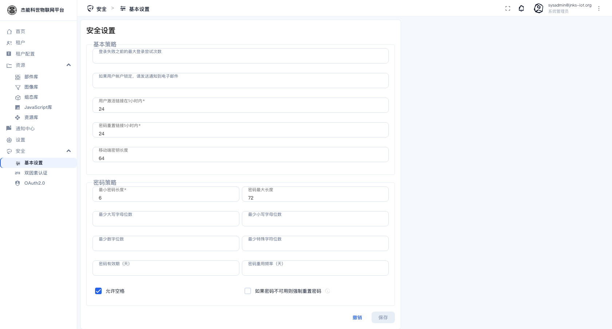

# 10-1 · 通用安全设置

> **只有系统管理员能进这个页面。** 菜单：**安全 → 基本设置**。这里是**平台级**策略，改动会影响所有租户。

页面分两段：**基本策略** 与 **密码策略**。改完点右下角的「保存」，点「撤销」放弃改动。

## 基本策略

| 字段 | 默认 | 说明 |
|---|---|---|
| **登录失败之前的最大登录尝试次数** | 空（不限） | 连续输错几次密码后锁定账号。**建议设 5~10** |
| **如果用户账户锁定，请发送通知到电子邮件** | 空 | 锁定时给这个邮箱发提醒。填运维邮箱 |
| **用户激活链接在 N 小时内有效** | 24 | 新用户激活链接的有效期 |
| **密码重置链接在 N 小时内有效** | 24 | 忘记密码链接的有效期 |
| **移动端密钥长度** | 64 | 移动 App 会话密钥长度。**没有移动端需求就不用改** |

**这几项的取值逻辑**：

- 「最大登录尝试次数」留空 = 不锁定，可以被无限暴力尝试。生产环境**一定要设**。
- 激活/重置链接的有效期越长越方便，也越不安全。24 小时是合理折中；邮件通道不稳定时可以放宽到 72。

## 密码策略

| 字段 | 默认 | 说明 |
|---|---|---|
| **最小密码长度** | 6 | 密码最短几位 |
| **密码最大长度** | 72 | 上限（bcrypt 算法的固有限制） |
| **最少大写字母位数 / 最少小写字母位数** | 空 | 强制大小写混合 |
| **最少数字位数 / 最少特殊字符位数** | 空 | 强制包含数字/符号 |
| **密码有效期（天）** | 空 | 到期必须改密码 |
| **密码重用频率（天）** | 空 | N 天内不能重复用旧密码 |
| **允许空格** | 勾选 | 密码里能不能有空格 |
| **如果密码不可用则强制重置密码** | 未勾选 | 密码不符合当前策略时，下次登录强制改 |

**建议配置**（兼顾安全与可用）：

| 项 | 建议值 | 理由 |
|---|---|---|
| 最小长度 | 8~12 | 长度比复杂度更有效 |
| 最少数字位数 | 1 | 避免纯字母 |
| 最少特殊字符位数 | 1 | — |
| 密码有效期 | 90 或留空 | 强制轮换会给运维增加负担，按合规要求定 |
| 允许空格 | 保持勾选 | 允许口令短语（passphrase），实际更安全 |

> **改了密码策略会让不符合新策略的现有账号在下次登录时失败**（如果勾了"强制重置"）。改之前先通知用户，尤其是"最小长度"这类会影响存量密码的项。

## 改完之后

| 场景 | 需要做什么 |
|---|---|
| 调了锁定次数 | 无需重启，立即生效 |
| 用户被锁了要立刻解锁 | 目前没有"解锁"按钮，只能等锁定期过去，或由管理员重置该用户密码 |
| 调了激活链接有效期 | 已发出的链接不会重新计时 |

---

下一章：[02-双因素认证](02-双因素认证.md)
