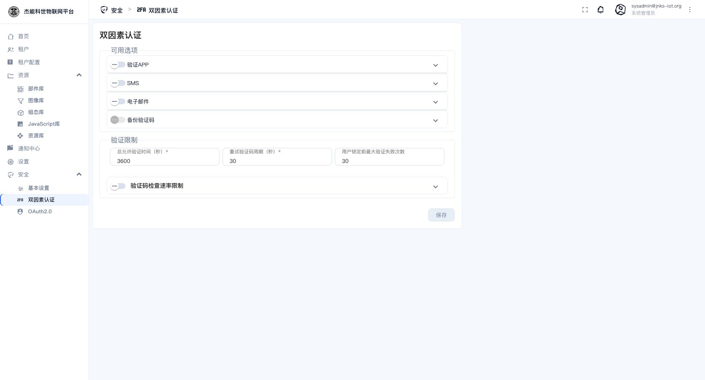
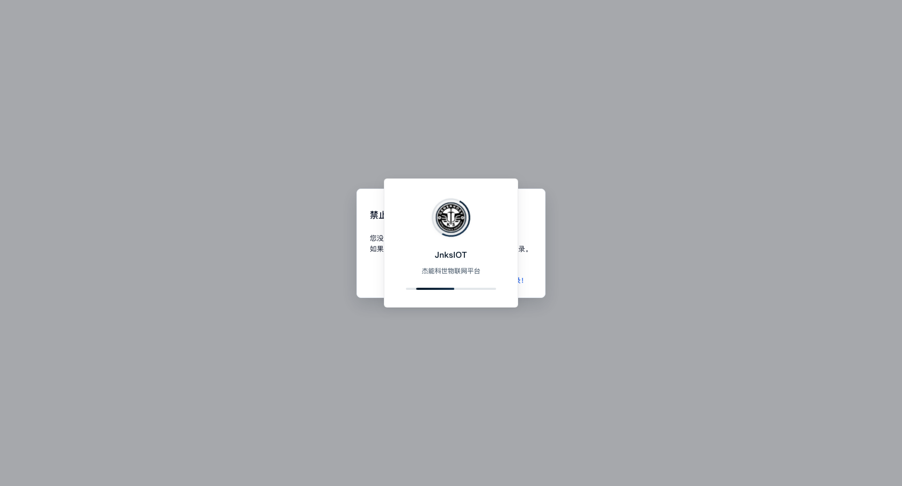

# 10-2 · 双因素认证

**双因素认证（2FA）**在密码之外再加一道验证：登录时除了密码，还要输入一个动态验证码。

> **只有系统管理员能进这个页面。** 菜单：**安全 → 双因素认证**。系统管理员在这里**开启平台支持的验证方式**；具体每个用户是否启用，由用户自己在账号设置里开。

## 可用选项

四种验证方式，最右边的开关（`∨`）决定是否**允许用户选用**：

| 方式 | 用户拿到验证码的方式 | 前置条件 |
|---|---|---|
| **验证APP** | 手机上的验证器 App（Google Authenticator、Microsoft Authenticator、1Password…）每 30 秒生成一个 | 无。**这是最推荐的一种** |
| **SMS** | 短信 | 需要平台配好短信通道 |
| **电子邮件** | 邮件 | 需要平台配好发件邮箱（见 [11-系统设置](../11-系统设置.md)） |
| **备份验证码** | 一次性备用码，打印/抄下来存好 | 无 |

推荐配置：**「验证APP」+「备份验证码」同时开启**。

- 验证 App 不依赖平台发短信/发邮件，最可靠。
- 备份码用于"手机丢了/换手机了"的场景 —— 没有它，用户手机一丢就登不进来了。

SMS 和电子邮件作为**第二因素其实偏弱**（手机号/邮箱本身可能被攻破），一般只在没有智能手机的场景下开。

## 验证限制

| 字段 | 默认 | 说明 |
|---|---|---|
| **总允许验证时间（秒）** | 3600 | 从输完密码到输完验证码的总时限。超时要重新登录 |
| **重试验证码周期（秒）** | 30 | 两次尝试之间的间隔限制 |
| **用户锁定前最大验证失败次数** | 30 | 连续输错这么多次就锁账号 |
| **验证码检查速率限制** | 折叠项 | 展开后可以配按 IP/用户限流，防暴力破解 |

**「用户锁定前最大验证失败次数」默认 30 偏高**，建议改小（如 5~10）。配合上面的「重试验证码周期」，能有效防止猜码。

## 用户侧怎么开

平台管理员开启方式后，用户自己启用：

1. 点右上角头像 → **账号**。
2. 找到双因素认证一栏，选择验证方式。
3. 选「验证APP」时，页面上会显示一个**二维码**。用手机上的验证器 App 扫码，App 里会出现一个 6 位数字。
4. 输入该数字确认绑定。
5. **务必**同时生成并保存一组备份验证码。

开启后，下次登录会多一步"请输入验证码"。

## 出问题了怎么办

| 情况 | 处理 |
|---|---|
| 用户换了手机，验证 App 失效 | 用**备份验证码**登录 |
| 备份码也丢了 | 需要联系平台管理员处理（备份码丢失等于 2FA 无法绕过，恢复手段取决于部署方）。**所以备份码必须妥善保存** |
| 想给所有人强制开 2FA | 本页面只能控制"允许哪些方式"，不能强制。需要靠管理流程要求 |
| 验证码总是"错误" | 手机的**时间不准确**。验证器 App 依赖系统时间，把手机设成自动对时 |

> **管理员自己也要配好备份码**。管理员账号被 2FA 锁在外面，恢复很麻烦。

---

上一章：[01-通用安全设置](01-通用安全设置.md) · 下一章：[03-OAuth2.0](03-OAuth2.0.md)
