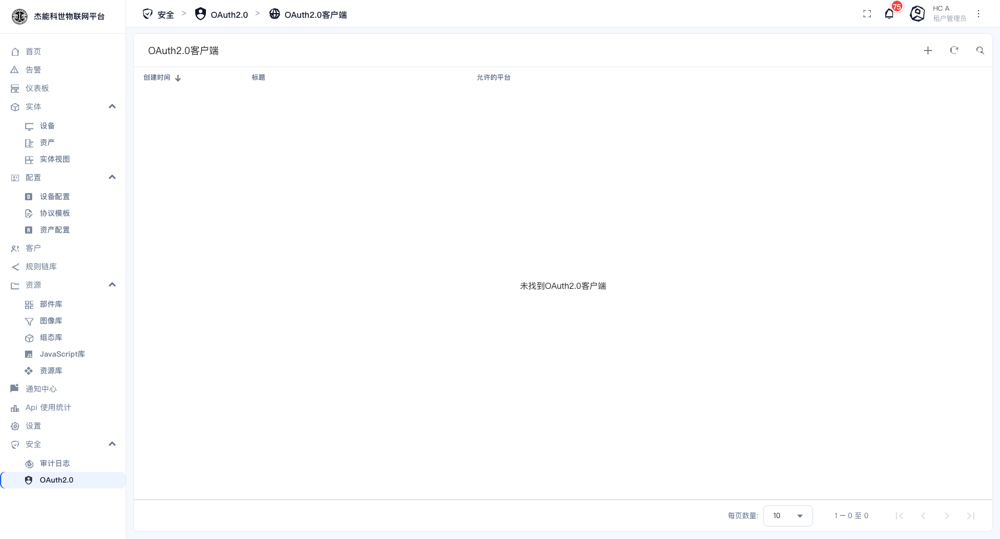

# 10-3 · OAuth2.0

**OAuth2.0** 让用户用第三方账号（企业微信、钉钉、GitHub、Google 等）登录平台，不必再记一套密码。

菜单：**安全 → OAuth2.0**



页面标题是**「OAuth2.0 客户端」**，列出已配置的第三方登录客户端。

| 列 | 说明 |
|---|---|
| 创建时间 | — |
| **标题** | 客户端名 |
| **允许的平台** | 这些客户端能被哪些端的用户使用 |

**租户管理员和系统管理员都能配**：系统管理员配的是平台级的客户端，租户管理员配的只对本租户生效。

## 新建一个 OAuth2.0 客户端

点 `+`，需要填的信息（不同服务商字段名略有差异，但结构一致）：

| 字段 | 说明 |
|---|---|
| **标题** | 显示名，会出现在登录页的第三方登录按钮上 |
| **客户端 ID / 客户端密钥** | 从第三方服务商申请应用时拿到的 |
| **Access token URI / Authorization URI** | 服务商提供的两个端点 |
| **Scope** | 要申请的权限范围 |
| **重定向 URI** | **必须与第三方后台登记的完全一致** |
| **用户名属性 / 邮箱属性 / 名字属性** | 从第三方返回的用户信息里，哪个字段对应平台要的字段 |
| **允许的平台** | 哪些端的登录页显示这个入口 |

### 重定向 URI 是配置成功的关键

平台提供的回调地址形如：

```
https://<你的平台域名>/login/oauth2/code/<客户端名>
```

**这个值必须原样填进第三方服务商的应用配置里**，一个字符都不能差（包括末尾的斜杠）。配错会报 `redirect_uri mismatch`。

> 本地部署用 `http://localhost` 时，多数第三方平台**不允许**把 `localhost` 登记为回调地址。要在内网试用，需要先有一个可访问的域名。

## 登录流程

配好之后：

1. 登录页会多出一个第三方登录按钮（显示的是客户端的「标题」）。
2. 用户点它 → 跳到第三方授权页 → 授权成功后跳回平台。
3. 平台按返回的**邮箱**匹配已有账号：
   - 邮箱已存在 → 直接登录该账号。
   - 邮箱不存在 → 按客户端的「允许的平台」与租户策略决定是否自动创建用户。

**注意**：邮箱是关联键。第三方账号的邮箱必须与平台账号的邮箱一致，否则会被当成新用户或登录失败。

## 常见问题

| 现象 | 原因 |
|---|---|
| `redirect_uri mismatch` | 回调地址与第三方登记的不一致 |
| 授权成功但回平台报错 | 客户端密钥错；或「用户名/邮箱属性」填的字段名与服务商返回的不匹配 |
| 登录进来是另一个账号 | 第三方账号的邮箱与平台里另一个用户的邮箱相同 |
| 登录页没有第三方按钮 | 客户端的「允许的平台」没勾当前端；或客户端没启用 |

## 安全建议

| 要点 | 原因 |
|---|---|
| 客户端密钥只放在平台配置里 | 泄露等同于别人能以任意用户身份登录 |
| 只开启需要的 scope | 权限越大，被滥用时损失越大 |
| 定期检查客户端列表 | 离职人员配的客户端要及时删除 |

---

上一章：[02-双因素认证](02-双因素认证.md) · 下一章：[04-审计日志](04-审计日志.md)
