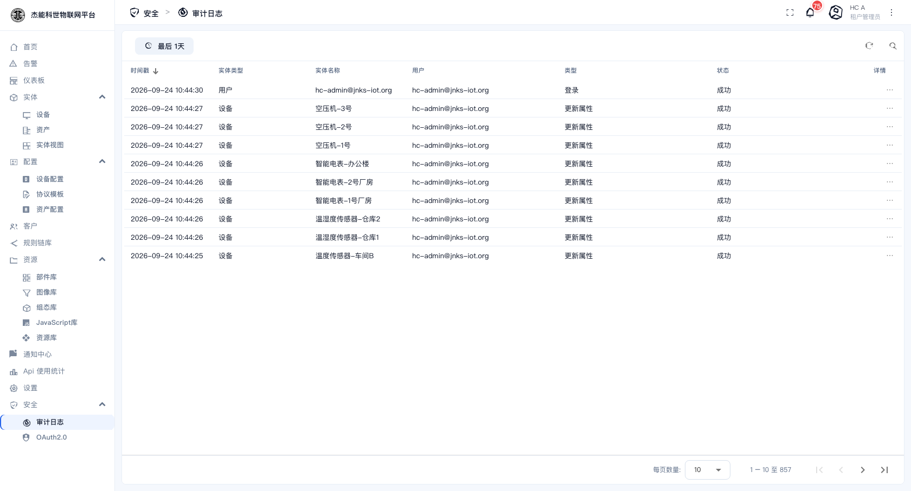
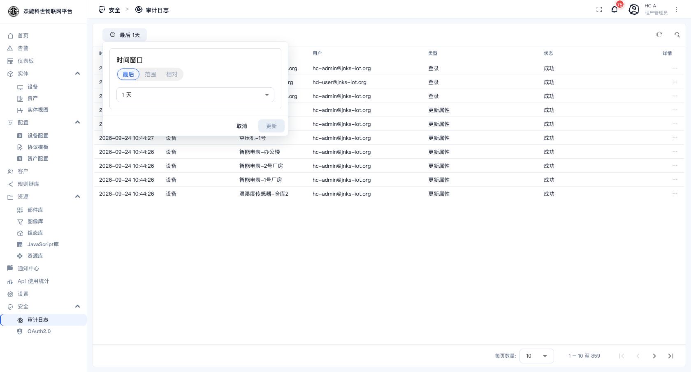

# 10-4 · 审计日志

**审计日志**记录"谁在什么时候对什么做了什么"。出问题时这是唯一的追溯依据。

菜单：**安全 → 审计日志**（租户管理员与系统管理员都有）

## 字段说明

| 列 | 说明 |
|---|---|
| **时间戳** | 操作发生的时间。默认倒序，最新的在最上面 |
| **实体类型** | 被操作的实体类别（用户 / 设备 / 资产 / 仪表盘 / 告警…） |
| **实体名称** | 具体是哪一个。点它可以直接跳到该实体 |
| **用户** | 谁做的这个操作 |
| **类型** | 操作类型，见下表 |
| **状态** | `成功` / `失败`。**失败也要看** —— 连续失败可能是权限配错，也可能是有人在试探 |
| **详情** | 行末的 `⋮`，展开可以看到这次操作的完整前后值 |

## 常见操作类型

| 类型 | 含义 |
|---|---|
| **登录** | 用户登录。**排查"谁在什么时候登录过"就看这里** |
| **添加/更新/删除** | 实体的增删改 |
| **更新属性 / 更新遥测** | 数据写入 |
| **分配给客户 / 取消分配** | 归属变更 |
| **确认告警 / 清除告警 / 指派告警** | 告警处理动作 |

## 时间范围

页面顶部的 **「最后 1天」** 按钮切换时间范围：

可选的窗口从"最后 1 天"一直到更长（或自定义固定区间）。

> **默认只看最近 1 天**。查一周前的事，必须先把这个范围调大，否则会以为"日志没有记录"。

## 典型用途

| 要查什么 | 怎么做 |
|---|---|
| 谁删了这台设备 | 实体名称筛该设备，看 `删除` 类型的记录 |
| 某人的登录记录 | 看「用户」列或按时间戳范围缩小，找 `登录` 类型 |
| 配置什么时候被改的 | 找 `更新` 类型，展开详情看改动前后的值 |
| 有没有异常登录 | 看状态为 `失败` 的登录记录，以及非工作时间的登录 |
| 客户什么时候被换了设备归属 | 找 `分配给客户` / `取消分配` |

## 保留与清理

审计日志**不会自动删除**，会一直累积。记录量增长很快（数据库实体一多，一天就有几千条），所以：

| 关注点 | 说明 |
|---|---|
| 数据库体积 | 审计日志是数据库增长的主要来源之一 |
| 保留策略 | 本平台的界面里**没有**"清理旧日志"的按钮，需要由部署方在数据库层面定期归档/清理 —— 属运维动作 |
| 合规要求 | 如果有审计留存年限的要求，要先确认保留期再定清理策略 |

## 与其他排查手段的分工

| 想知道 | 去哪 |
|---|---|
| 谁改的配置、谁登录过 | **审计日志**（本页） |
| 设备上报的数据去哪了 | 设备详情 → **事件**页签，或 [06-3 调试与排错](../06-规则引擎/03-调试与排错.md) |
| 通知有没有发出去 | [09-通知中心](../09-通知中心.md) 的「已发送」 |
| 接口调用了多少 | [13-使用量统计](../13-使用量统计.md) |

---

上一章：[03-OAuth2.0](03-OAuth2.0.md) · 下一章：[11-系统设置](../11-系统设置.md)
