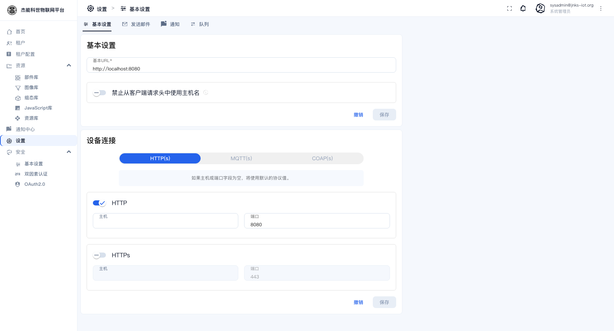
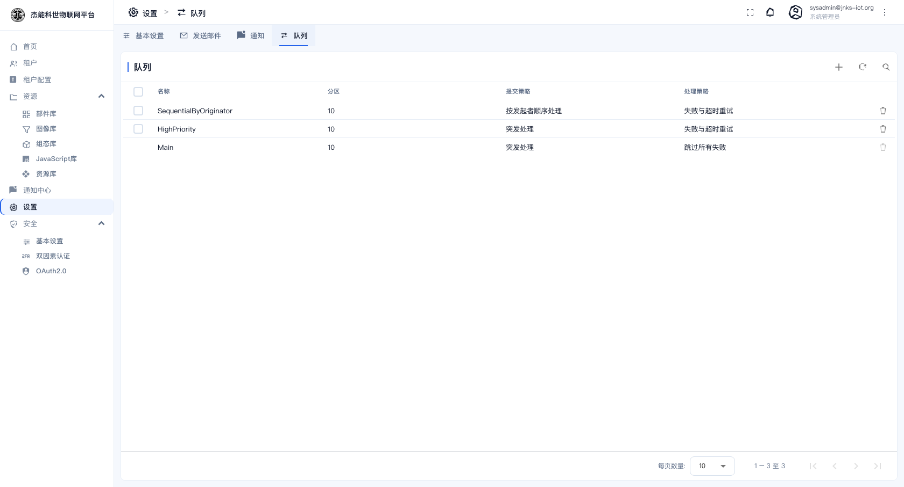
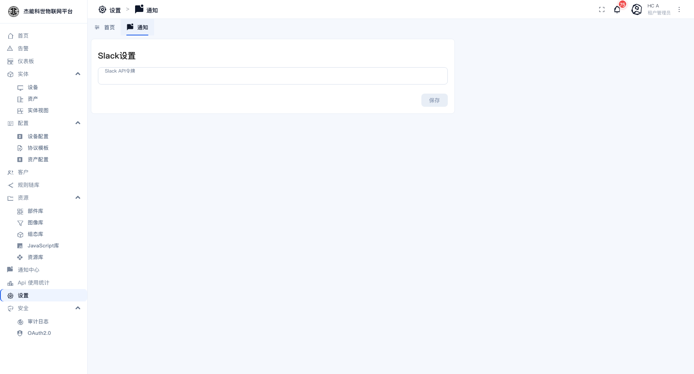

# 11 · 系统设置

**设置**菜单的内容随角色不同：

| 角色 | 页签 |
|---|---|
| **系统管理员** | 基本设置 / 发送邮件 / 通知 / 队列 |
| **租户管理员** | 首页 / 通知 |

## 系统管理员：基本设置

菜单：**设置**（默认进入「基本设置」）

### 平台地址

| 字段 | 说明 |
|---|---|
| **基本 URL** | 平台对外的访问地址，如 `http://localhost:8080`。**这个值会拼进发给用户的邮件链接里**（激活链接、密码重置链接）。填错会导致用户点邮件里的链接打不开 |
| **禁止从客户端请求头中使用主机名** | 勾上后平台只用「基本 URL」生成链接，忽略请求头里的 Host。**反向代理后面部署时建议勾上** |

### 设备连接

这一段决定**平台在界面上告诉你设备该连到哪个地址**：

| 控件 | 说明 |
|---|---|
| **HTTP(s) / MQTT(s) / COAP(s)** | 分三组切换，每组有独立的开关与地址 |
| **协议开关** | 决定该协议**是否对外公布**。关掉后，设备详情页的「连接说明」里不再显示这个协议 |
| **主机 / 端口** | 发给设备的连接地址。**留空则使用默认协议端口** |

**什么时候需要改**：设备在内网、平台在外网时，设备看到的地址与平台自己的地址不一样。这时把「主机」改成设备可达的那个域名/IP，设备详情页给出的连接示例才是对的。

> 这个设置**只影响界面上的提示文本**，不改变平台真正监听的端口。真实端口由部署时的容器映射决定。

## 系统管理员：发送邮件

配置平台发信用的 SMTP 账号。配好后，用户激活、密码重置、告警邮件通知才能发出去。

| 字段 | 说明 |
|---|---|
| **邮件服务商** | 可选 Gmail 或"其他"（自定义 SMTP） |
| **SMTP 主机 / 端口** | 邮件服务器地址 |
| **用户名 / 密码** | SMTP 账号（很多服务商用授权码而不是登录密码） |
| **TLS / SSL** | 加密方式，两者选其一，要与端口匹配（465 用 SSL，587 用 TLS） |
| **发件人地址** | 显示的发件邮箱 |
| **启用邮件** | 总开关 |

**配置要点**：

| 要点 | 原因 |
|---|---|
| 端口与加密方式必须匹配 | 465+SSL、587+TLS 是常见组合；错配会连接超时 |
| 用授权码而不是登录密码 | Gmail、QQ 邮箱、163 等都要求授权码 |
| 配完**发一封测试邮件** | 「发送测试邮件」按钮。不测就上线，等用户收不到激活邮件才发现 |

## 系统管理员：通知

系统级通知渠道的默认配置（短信服务商等）。**要让告警能发短信**，必须先在这里配好短信通道，否则 [09-通知中心](09-通知中心.md) 里勾了"短信"也发不出去。

## 系统管理员：队列

查看平台内部消息队列的配置与状态（各服务用的队列、分区数等）。

> **这里的值一般不要改**。队列配置与部署时的中间件（Kafka）强相关，改错会导致服务之间收不到消息，表现为"设备上报了但没有数据"。

## 租户管理员：首页

菜单：**设置**（默认进入「首页」）

| 字段 | 说明 |
|---|---|
| **首页仪表板** | 选一个仪表盘作为登录后的落地页。留空则用平台默认的概览首页 |
| **隐藏首页仪表板工具栏** | 勾上后，作为首页打开的仪表盘不显示顶部工具栏。适合投屏 |

详见 [02-首页](02-首页.md#把首页换成自己的仪表盘)。

## 租户管理员：通知

租户级的通知配置。开关与租户相关的通知项。

## 常见问题

| 现象 | 处理 |
|---|---|
| 用户收不到激活邮件 | 检查「发送邮件」的连接参数；改完后**重新生成激活链接**（旧链接不受影响，但邮件要重发） |
| 邮件里的链接指向错误地址 | 检查「基本 URL」 |
| 设备连接说明里的地址不对 | 在「基本设置 → 设备连接」里改主机 |
| 改了队列配置后系统异常 | **立即改回**。队列配置改动需要重启相关服务才生效，期间可能出现消息丢失 |

---

上一章：[10-4 审计日志](10-安全设置/04-审计日志.md) · 下一章：[12-租户与租户档案](12-租户与租户档案.md)
