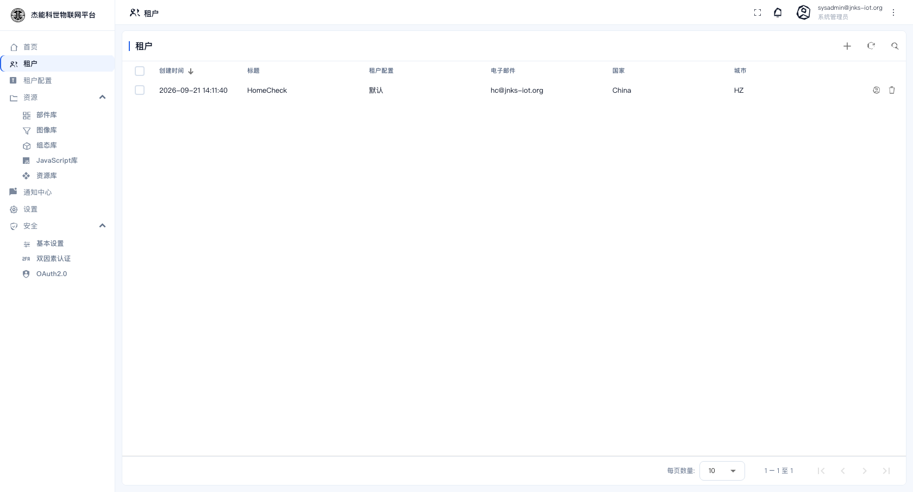
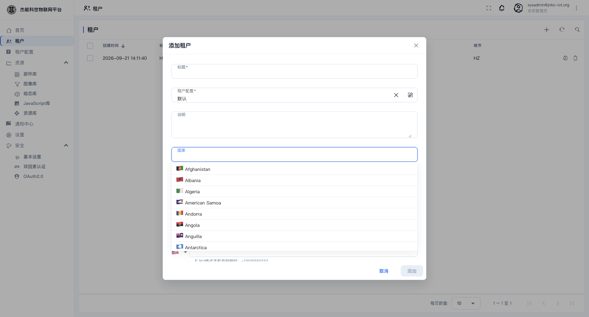
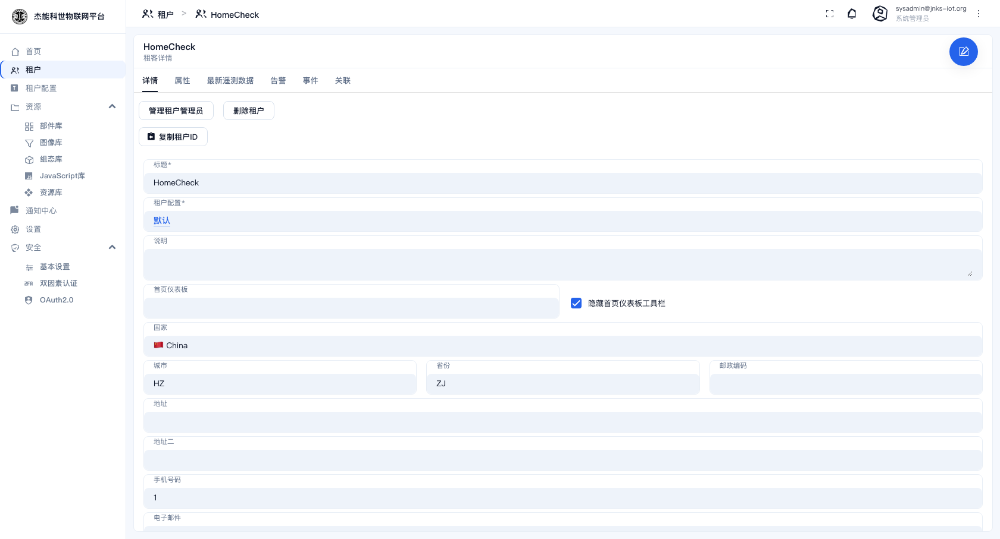
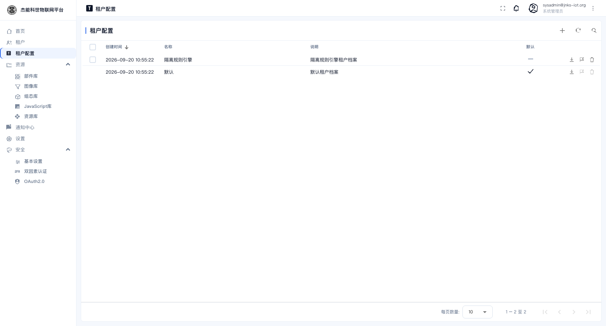

# 12 · 租户与租户档案

> **只有系统管理员能进这两个页面。** 菜单：**租户** 与 **租户配置**。

**租户**是平台上的一个独立组织。每个租户的数据（设备、资产、仪表盘、规则链、用户、客户）**完全隔离** —— 租户 A 的账号看不到租户 B 的任何东西。

```
平台（系统管理员管全局）
├── 租户「HomeCheck」  ← 一个独立的客户/事业部
│     ├── 设备 / 资产 / 仪表盘 / 规则链
│     ├── 用户（租户管理员、客户用户）
│     └── 客户
└── 租户「另一家公司」
      └── （完全看不到上面那些）
```

## 租户列表

菜单：**租户**



| 列 | 说明 |
|---|---|
| 创建时间 | — |
| **标题** | 租户名 |
| **租户配置** | 该租户用的**租户档案**（见下节） |
| 电子邮件 / 国家 / 城市 | 联系信息 |

行内动作：

| 图标 | 作用 |
|---|---|
| 👤 | **管理用户** —— 管理该租户下的用户（主要是租户管理员） |
| 🗑 | 删除租户 |

> **删除租户会连带删除它下面的全部数据**（设备、仪表盘、规则链…），不可恢复。删之前先把要保留的东西导出。

## 新建租户

点 `+`：

| 字段 | 必填 | 说明 |
|---|---|---|
| **标题** | 是 | 租户名 |
| **租户配置** | 是 | 选一个租户档案，决定该租户的隔离级别与配额。一般选"默认" |
| **国家 / 城市 / 州省 / 邮编 / 地址** | 否 | 地址信息 |
| **邮箱 / 电话** | 否 | 联系方式 |



### 建完租户之后必须做的两件事

1. **建租户管理员**：在租户列表行内点「管理用户」→ `+` → 选角色**租户管理员** → 填邮箱 → 激活方式选「显示激活链接」（本地没配邮件时）。
2. **把激活链接给到人**：用户打开链接设置密码后才能登录。

**新建的租户里一切是空的** —— 没有设备、没有仪表盘，连"首页"也是平台默认的概览页。租户管理员登录后需要自己建实体，或由系统管理员协助导入。

点一行进入租户详情，可以改租户信息、管理该租户的用户：



## 租户档案

菜单：**租户配置**（对应侧边栏的"租户配置"）



**租户档案**是租户的"模板"，定义两件事：

| 定义 | 说明 |
|---|---|
| **隔离级别** | 该租户的数据与计算资源是否独享 |
| **配额** | 设备数、资产数、用户数、仪表盘数、API 调用量等上限 |

| 列 | 说明 |
|---|---|
| 创建时间 / 名称 / 说明 | — |
| **默认** | 打勾 = 新建租户时默认选中的那份档案 |

平台自带一个名为 `default` 的档案。

### 隔离级别

| 级别 | 含义 | 适用 |
|---|---|---|
| **共享**（默认） | 多个租户共用一套规则引擎与数据库资源，靠数据字段隔离 | 绝大多数场景，成本低 |
| **独立**（隔离的规则引擎 / 核心） | 该租户独享规则引擎或核心服务实例 | 对性能或合规有硬要求的租户，成本高 |

**档案名 `default` 不要改**：代码里有按名字判断"是不是默认档案"的逻辑，改名会让新建租户时选不中默认档案。

### 配额

配额项决定该档案下的租户最多能用多少：

| 配额项 | 说明 |
|---|---|
| 设备数 / 资产数 / 实体视图数 | 实体总量上限 |
| 用户数 / 仪表盘数 / 客户数 | — |
| **传输消息数 / 数据点数** | 每天或每分钟的上报量上限 |
| 规则引擎执行数 / JS 执行数 | 计算资源上限 |
| 邮件 / 短信条数 | 通知渠道上限 |

**超配额的表现**：达到上限后新的上报会被拒绝（或丢弃），界面上 [13-使用量统计](13-使用量统计.md) 里对应的进度条会变红。

> 配额**按天/按周期重置**，具体周期由档案定义。给租户放配额前先估算它的设备数×上报频率，放太小会被业务方投诉"数据丢了"。

## 平台上限

平台自身还有一个总配额（在 [13-使用量统计](13-使用量统计.md) 顶部能看到"平台"的用量）。租户档案里的配额之和不应超过平台上限，否则会出现"档案里给了额度但实际用不了"。

## 常见问题

| 现象 | 处理 |
|---|---|
| 新租户管理员登录不了 | 账号未激活。重新生成激活链接给用户 |
| 租户说"设备建不了了" | 查该租户档案的设备配额，以及平台总量是否用满 |
| 想给某租户单独扩容 | 改它用的租户档案配额。**注意会同时影响用同一档案的所有租户** —— 要单独给某一家，得为它建一份新档案 |
| 删了租户想恢复 | 只能从数据库备份恢复 |

---

上一章：[11-系统设置](11-系统设置.md) · 下一章：[13-使用量统计](13-使用量统计.md)
