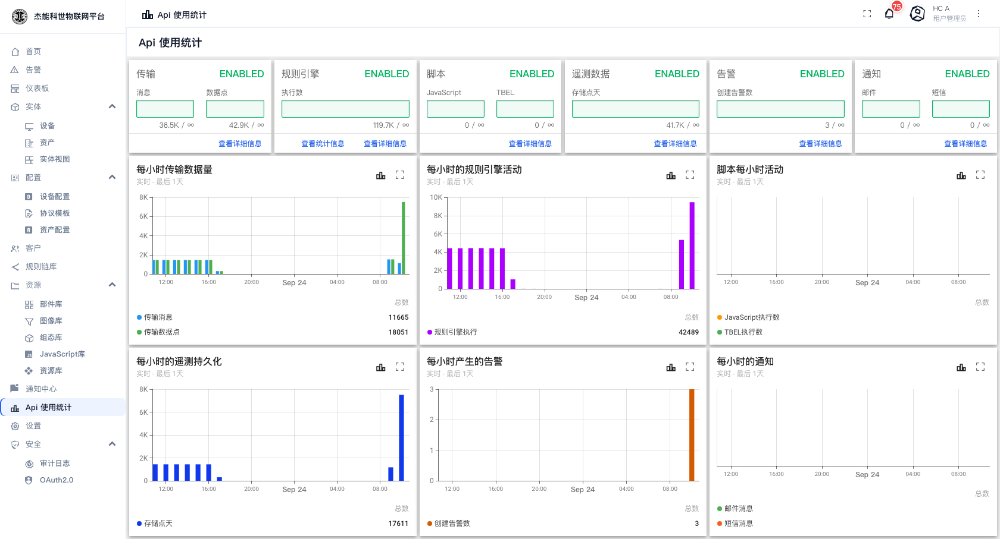

# 13 · 使用量统计

**Api 使用统计**把平台消耗的资源用量摆在一屏上：传输消息、数据点、规则引擎执行、脚本执行、存储点、告警、通知。它是判断"要不要扩容""配额够不够"的主要依据。

菜单：**Api 使用统计**（租户管理员可见）

## 上半部分：六组配额卡

每张卡代表一类资源，右上角的 `ENABLED` 表示这类统计已启用：

| 卡片 | 统计什么 | 两个数字 |
|---|---|---|
| **传输** | 设备连接到平台产生的流量 | **消息**（条数） / **数据点**（键值对数） |
| **规则引擎** | 规则节点的执行次数 | **执行数** |
| **脚本** | 脚本节点的执行次数 | **JavaScript** / **TBEL** |
| **遥测数据** | 落库的时序数据 | **存储点天**（数据点 × 保留天数的累计量） |
| **告警** | 产生过的告警 | **创建告警数** |
| **通知** | 发出的通知 | **邮件** / **短信** |

每张卡上的数字形如 **`36K / ∞`**：

- **左边**是已用量，"K"表示千，"M"表示百万。
- **右边**是配额上限。**`∞` 表示不限量**。

**看到红色就要注意**：接近或超过配额时数字会变色。超过后对应的操作会被拒绝 —— 设备上报会被丢弃、规则链不再执行。

每张卡下方的**「查看详细信息」/「查看统计信息」** 点进去可以看到更细的拆分（按设备、按规则节点等）。

## 下半部分：六张趋势图

| 图表 | 看什么 |
|---|---|
| **每小时传输数据量** | 消息与数据点的每小时走势。**设备规模变化、异常风暴都在这里显现** |
| **每小时的规则引擎活动** | 规则链的执行次数。涨得比消息量快，说明规则链里有放大逻辑（一个节点拆成多条消息） |
| **脚本每小时活动** | JS / TBEL 脚本的执行次数 |
| **每小时的遥测持久化** | 实际写进数据库的数据点，决定数据库增长速度 |
| **每小时产生的告警** | 告警的产生频率。**突增通常意味着阈值配得不合理或设备真出问题了** |
| **每小时的通知** | 邮件 / 短信发出量。**短信要花钱，这张图直接对应成本** |

每张图右下角有**总数**，是当前时间窗口内的累计值。图下方的拖拽条可以缩放时间范围，右上角的图标可以全屏或导出。

## 怎么用它做决策

| 想知道 | 看哪里 |
|---|---|
| 数据库为什么涨这么快 | 「每小时的遥测持久化」的日总量 × 保留天数。要降下来得从**减少上报频率**或**缩短数据保留期**入手（后者由部署方在服务端配置） |
| 规则引擎扛不扛得住 | 「每小时的规则引擎活动」的峰值，与部署的 rule-engine 实例数对照 |
| 短信费为什么超了 | 「每小时的通知」的短信曲线 |
| 配额还剩多少 | 上半部分的 `已用 / 上限` |
| 哪个设备在上报风暴 | 从「每小时传输数据量」进「查看详细信息」按设备拆分 |

## 配额与用量对不上时

| 现象 | 原因 |
|---|---|
| 用量是 `0 / ∞` | 该租户档案里这一项没设上限，所以显示 `∞` |
| 用量到顶了但业务说没那么多数据 | 统计口径包含**所有**匹配的实体，可能有不用的设备还在上报 |
| 想提高配额 | 由系统管理员改**租户档案**里的对应项 —— 见 [12-租户与租户档案](12-租户与租户档案.md)。改档案会同时影响用同一档案的所有租户 |
| 用量突然跳变 | 检查是否有设备在异常重连、或者规则链被改成了会把一条消息拆成多条 |

## 与审计日志的分工

| 想知道 | 去哪 |
|---|---|
| 用了多少资源（量） | **本页** |
| 谁做了什么操作（行为） | [10-4 审计日志](10-安全设置/04-审计日志.md) |
| 某条数据为什么没存下来 | [06-3 调试与排错](06-规则引擎/03-调试与排错.md) |

---

上一章：[12-租户与租户档案](12-租户与租户档案.md) · 下一章：[14-设备接入指南](14-设备接入指南.md)
