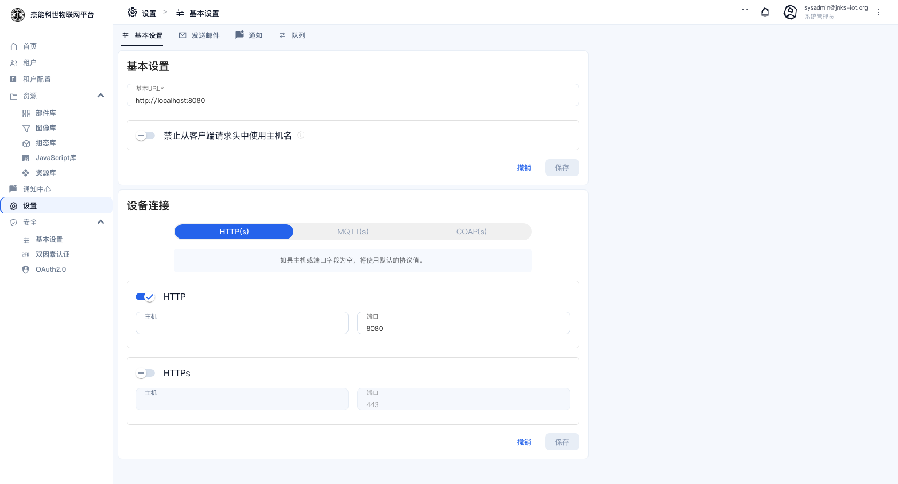
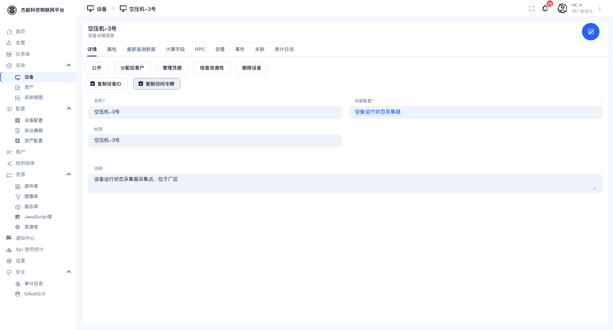
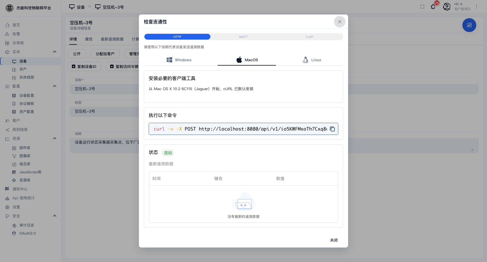

# 14 · 设备接入指南

这一章解决"**设备端该怎么写代码才能把数据送上来**"。

平台侧只是"建一台设备、拿一个令牌"，设备端才是真正干活的一方。完整流程：

```
① 建/选设备档案（决定传输方式）
② 建一台设备（选档案、填名字）
③ 复制该设备的访问令牌
④ 在设备端用令牌 + 协议地址上报数据
⑤ 在设备详情页确认数据到了
```

前三步在界面里做（见 [03-1 设备](03-实体管理/01-设备.md) 与 [03-4 设备档案](03-实体管理/04-设备档案.md)），这一章重点是第 4 步。

## 先拿到两个值

### 平台地址与端口

**不要凭记忆填。** 在 **设置 → 基本设置 → 设备连接** 里看平台对外公布的地址：



这里有 HTTP(s) / MQTT(s) / COAP(s) 三组，每组一个主机和一个端口。设备端就用这里的值。

> 关掉的协议不会显示在设备详情页的"连接说明"里。如果某个协议没开而你需要用，让系统管理员来打开。

### 设备访问令牌

设备详情页 → **复制访问令牌**：



或者点 **管理凭证** 打开凭证对话框，能看到令牌内容、也能重置：


令牌是一串随机字符串，**它就是设备的身份**。谁拿到它就能以这台设备的身份上报数据 —— 按密码的规格保管。

## HTTP

最简单，用 `curl` 就能验证。

### 上报遥测

```bash
curl -v -X POST http://<平台地址>:<HTTP端口>/api/v1/<访问令牌>/telemetry \
  -H 'Content-Type: application/json' \
  -d '{"temperature": 25.3, "humidity": 60.2}'
```

成功返回 `200 OK`，没有响应体。

### 上报属性

```bash
curl -v -X POST http://<平台地址>:<HTTP端口>/api/v1/<访问令牌>/attributes \
  -H 'Content-Type: application/json' \
  -d '{"firmwareVersion": "1.2.3", "installLocation": "车间A"}'
```

### 带时间戳

不写时间戳时，平台用**收到消息的时刻**。设备时钟不准或需要补历史数据时自己带上（毫秒）：

```bash
curl -v -X POST http://<平台地址>:<HTTP端口>/api/v1/<访问令牌>/telemetry \
  -H 'Content-Type: application/json' \
  -d '[{"ts": 1790216000000, "values": {"temperature": 25.3}},
       {"ts": 1790216060000, "values": {"temperature": 25.8}}]'
```

> **HTTP 是"拉"的模式**：平台不会去连设备。设备要自己定时 POST。没有定时器能力的设备不适合 HTTP。

## MQTT

适合长连接、低功耗的场景。**平台是 MQTT 服务端，设备是客户端。**

| 参数 | 值 |
|---|---|
| **Broker 地址** | `<平台地址>` |
| **端口** | 见"设备连接"里 MQTT 的端口（明文默认 1883） |
| **clientId** | 任意唯一字符串（**不能重复**，重复会把前一个踢下线） |
| **用户名** | 设备的**访问令牌** |
| **密码** | 留空 |
| **发布主题** | `v1/devices/me/telemetry`（遥测）/ `v1/devices/me/attributes`（属性） |

命令行验证（`mosquitto_pub`）：

```bash
mosquitto_pub -h <平台地址> -p <MQTT端口> \
  -i "sensor-001" \
  -u "<访问令牌>" -P "" \
  -t "v1/devices/me/telemetry" \
  -m '{"temperature": 25.3, "humidity": 60.2}'
```

设备端代码要点：

| 要点 | 原因 |
|---|---|
| **clientId 必须唯一** | 两个设备用同一个 clientId 会互相踢下线，表现为"数据时有时无" |
| **断线要自动重连** | 网络抖动很常见，重连后重新订阅即可 |
| **QoS 用 0 或 1** | 平台侧两者都支持；QoS 2 会显著增加开销且无必要 |
| 用 TLS 时端口换成 MQTTS 的端口 | 见"设备连接"设置 |

### MQTT 基础凭证方式

设备档案的传输方式选「MQTT」，并把**凭证类型**设为 `MQTT_BASIC` 时，设备端不用访问令牌，改用三元组：

| 参数 | 值 |
|---|---|
| clientId | 你在建凭证时定的值 |
| 用户名 / 密码 | 建凭证时定的值 |

这种方式更严格（凭证与 clientId 绑定，盗用难度更高），代价是配置更复杂。

## CoAP

适合极低功耗设备（NB-IoT 等）。

```bash
coap-client -m post \
  coap://<平台地址>:<CoAP端口>/api/v1/<访问令牌>/telemetry \
  -t application/json -e '{"temperature": 25.3}'
```

CoAP 用 UDP，**默认不可靠**。设备端要自己实现重传，否则丢包时数据就没了。

## LWM2M

LWM2M 不是"设备往平台推"，而是**设备向平台注册、平台再读/写它的资源**。

| 参数 | 值 |
|---|---|
| **LWM2M 服务端地址** | `coap://<平台地址>:<LWM2M端口>` |
| **Endpoint 名（clientName）** | **填设备的名称**（与平台里建的那台设备同名） |
| **安全模式** | 无安全 / PSK / RPK / X.509，按平台配置选 |

设备注册成功时平台返回 `2.01 Created`。

平台自带约 300 条 **LWM2M 模型**定义（在 [08-5 资源库](08-资源库/05-资源库.md) 里可以看到）。设备上报的对象 ID / 资源 ID 要在这些模型里能找到，否则平台不知道这个值叫什么。

> **Endpoint 名与设备名必须一致**。不一致的表现是设备注册成功但平台里"没有这台设备"。

## SNMP

**SNMP 与上面几种方向相反**：不是设备上报，而是**平台主动去轮询设备**（网络交换机、UPS、服务器这类支持 SNMP Agent 的设备）。

平台侧配置步骤：

1. 建一个传输方式为 **SNMP** 的设备档案。
2. 在档案的**传输配置**里填 SNMP Agent 的地址、端口、community/版本，以及要采集的 OID 列表。
3. 建一台设备，选这个档案。
4. 平台按配置的周期自己去读，读到值后写入该设备的遥测。

**排查要点**：

| 现象 | 原因 |
|---|---|
| 完全没数据 | 平台到设备的 **UDP 端口不通**（SNMP 走 UDP，容易被防火墙拦） |
| 部分 OID 有数据 | 该 OID 在设备上不存在或需要更高权限的 community |
| 数据是字符串不是数字 | 该 OID 的类型不是数值型 |

## TCP / UDP（自定义协议）

设备用的是私有协议（Modbus RTU over TCP、厂商自定义报文等）时，走 TCP 或 UDP 传输。**下行**有两种建模方式，按设备实际收什么来选（见下面的「两条下行通道」）：

- **协议模板**：平台按模板把命令组帧成 HEX 再发，上行也按模板解析字节。适合定长 / 带校验的二进制报文。
- **自定义 JSON**：参数本身就是负载，平台**原样发这段 JSON**，不需要先定义模板。

| 步骤 | 做什么 |
|---|---|
| 1 | 在 [协议模板](03-实体管理/06-协议模板.md) 里定义**帧模板**：帧头、长度字段、各字段的偏移与类型、校验方式 |
| 2 | 建一个传输方式为 TCP 或 UDP 的设备档案，在**传输配置**里绑定该协议模板 |
| 3 | 建设备，选这个档案 |
| 4 | 设备连上平台的 TCP/UDP 端口，按模板约定的格式发字节流 |

只走「自定义 JSON」的档案可以不绑协议模板；但既没绑模板、方法也没登记成「自定义 JSON」时，平台只会发下面那种标准信封——看不懂 JSON 的设备自然收不到有用数据。

### 两条下行通道

TCP/UDP 档案的每个 **RPC 方法**在「绑定类型」里二选一：

| 绑定类型 | 调用时填什么 | 设备实际收到 |
|---|---|---|
| **协议模板**（默认） | 模板字段值；或直接写组帧结果 `{"hex":"0107"}` | 平台按模板组帧后的**原始字节** |
| **自定义 JSON** | 一段 JSON | **这段 JSON 原文**，不带任何信封 |

**协议模板**这条路上，`params` 必须含 `hex` 键、且档案负载编码是「原始字节 / 协议模板」，平台才发裸字节；否则发的是标准信封 `{"method":"rpc","requestId":…,"params":"<字符串>",…}`。

**自定义 JSON** 这条路上，`params` 就是负载本身：

```
下发 {"mode":"auto","speed":3}   →   设备收到 {"mode":"auto","speed":3}
```

要点：

- **不带信封**，因此没有 `requestId`，**只能单向**：绑「自定义 JSON」的方法会被强制勾成单向，配成双向保存会被后端拒绝。
- **不按模板组帧**，也**不会**把 `{"hex":…}` 解成字节 —— 你的 JSON 里就算有 `hex` 键也照原样发。
- **UDP 不分帧**（一个数据报即一帧）；**TCP 按档案的分帧方式加边界**（LINE 补换行、`LENGTH_PREFIX_*` 加长度前缀等）。档案分帧是 `FIXED_LENGTH` 时 JSON 无法定长补零，平台记一条 warn 后**按不分帧发送**。
- 方法**没登记在档案目录里**的调用（仪表板 / 规则链临时发的方法名）仍走标准信封，不受影响。

> 两条通道可以在**同一个档案**里并存：走模板的方法绑「协议模板」，走 JSON 的方法绑「自定义 JSON」。

### 监听端口（每个档案必填）

TCP 与 UDP 档案都**必须**填一个自己的监听端口（TCP 在"接入模式 = 服务端"时填；UDP 恒为监听方，一律必填）：

| 情况 | 行为 |
|---|---|
| 填了端口 | 该档案的设备连这个端口；**每个 transport 实例都会监听它**（`SO_REUSEPORT`），所以经网关 / 负载均衡打到任一实例都能处理 |
| 端口重复 | 同一个端口只能被一个档案声明，重复保存会报错；TCP 与 UDP 的同号端口互不影响 |
| 平台默认端口 | **没有**共享默认端口（旧版的 5683 / 5684 已取消），设备只能连各档案自己声明的端口 |

端口只服务声明它的档案，因此设备报文**从第一帧起**就按该档案的分帧方式解析（不必像旧版那样先按平台全局分帧、鉴权后再切换）。

UDP 端口别和平台其它协议的固定端口撞：CoAP 用 `5683`/`5684`、LWM2M 用 `5685`–`5688`、SNMP 用 `1620`、MQTT 用 `1883` —— 撞了会在宿主机或网关上互相占用。

> **Docker 部署要多做一步**：宿主端口要发布、网关也要转发这个端口——在 `docker/services/nginx/config/nginx.conf` 的 `stream` 段加 `upstream` + `listen`，在 `docker/services/docker-compose.yml` 里把该端口发布出来，然后 `docker exec jnks-iot-gateway nginx -s reload`。用 `scripts/start-microservices.sh` 的 JVM 模式不用改配置：同机多实例靠 `SO_REUSEPORT` 共享同一端口。
>
> **档案用的是「无鉴权 + 期望源 IP」时，网关转发必须用透明绑定**：`proxy_bind $remote_addr:$remote_port transparent;`（本仓 `nginx.conf` 的 55566 段已这么配）。否则平台看到的源 IP 是**网关容器**的地址，`sourceHost` 永远匹配不上。
> **端口必须一起带上**（`$remote_addr` 后面跟 `:$remote_port`）：只写地址时上游 socket 的源端口由网关临时分配，而平台按 (本地端口, 对端地址) 认会话 —— 端口每包一变，就会每个数据报都重建一次会话。
> 透明绑定要 bind 非本机地址，网关容器得有 `CAP_NET_ADMIN`（`docker/services/docker-compose.yml` 里 `nginx-gateway` 的 `cap_add`）；少了它每个数据报都会 EPERM，nginx 的 error.log 里能看到。

### UDP 的下发地址

UDP 默认**原路回发**：下发（RPC、共享属性、定时 RPC）发到**设备最近一次上报的源 IP:源端口**（经透明绑定网关接入时，那就是设备的真实地址）。

如果设备的上报端口和收指令的端口不是同一个（设备从临时或 NAT 端口上报、固定端口收指令），在**设备**详情的传输配置里填「固定下行地址 / 固定下行端口」，下发就改走该地址：

| 配置 | 下发目的地 |
|---|---|
| 都留空（默认） | 设备最近一次上报的源 IP:源端口 |
| 都填了 | 配置的固定地址:端口，与上报源地址无关 |
| 只填一个 | 保存被拒（须成对填写） |

**被动设备**（从不发包）也能收到下发：设备上配好下行地址后，平台会为它建一个**出站会话**，定时 RPC 一样发得出去；
帧**从档案的监听端口**发出，所以设备回包会落回同一个端口并建立真实会话。设备在发/收数据之前**不会**因此显示活跃。

前置条件：设备的**下行地址必须可达**（平台要能直接发过去；设备在 NAT 后面就打不到）。

> 注意：**在设备详情里改这个配置会关掉它当前的会话**，改完要等设备下一次上报重建会话，下发才通。

## 令牌的两种类型

| 类型 | 用法 | 何时用 |
|---|---|---|
| **访问令牌**（Access Token） | 一串字符串，放在 URL / 用户名 / 请求头里 | 绝大多数场景 |
| **MQTT 基础**（MQTT Basic） | clientId + 用户名 + 密码三元组 | 需要更严格的 MQTT 接入控制 |

**重置令牌会让设备立刻断连**，必须同步改设备端配置。

## 验证数据到了

设备端发出数据后，按这个顺序确认：

1. 设备列表 → 该设备的**状态**变成"活动"。
2. 设备详情 → **最新遥测数据**页签里能看到刚上报的键和值。
3. 如果状态是活动的但遥测页签是空的 → 消息进来了但没被保存，是**规则链**的问题，见 [06-3 调试与排错](06-规则引擎/03-调试与排错.md)。
4. 想确认设备是否真的能应答 → 设备详情 → **检查连通性**：



> **「检查连通性」依赖设备支持 RPC**。很多简单设备（只会上报、不会接收指令）不支持，此时点它必然失败，**这不代表设备没连上**。以"状态是否活动 + 遥测是否有数据"为准。

## 接入排查对照表

| 现象 | 先查 |
|---|---|
| HTTP 返回 401 | 令牌错/被重置了。重新复制令牌 |
| MQTT 连不上 | 端口、clientId 冲突、用户名是否为令牌 |
| MQTT 连上但没数据 | 主题写错（必须是 `v1/devices/me/telemetry`） |
| 数据进来了但键名不对 | 上报的 JSON 键名就是平台里的键名，检查拼写 |
| 状态一直"非活动" | 设备根本没连上。查网络、端口、令牌 |
| LWM2M 注册成功但设备不存在 | Endpoint 名与设备名不一致 |
| SNMP 无数据 | UDP 端口不通 |
| TCP/UDP 无数据 | 档案里没绑协议模板，或帧格式与模板不符 |
| 一台设备的数据时有时无 | **clientId 重复**，或被别人用同一个令牌连了 |

---

上一章：[13-使用量统计](13-使用量统计.md) · 回到 [README](README.md)
