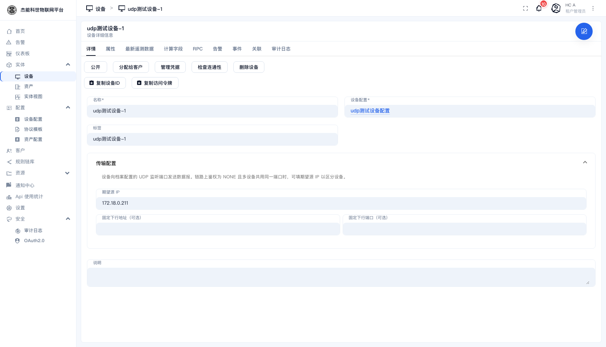
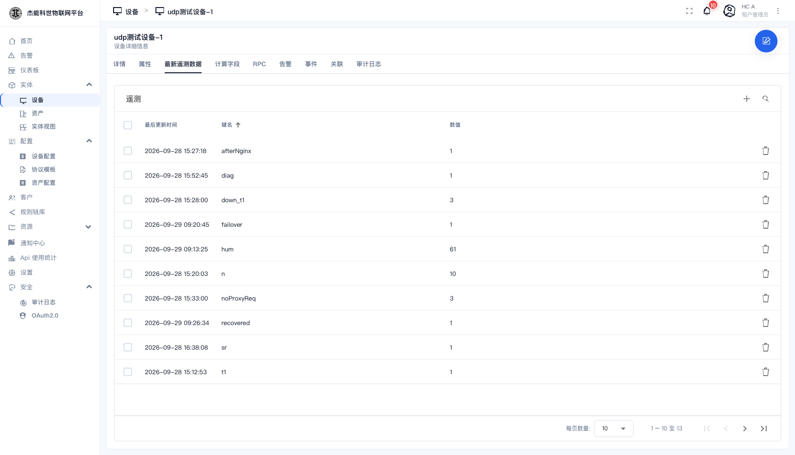
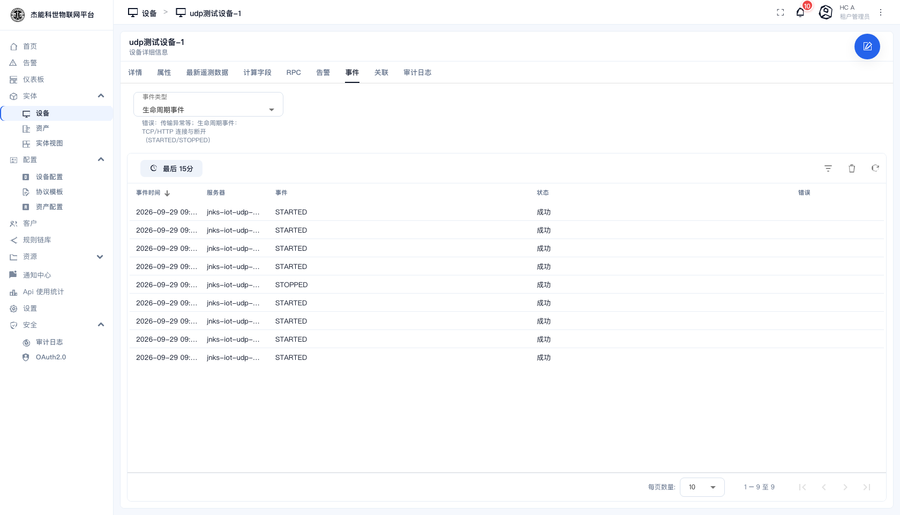

# 15 · UDP 接入测试流程

这一章是一份**可照做的验收流程**：怎么建 UDP 设备、怎么确认上行/下行/活跃都通了。

涉及的界面在 [03-4 设备档案](03-实体管理/04-设备档案.md) 和 [03-1 设备](03-实体管理/01-设备.md)；
设备端怎么写代码见 [14 设备接入指南](14-设备接入指南.md)。

---

## 一、只有一种模型：平台监听 + 谁先说话

UDP **不再分「接入模式」**：平台固定监听档案声明的端口，设备把数据报发到那里。区别只剩"谁先说话"：

| 场景 | 怎么走 |
|---|---|
| 设备主动上报 | 设备往档案的**监听端口**发数据报 → 平台按源 IP / 协议设备 ID 认领 → 计入活跃 |
| 平台主动查询（被动设备）| 平台按设备配置的**下行地址:端口**、**从同一个监听端口**发一帧过去 → 设备回包落回监听端口 → 建会话、计入活跃 |

两种场景的**活跃判定完全一样**：收到数据就算活跃，默认 600 秒收不到就非活跃。

- 设备上的「**下行地址 / 下行端口**」既决定平台主动下发打哪儿，也决定被动设备能不能被"点名"。
- **被动设备（从不发包）也能收到下发**：平台会给"配了下行地址"的设备建一个**出站会话**，定时 RPC 照样发得出去；设备回一包就有了真实会话。

> **历史**：以前有「服务端 / 客户端」两种接入模式 —— 客户端模式是平台从**临时端口**去 dial 设备、档案**不留监听端口**。
> 该模式已移除：它能做的事现在服务端模式都能做，而且**回包有固定落点**（监听端口），读空闲回收、源 IP 认领也都正常。
> 早先按客户端模式建的档案需要**补一个监听端口**。

---

## 二、前置准备

| 项 | 值 |
|---|---|
| 平台地址 | `http://<host>`（本机 `http://127.0.0.1`） |
| 账号 | 租户管理员 `hc-admin@jnks-iot.org` |
| 网关 | 所有 UDP 设备接入都经网关，不要直连 transport 容器 |
| 本次测试用的档案 | `udp测试设备配置`（监听 `55566`） |

**验证要用到的两个观察点**：

1. **设备详情 → 最新遥测数据**：看上行数据有没有进来
2. **设备详情 → 事件**（事件类型选「生命周期事件」）：看上线/下线事件，以及**是哪台 transport 报的**

---

## 三、测试一：设备主动上报

### 3.1 档案配置

按上图 01 建档案：自定义监听端口填一个**不与平台其它协议冲突**的端口，链路鉴权选「无（按端口/源 IP 绑定）」。

### 3.2 设备配置

建一台设备、选该档案。设备详情的传输配置里会要求填 **期望源 IP**：



- 「固定下行地址 / 固定下行端口」**可选**：设备从临时端口上报、但固定端口收指令时才填；不填就回发到最近一次上报的源地址

### 3.3 逐项验证

| # | 操作 | 期望结果 |
|---|---|---|
| 1 | 设备向档案监听端口发一帧遥测 | 「最新遥测数据」出现该键值；设备 `active` 变 `True` |
| 2 | 平台下发 RPC（设备详情 → RPC） | 设备收到 `{"method":"rpc",...}` |
| 3 | 查看「事件 → 生命周期事件」 | 一条 `STARTED`，**服务器列 = 持有该会话的 transport 实例** |
| 4 | 设备停止上报，等读空闲超时 | 会话被回收，产生一条 `STOPPED`；再过一会儿设备变**非活跃** |
| 5 | 停掉设备所在的 transport 实例 | **前 1~2 个数据报会丢**，之后自动转移到另一台；实例恢复后设备回到原实例 |





> `STARTED` 是**每次会话鉴权成功**写一条，不是每台设备只写一条。
> 同一源地址持续上报**不会**产生新事件；但设备换源端口、或 transport 重启后重新鉴权，就会多一条——这是预期行为。

---

## 四、测试二：平台主动查询（被动设备）

设备**从不发包**时，靠设备上配的「下行地址 / 下行端口」让平台主动去问它。

### 4.1 档案配置

用**和测试一同一个档案**即可（平台监听的端口同时就是回包的落点），不需要额外配置。

### 4.2 设备配置

设备详情的传输配置里填两样：

- **期望源 IP**（链路鉴权选「无」时）或**协议设备 ID**（延迟鉴权时）—— 用来认领回包；
- **下行地址 / 下行端口** —— 设备收发指令的 IP:端口。

### 4.3 逐项验证

| # | 操作 | 期望结果 |
|---|---|---|
| 1 | 保存设备后等十几秒 | transport 日志出现 `Established UDP outbound session` —— **设备一个包都没发**也有会话 |
| 2 | 给设备配一条**定时 RPC**（绑定类型 `UDP_TEMPLATE` 或 `NATIVE`）| 设备收到帧；抓包看**源端口就是档案的监听端口**（回包才能落回来）|
| 3 | 设备回一帧 | 落回监听端口 → 建立**真实会话**（出站会话退场）→ 遥测入库、设备变活跃 |
| 4 | 设备一直不回 | 只有出站会话，**不会**因此显示活跃；超时后仍是非活跃 |

> 判定标准：**收到回包才算活跃**，一直收不到就是非活跃。

### 4.4 活跃判定（与"谁先说话"无关）

**活跃只看"最近有没有收到这台设备的数据"。** 默认不活跃超时 **600 秒**——设备停掉后马上看当然还是活跃，等不到 10 分钟容易误判成"感知不到"。要快速验证就给设备加服务端属性 `inactivityTimeout`（单位**毫秒**）：

```
inactivityTimeout = 60000     # 60 秒，测完删掉
```

**"会话还在"这个窗口内下发 RPC 仍返回 200**（平台确实发出去了，只是没人收）；等读空闲回收（同时产生 `STOPPED`）后再下发就会失败。这是 UDP 无连接的固有语义，不是缺陷。

---

## 五、测试三：三条下行通道

同一条下行 RPC 走哪条通道，**由档案里那条方法的「绑定类型」决定**（「设备配置 → RPC 方法」里选）：

| 绑定类型 | 调用时填 | 设备收到 |
|---|---|---|
| 协议模板（UDP 档案显示「UDP 协议模板下行」，TCP 显示 TCP 那档） | 模板字段值，或 `{"hex":"0107"}` | 平台按模板组帧后的**原始字节**（如 `01 07`） |
| 原生 RPC（标准 JSON） | 一段 JSON | 标准信封 `{"method":"rpc","params":…}` 的 UTF-8 文本 |
| 自定义 JSON | 一段 JSON | **这段 JSON 原文**，不带信封 |

### 5.1 逐项验证

| # | 操作 | 期望结果 |
|---|---|---|
| 1 | 给 UDP 档案加一条方法，绑定类型选「自定义 JSON」| **不必选「模板下行命令」就能保存**——这是它与协议模板最大的区别 |
| 2 | 看该方法表单 | 只出现「默认 params (JSON)」文本框；「单向 RPC」被勾上且**灰掉不可改** |
| 3 | 设备页 → RPC → 选它 → 填 `{"mode":"auto"}` → 下发 | 设备收到 `{"mode":"auto"}`，**没有** `{"method":"rpc",…}` 信封 |
| 4 | 参数改成 `{"hex":"0107"}` 再下发 | 设备收到的仍是这串 JSON 文本（**不会**被解成 `01 07` 两个字节）|
| 5 | 同档案另配一条绑定「协议模板」的方法，用 `{"hex":"0107"}` 下发 | 设备收到 `01 07` 原始字节 —— 两条通道互不影响 |
| 6 | 把「自定义 JSON」方法改成双向后保存 | **保存被拒**：`CUSTOM_JSON RPC method must be one-way` |

> 定时 RPC 走同一条路：设备页「定时下发 JSON」里的 `paramsJson` 会**先与档案方法的默认体合并**（同名键以定时里的为准），再按上表规则发出。

### 5.2 观察点

看设备侧的**原始字节**最直接（二进制帧在日志里是不可见字符，JSON 通道则是一眼能读的文本）：

```bash
docker logs --since 60s <设备容器> | grep "RX from"
```

## 六、结果汇总

| 验证项 | 设备主动上报 | 平台主动查询（被动设备）|
|---|---|---|
| 会话建立 | 设备首帧之后 | 平台建**出站会话**（设备无需发包）|
| 上行遥测入库 | ✅ | ✅（回包即入库）|
| 下行 RPC 到达 | ✅ | ✅（从监听端口发到设备的下行地址）|
| 下行通道 | 协议模板（`params.hex` → 原始字节）/ 自定义 JSON（原样发，仅单向）两条并存 | 同左 |
| 生命周期事件 `STARTED` | ✅ 归属正确 | ✅ 归属正确（出站会话一条 + 真实会话一条）|
| 会话回收产生 `STOPPED` | ✅ 恰好一条 | ✅ |
| 收到数据**之前**是否活跃 | 否 | **否**（建出站会话不算活跃）|
| 设备离线时下发 RPC | 会话还在就返回 200 | 同左 |
| 单实例宕机 | ⚠️ 前 1~2 帧丢，之后转移 | 同左 |

---

## 七、排错速查

| 现象 | 先查什么 |
|---|---|
| 设备一直显示非活跃 | 设备到底有没有在发？「最新遥测数据」有没有新值 |
| 上行完全没数据 | 设备打的是不是**网关**地址？网关有没有把该端口转发出去？ |
| 生命周期事件里节点不符预期 | 网关按**源 IP 一致性哈希**分配实例；同一源 IP 永远同一实例 |
| 被动设备收不到下发 | 设备填了「下行地址 / 下行端口」吗？这个地址平台可达吗（NAT 之后不可达）？抓包看源端口是不是档案的监听端口 |
| 改了档案但设备行为没变 | 档案改动要等 transport 重新同步（约 10 秒），必要时重启 transport 实例 |
